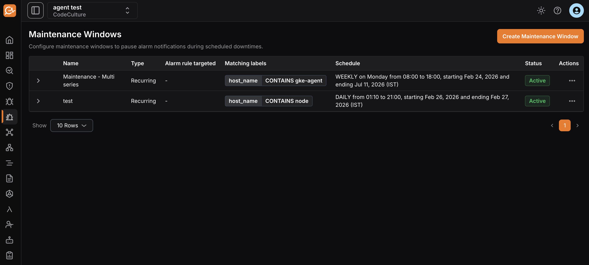
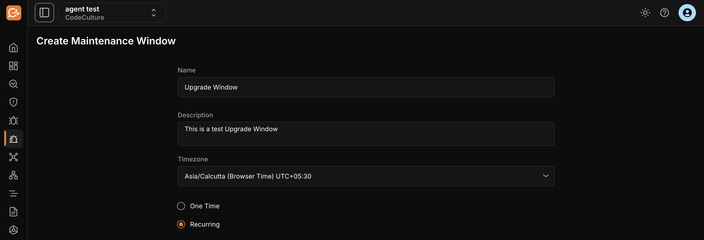
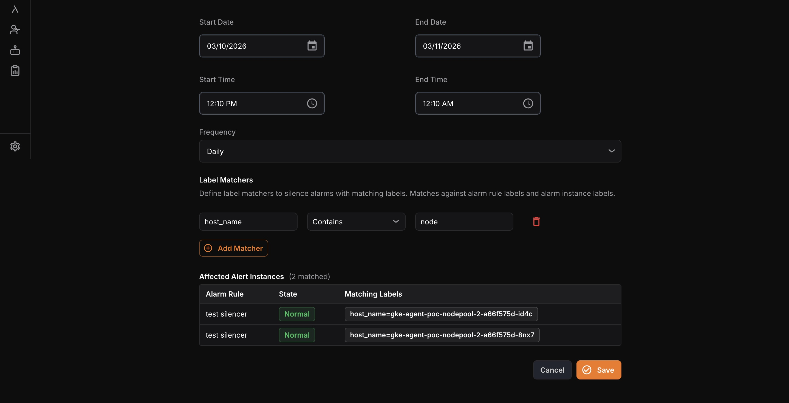

The Maintenance Window feature in the Alarm module defines a scheduled time period during which monitoring alerts are temporarily suppressed, muted, or deprioritized while planned work is performed on a system.

## Purpose

- It prevents false or expected alerts during deployments, patches, upgrades, or infrastructure changes.
- This avoids unnecessary escalations or incident tickets.
- It also keeps monitoring reports clean and meaningful.

## Overview Page

The overview page displays all created maintenance windows with these details:

- **Name**: Name of the maintenance window.
- **Description**: Description of the maintenance window.
- **Alarm rule targeted**: Alarm rule to which the maintenance window applies.
- **Matching label**: Labels assigned to the maintenance window.
- **Schedule**: Start and end time period for the maintenance window.
- **Status**: Whether the maintenance window is active or paused.

## Creating a Maintenance Window

1\. Navigate to the **Maintenance Windows** page in the Alarm module.

2\. Click **Create Maintenance Window**.

3\. Configure these details:

- **Name**: Name for the maintenance window.
- **Description**: Short description of the maintenance window.
- **Timezone**: Timezone for the scheduled maintenance window.
- **One time**: A one-time maintenance window schedules a maintenance period only once for a specific date and time.
- **Recurring**: A recurring maintenance window automatically repeats on a regular cycle, so you do not need to set it up each time.

Additional settings include:

- **Start time**: Date and time when the maintenance window begins.
- **End time**: Date and time when the maintenance window ends.
- **Frequency**: Available only for recurring windows; select daily, weekly, or monthly schedules.
- **Label Matchers**: Use labels from alarms to target the maintenance window to specific services (e.g., instance name, service name).

4\. Click **Save** to create the new maintenance window.

