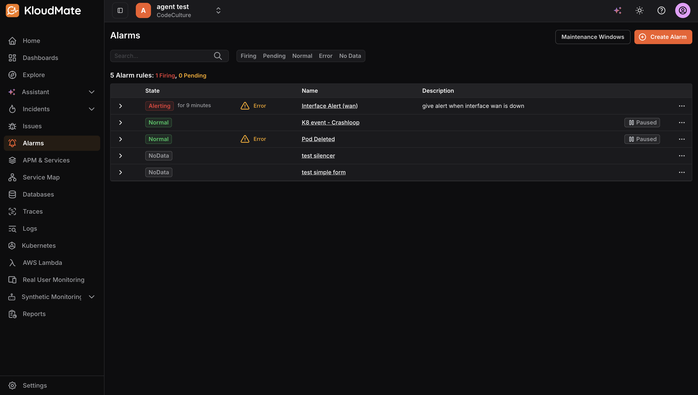

KloudMate lets users create and configure alarms for events that are critical to their application. By setting up alarms, users can monitor when certain metrics cross pre-defined thresholds and take necessary actions promptly.

## Getting Started

Navigate to the **Alarms** section from the left navigation menu. 

The Alarms screen displays a list of all existing alarms along with their current state, name, and description. The summary at the top shows the total number of alarm rules with a count of how many are currently Firing or Pending.

From the **more options (⋯)** icon on any alarm, you can:
&#x9;•  **View** the alarm details
&#x9;•  **View State History** of the alarm
&#x9;•  **Edit** the alarm configuration
&#x9;•  **Duplicate** the alarm
&#x9;•  **Pause Evaluation**or**Pause Notifications**&#x9;•**Delete** the alarm

To learn about the key concepts of KloudMate Alarms, see [Understanding KloudMate Alarms](<./Understanding KloudMate Alarms.mdx>).

## Creating a New Alarm

Click the **Create Alarm** button at the top-right corner of the Alarms screen. This opens the Create Alarm page, which is divided into four sections.

You can create multiple queries and expressions using the **Add Query**and**Add Expression** buttons. Each query or expression is assigned a unique alphabetical notation (A, B, C, and so on). You can duplicate any query or expression using the copy icon at the top-right corner of each block.

## Step 1: Setup Query Conditions and Expressions

Select OpenTelemetry or KloudMate as the data source from the first dropdown.

### **1.1 Setting Up Query Conditions for OpenTelemetry / KloudMate**

- **Data Set:**Select the dataset you want to retrieve from your data source.
- **Metric to Aggregate:** Select the metric associated with the selected dataset that you want to monitor.
- **Group By:**Enter the attributes to group the data points.
- **Filters:** Add filters to narrow down the retrieved data points.

OpenTelemetry users can also use Prometheus query language to retrieve data and set alarms.

### 1.2 Setting Up Query Conditions for AWS (CloudWatch)

- **Time Range:** Set the duration for which data should be fetched using the dropdown or enter a custom value in seconds.
- **Region:** Select the AWS region of the service you want to monitor.
- **Namespace:** Select the AWS service namespace you want to create an alarm for.
- **Metric:** Select the metric associated with the selected namespace.
- **Statistic:** Select the statistical function to use when calculating data points.
- **Dimensions:** Optionally configure the alarm for grouped resources within the selected namespace. For example, for EC2, you can filter by autoscaling group name, image ID, instance type, and more.

Click **Run Query** to fetch data.

### 1.3 Time Range Expressions for Custom Time

Alarm query time ranges support the following:

- Operators: `-` (Subtract time)
- Same units and keywords as dashboards — refer to Time Range Expressions and Settings
- Examples: `now`, `now-5m`

### 1.4 Setting Up Evaluation Expressions

Expressions let you apply logic to query results. Reference any configured query or expression using its alphabetical notation (A, B, C, and so on). Note that an expression can be passed as a parameter only when multiple expressions are configured.

Choose from the following expression types:

**Math Expression**Enter a mathematical expression to apply to the value of a query or expression. Examples: `$A+1`, `$A<$B`, `$A && $C`. For more information, see [Writing Expressions for KloudMate Alarms](<./Writing Expressions for KloudMate Alarms.mdx>).**Reduce**
Select a function to aggregate the values of a query or expression into a single number, then select the target query or expression from the Input dropdown. Available functions include:
&#x9;•  `mean()` — Average value
&#x9;•  `max()` — Maximum value
&#x9;•  `min()` — Minimum value
&#x9;•  `sum()` — Sum of all values
&#x9;•  `last()` — Last value
&#x9;•  `count()` — Total number of values

**Condition Expression**Select a function and a query or expression, then choose a condition and provide a threshold value to evaluate against. You can add multiple conditions and combine them using**AND**or**OR** logical operators.

Click **Run Queries** to execute all configured queries and expressions.

<hint type="info">
  To avoid the **NoData** issue when using multiple queries in a single alarm, use the `ifNull` operator to assign a default value. Read more in [Writing Expressions for KloudMate Alarms](<./Writing Expressions for KloudMate Alarms.mdx>).
</hint>

## Step 2: Configure Evaluation Settings

- **Alarm Condition:** Select the query or expression that should trigger the alarm (A, B, or C).
- **Evaluate Every:** Define how frequently the alarm condition should be evaluated (e.g., `1m`).
- **Pending Duration:** Define how long the alarm condition must remain true before the alarm is triggered (e.g., `5m`).
- **Alert State if No Data:** Select the alarm behavior when the query returns no data.
- **Alert State if Error:** Select the alarm behavior when the query returns an error.

Click **Preview Alarms** to run the query immediately and check the result.

## Step 3: Add Alarm Details

- **Alarm Name:** Enter a name for the alarm.
- **Description:** Add a description to help identify the alarm’s purpose.
- **Responder Context:** Optionally add context to help on-call responders understand the alarm and act quickly:
- **Dashboard:** Link a relevant dashboard for quick reference.
- **Summary:** Add a summary that will be included in notifications to provide context.
- **Playbook URL:** Add an optional runbook or playbook URL with on-call instructions.
- **Custom Annotations:** Add any custom key-value annotations.
- **SLA Target:** Set an SLA target percentage for this alarm.

## Step 4: Add Notification Tags

Add tags to the alarm to route notifications through a matching notification policy. When the alarm is triggered, notifications will be sent to the channels configured in the matching notification policy.

## Step 5: Save the Alarm

Click **Save**to save the alarm, or**Save & Close**to save and return to the Alarms screen.***

## Related Resources

- [Understanding KloudMate Alarms](https://docs.kloudmate.com/understanding-kloudmate-alarms)
- [Writing Expressions for KloudMate Alarms](https://docs.kloudmate.com/writing-expressions-for-kloudmate-alarms)

