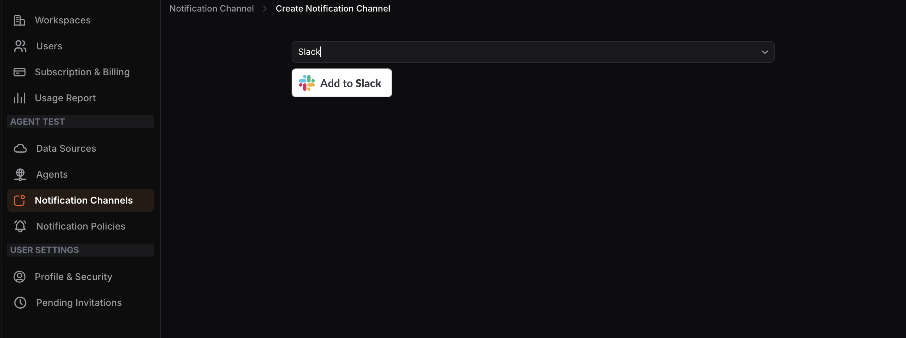

## Configuring a Slack Notification Channel

**Step 1:**Select**Slack**from the dropdown menu, then click the**Add to Slack** button.

**Step 2:**You will be redirected to the Slack integrations page. Follow the on-screen instructions, add a message for your App Manager, then click**Submit**.

