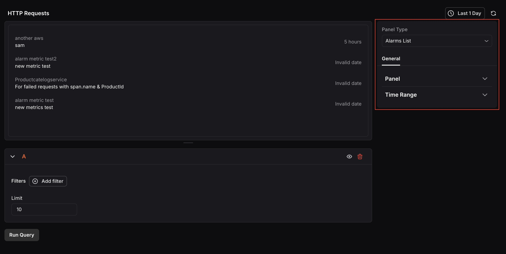

The Alarms List Panel displays a list of configured alarms within the selected time range. The list can be filtered based on available attributes to focus on specific alarms relevant to your dashboard.

When the panel type is set to Alarms List, the following settings are available under the **General** tab:

### Panel

- **Name:** Enter a name for your panel. This appears as the panel title on the dashboard.
- **Description:** Enter a description to provide additional context about what the panel displays.

### Time Range

Configure time range behavior for this panel independently from the dashboard.

- **Override Dashboard Time Range:** Individual panels can use their own time range configuration. Enable this to override the time range set at the dashboard level.
- **Time Shift:** Shift the panel’s start and end time by a specified time shift expression. Use the minus (`-`) operator to subtract time, with the same units supported by the dashboard time range expressions. 

Refer to [Time Range Expressions and Settings](/dashboards-alerts/dashboards/adding-a-panel/Time Range Expressions and Settings/) for supported units and syntax.
