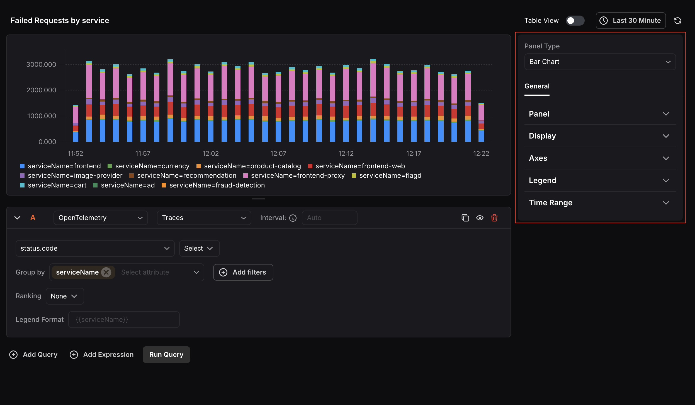
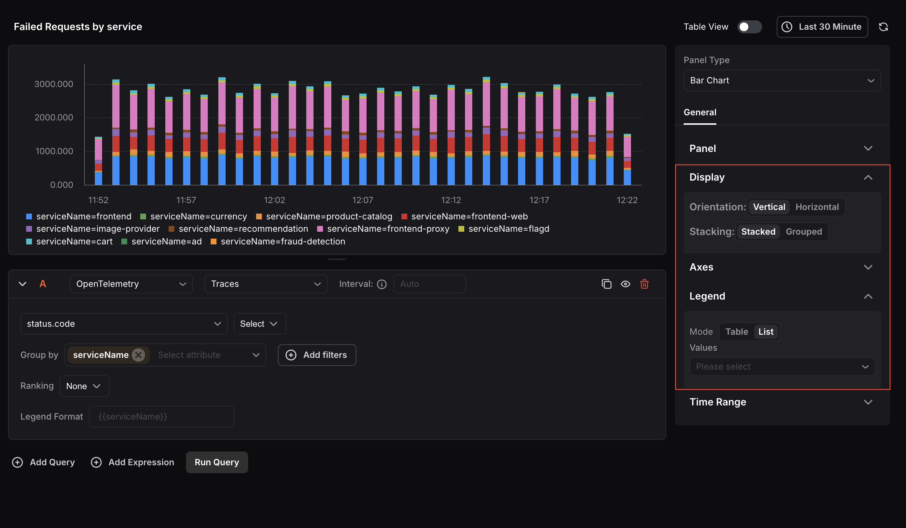
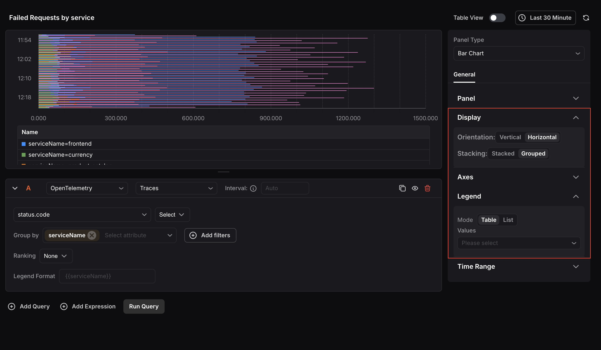

The Bar Chart Panel displays data in a bar format, allowing for easy comparison of values across categories. It includes a query box to define the data you want to visualize, and settings to customize orientation, stacking, axes, and legend.

When the panel type is set to Bar Chart, the following settings are available under the **General** tab:

### Panel
- **Name:**Enter a name for your panel. This appears as the panel title on the dashboard.
- **Description:**Enter a description to provide additional context about what the panel displays.

### Display
Control how the bar chart is visually rendered.

- **Orientation:**Choose between Vertical or Horizontal bar layout.
- **Stacking:**Choose between Stacked (bars stacked on top of each other) or Grouped (bars placed side by side) to control how multiple series are displayed.

### Axes
Configure how data is represented on each axis of the chart.

- **X-Axis:** Use the Date Style dropdown to choose from various date formats for the horizontal axis of the chart.
- **Y-Axis:** Use the Format dropdown to choose the unit of data displayed, such as Number, Percentage, or Duration. You can also set decimal places, multiply values by a number, and add a prefix or suffix.

### Legend
Choose between Table or List mode to control how query results are displayed. Use the Values selector to pick aggregate functions to show alongside each legend entry.

### Time Range
Configure time range behavior for this panel independently from the dashboard.

- **Override Dashboard Time Range:** Individual panels can use their own time range configuration. Enable this to override the time range set at the dashboard level.
- **Time Shift:** Shift the panel’s start and end time by a specified time shift expression. Use the minus (`-`) operator to subtract time, with the same units supported by the dashboard time range expressions. 

Refer to [Time Range Expressions and Settings](/dashboards-alerts/dashboards/adding-a-panel/Time Range Expressions and Settings/) for supported units and syntax.
