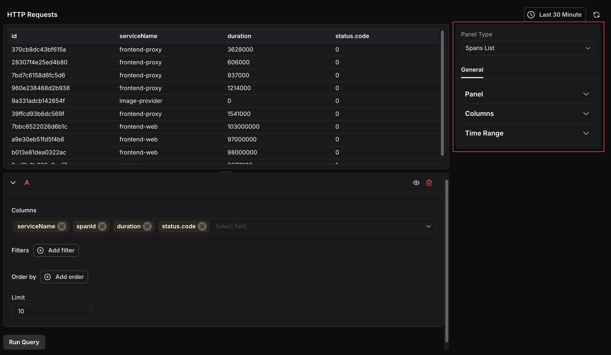
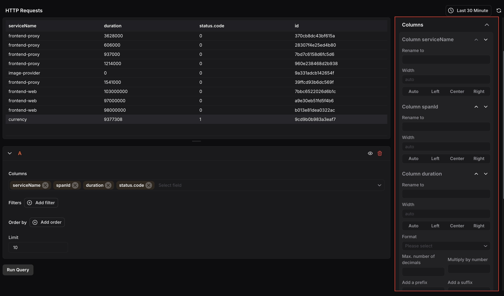

The Spans List Panel displays a list of spans generated for the selected time range. The list can be filtered based on available attributes, and you can choose which columns to display from your span data.

When the panel type is set to Spans List, the following settings are available under the **General** tab:

### Panel
- **Name:**Enter a name for your panel. This appears as the panel title on the dashboard.
- **Description:**Enter a description to provide additional context about what the panel displays.

### Columns 
Configure the appearance of each column in the spans table. Each column selected in the query can be expanded to set a custom display name using Rename to, and a Width with alignment options (Auto, Left, Center, or Right). For numeric columns such as duration, you can also set a Format, maximum number of decimal places, a multiplier, and a prefix or suffix. Columns correspond to the fields selected in the query, such as serviceName, spanId, duration, and status.code.

### Time Range
Configure time range behavior for this panel independently from the dashboard.

- **Override Dashboard Time Range:** Individual panels can use their own time range configuration. Enable this to override the time range set at the dashboard level.
- **Time Shift:** Shift the panel’s start and end time by a specified time shift expression. Use the minus (`-`) operator to subtract time, with the same units supported by the dashboard time range expressions. 

Refer to [Time Range Expressions and Settings](<./Time Range Expressions and Settings.mdx>) for supported units and syntax.

***

At the query level, you can select which Columns to display, filter results using Filters, sort using Order by, and control how many rows appear using the Limit field.​​​​​​​​​​​​​​​​
