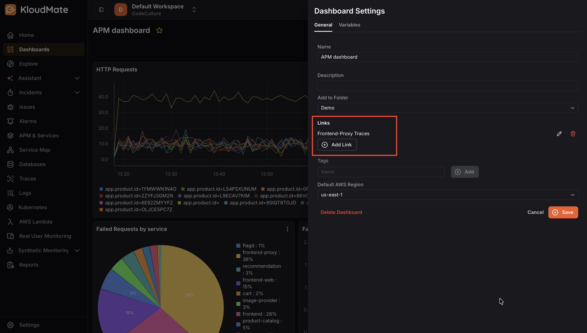
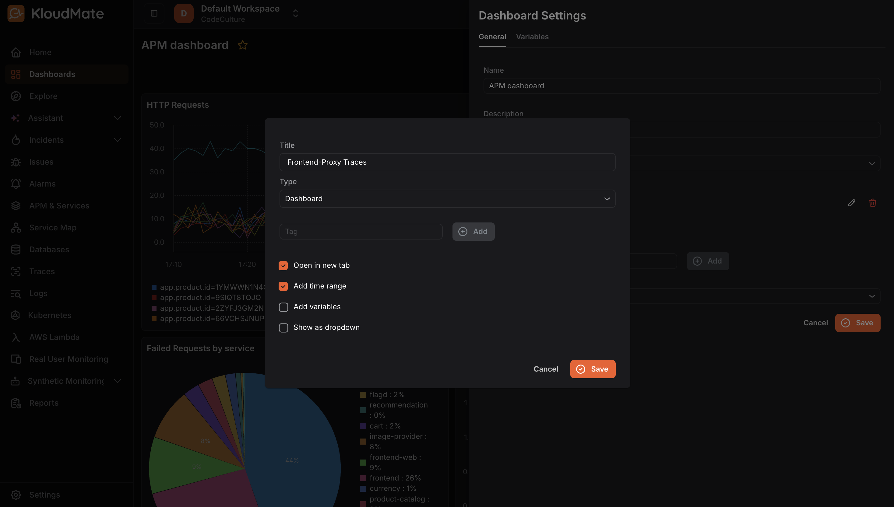
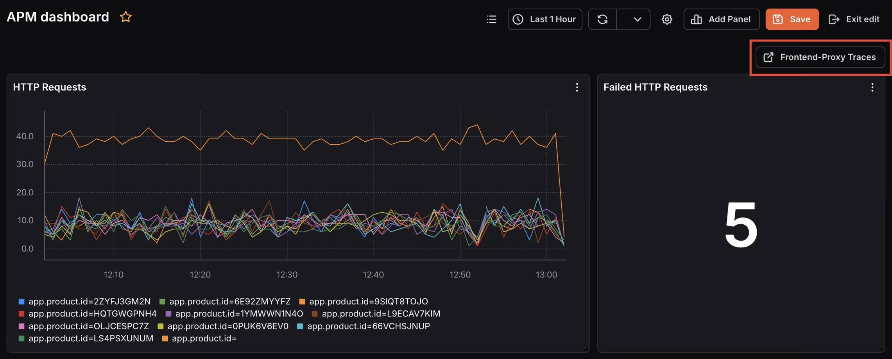
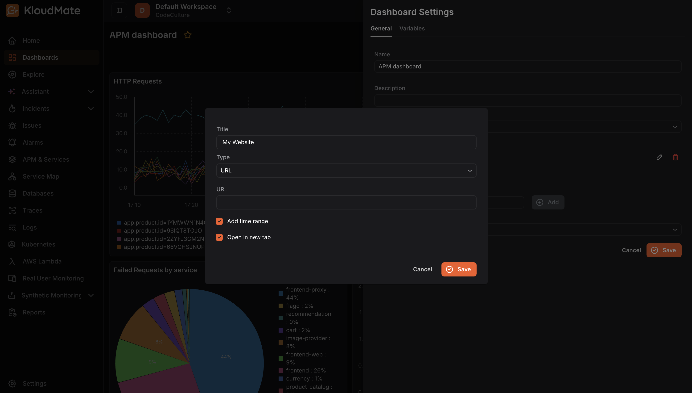
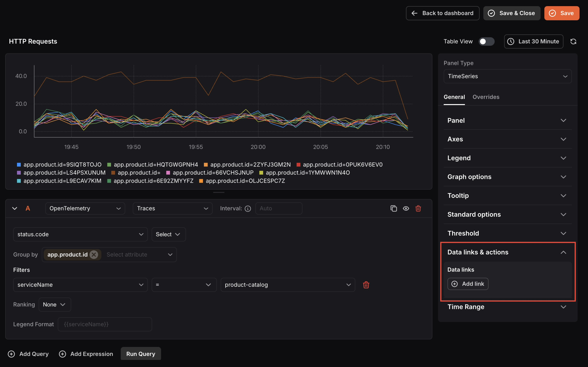
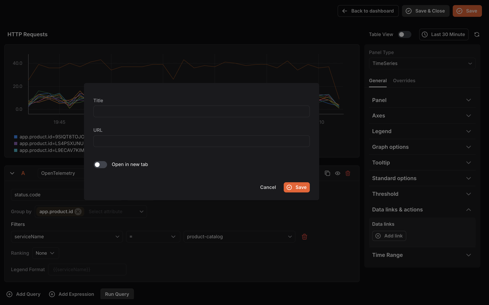

KloudMate dashboards allow adding both internal dashboard links and external URLs, helping you quickly navigate to related resources for streamlined data analysis and correlation.

## Add a Dashboard Link

To add a link to another KloudMate dashboard:

**Step 1:**Navigate to the dashboard where the link will be added.**Step 2:**Open **Dashboard Settings**and click on the**General** tab.

**Step 3:**Click**Add Link**.

**Step 4:**Enter a**Title**for your link.**Step 5:**Select **Dashboard**as the link type from the dropdown.**Step 6:**Optionally, add a **Tag**to reference the target dashboard.**Step 7:**Select from the available options:

- **Open in new tab:** Opens the linked dashboard in a separate browser tab.
- **Add time range:** Transfers the time range selected in the main dashboard to the linked dashboard.
- **Add variables:** Transfers variables from the main dashboard to the linked dashboard if the same variables are available.
- **Show as dropdown:**Displays multiple dashboard links as a dropdown, useful when several links are added to the same dashboard.**Step 8:**Click **Save**.

Once saved, the link appears as a button in the top-right corner of the dashboard.

***

## Add a URL Link to a Dashboard

To add an external URL as a dashboard link:

**Step 1:**Follow steps 1–4 from Add a Dashboard Link.

**Step 2:**Select**URL**as the link type from the dropdown.**Step 3:**Enter the desired URL in the URL field.**Step 4:**Select from the available options:

- **Add time range:** Transfers the dashboard’s selected time range to the linked URL if that URL supports time range filtering.
- **Open in new tab:**Opens the URL in a new browser tab.**Step 5:**Click **Save**.***

## Add a Data Link to a Panel

To add a URL link to an individual panel:

**Step 1:**Navigate to the dashboard containing the panel and open it for editing.**Step 2:**n the right-hand panel settings, scroll down to**Data links & actions**.

**Step 3:**Under Data links, click**Add link**.**Step 4: **Enter a**Title**and the**URL**for the link.**Step 5:** Toggle Open in new tab if needed.

**Step 6:**Click **Save**.
