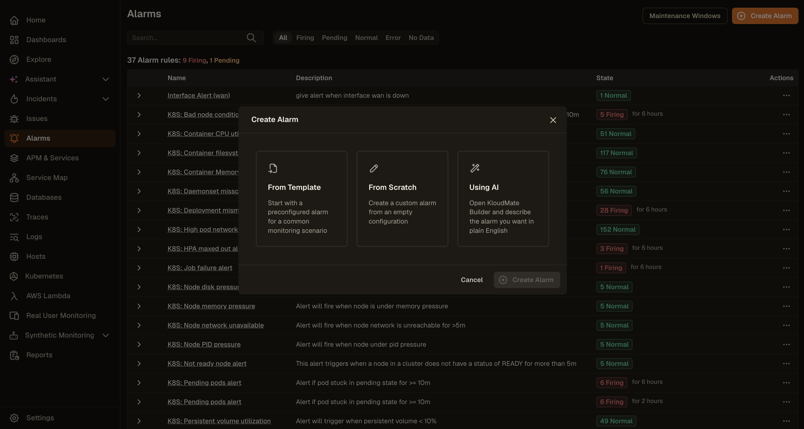
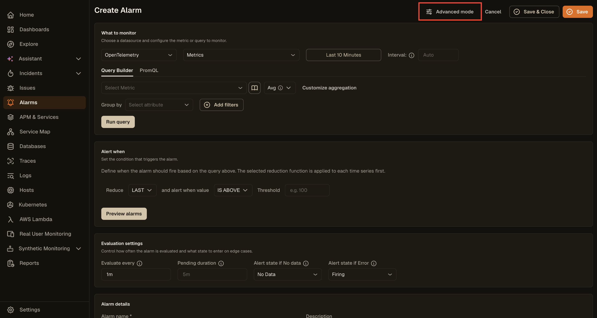

KloudMate lets users create and configure alarms for events that are critical to their application. By setting up alarms, users can monitor when certain metrics cross pre-defined thresholds and take necessary actions promptly.

## Getting Started

Navigate to the **Alarms** section from the left navigation menu.

The **Alarms** screen displays a list of all existing alarms along with their current state, name, and description. The summary at the top shows the total number of alarm rules, including how many are currently **Firing** or **Pending**.

From the **more options (⋯)** icon on any alarm, you can:

- **View** the alarm details
- **View State History** for the alarm
- **Edit** the alarm configuration
- **Duplicate** the alarm
- **Pause Evaluation** or **Pause Notifications**
- **Delete** the alarm

To learn about the key concepts of KloudMate Alarms, see the [Alarms Overview](../alarms/).

## Creating a New Alarm

Click the **Create Alarm** button at the top-right corner of the **Alarms** screen. A dialog appears with three ways to create an alarm:

- **From Template**: Start with a pre-configured alarm for a common monitoring scenario.
- **From Scratch**: Create a custom alarm from an empty configuration.
- **Using AI**: Describe the alarm you want in plain English and let KloudMate build it for you.

### From Template

Instead of building an alarm from scratch, you can start from a pre-configured template that covers common monitoring scenarios and best practices.

1. In the **Create Alarm** dialog, select **From Template**.

2. Click the **Select a template** dropdown and choose a template that matches your monitoring needs.

3. Click **Create Alarm**. The alarm is created and appears in the **Alarms** list.
4. To open and configure it, click the menu next to the alarm and select **Edit**.
5. The alarm opens pre-configured with the query, aggregation, and threshold settings from the template. Review and adjust any filters to match your environment.
6. Click **Save** or **Save & Close** when done.

### Using AI

KloudMate's assistant can automatically generate alarm queries and thresholds based on your natural language prompt.

1. In the **Create Alarm** dialog, select **Using AI**.

2. A text box appears. Describe the alarm you want to create.
3. Click **Create Alarm**. KloudMate generates the alarm configuration based on your description.
4. To review or adjust the settings, click the menu next to the alarm and select **Edit**.

### From Scratch

To build a fully custom alarm, select **From Scratch** in the **Create Alarm** dialog and click **Create Alarm**.

This opens the alarm creation form where you can choose a data source, configure the metric or query to monitor, and define the alert condition on a single page.

You can create multiple queries and expressions using the **Add Query** and **Add Expression** buttons. Each query or expression is assigned a unique alphabetical notation such as **A**, **B**, or **C**. You can duplicate any query or expression using the copy icon at the top-right corner of each block.

To access advanced query and expression options such as **Math expressions**, **Reduce**, and **Condition expressions**, click **Advanced mode** at the top of the form.

### 1. Setup Query Conditions and Expressions

#### Setting Up Query Conditions for OpenTelemetry / KloudMate

- **Data Set:** Select the dataset you want to retrieve from your data source.
- **Metric to Aggregate:** Select the metric associated with the selected dataset that you want to monitor.
- **Group By:** Enter the attributes used to group the data points.
- **Filters:** Add filters to narrow down the retrieved data points.

OpenTelemetry users can also use **Prometheus query language** to retrieve data and configure alarms.

#### Setting Up Query Conditions for AWS (CloudWatch)

- **Time Range:** Set the duration for which data should be fetched using the dropdown, or enter a custom value in seconds.
- **Region:** Select the AWS region of the service you want to monitor.
- **Namespace:** Select the AWS service namespace you want to create an alarm for.
- **Metric:** Select the metric associated with the selected namespace.
- **Statistic:** Select the statistical function to use when calculating data points.
- **Dimensions:** Optionally configure the alarm for grouped resources within the selected namespace. For example, for EC2, you can filter by autoscaling group name, image ID, instance type, and more.

Click **Run Query** to fetch data.

#### Time Range Expressions for Custom Time

Alarm query time ranges support the following:

- **Operators:** `-` for subtracting time
- **Supported values:** The same units and keywords used in dashboards
- **Examples:** `now`, `now-5m`

#### Setting Up Evaluation Expressions

Expressions let you apply logic to query results. Reference any configured query or expression using its alphabetical notation, such as **A**, **B**, or **C**. An expression can be passed as a parameter only when multiple expressions are configured.

Choose from the following expression types:

- **Math Expression:** Enter a mathematical expression to apply to the value of a query or expression. Examples: `$A+1`, `$A<$B`, `$A && $C`. For more information, see [Alarm Expressions](./expressions/).
- **Reduce:** Select a function to aggregate the values of a query or expression into a single number, then select the target query or expression from the **Input** dropdown. Available functions include `mean()`, `max()`, `min()`, `sum()`, `last()`, and `count()`.
- **Condition Expression:** Select a function and a query or expression, then choose a condition and provide a threshold value to evaluate against. You can add multiple conditions and combine them using **AND** or **OR** logical operators.

Click **Run Queries** to execute all configured queries and expressions.

:::info
To avoid the **NoData** issue when using multiple queries in a single alarm, use the `ifNull` operator to assign a default value. Read more in [Alarm Expressions](./expressions/).
:::

### 2. Configure Evaluation Settings

- **Alarm Condition:** Select the query or expression that should trigger the alarm, such as **A**, **B**, or **C**.
- **Evaluate Every:** Define how frequently the alarm condition should be evaluated, for example `1m`.
- **Pending Duration:** Define how long the alarm condition must remain true before the alarm is triggered, for example `5m`.
- **Alert State if No Data:** Select the alarm behavior when the query returns no data.
- **Alert State if Error:** Select the alarm behavior when the query returns an error.

Click **Preview Alarms** to run the query immediately and check the result.

### 3. Add Alarm Details

- **Alarm Name:** Enter a name for the alarm.
- **Description:** Add a description to help identify the alarm's purpose.
- **Responder Context:** Optionally add context to help on-call responders understand the alarm and act quickly.
- **Severity:** Add a free-form severity label such as `sev1`, `critical`, or `p1`. You can also use templates such as `{{ labels.* }}`, `{{ state.value }}`, and `{{ state.values.A }}`.
- **Dashboard:** Link a relevant dashboard for quick reference.
- **Summary:** Add a summary that will be included in notifications to provide context. It supports the same template variables as **Severity**.
- **Playbook URL:** Add an optional runbook or playbook URL with on-call instructions.
- **Custom Annotations:** Add custom key-value annotations.
- **SLA Target:** Set an SLA target for this alarm.

### 4. Add Notification Tags

Add tags to the alarm to route notifications through a matching notification policy. Each tag is a **Name/Value** pair. Click **Add tag** to add more tags. When the alarm is triggered, notifications are sent to the channels configured in the matching notification policy.

### 5. Save the Alarm

Click **Save** to save the alarm, or **Save & Close** to save and return to the **Alarms** screen. A confirmation message appears when the alarm is created successfully.

## Viewing an Alarm

To open an alarm, click the menu next to it and select **View**. This opens the alarm detail page with four tabs:

- **Overview:** Shows instance states, breaching instances with labels, reason, and duration, along with recent state transitions.
- **Instances:** Shows the full list of alarm instances and their current states.
- **History:** Shows the state change history over time.
- **Rule:** Shows the alarm configuration and query definition.
