Alarm expressions allow you to manipulate query results using math and other operations. KloudMate alarms can only target numeric data. If a query returns time series data, it must be reduced using expressions before it can be used as an alarm target.

Each query or expression is represented by a unique alphabetical notation (A, B, C, and so on). While writing an expression, one or more queries or other expressions can be passed as parameters using their notation.

## Expression Operations

KloudMate supports three types of operations in alarm expressions:
- Math expression
- Reduce
- Condition expression

### Math Expression

Math expression takes time series or number data returned by a query or an expression and turns them into different time series and numbers using mathematical operations or functions.

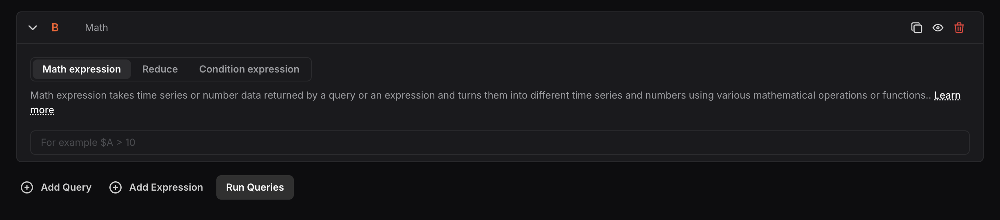

**Input:** Any mathematical operation to apply to the data returned from other queries or expressions. Queries and expressions are passed as parameters using their alphabetical notation prefixed with a dollar sign, for example, `$A`.

#### Mathematical Operations

**Arithmetic operations:**
- `++` (Increment)
- `--` (Decrement)
- `+` (Addition)
- `-` (Subtraction)
- `*` (Multiplication)
- `/` (Division)
- `%` (Modulo)
- `^` (Exponentiation)

Examples: `++$A`, `$A++`, `$A+1`, `$A-2`, `$A*2`, `$A/6`, `$A%$B`, `$A^2`

**Boolean operations:**
- `==` (Equal to)
- `!=` (Not equal to)
- `<` (Less than)
- `>` (Greater than)
- `<=` (Less than or equal to)
- `>=` (Greater than or equal to)

Examples: `$A==0`, `!$A!=0`, `$A<$B`, `$A>10`, `$A<=$D`, `$A>=$D`

**Logical operations:**
- `&&` (AND)
- `||` (OR)
- `ifNull` (If NoData)

Examples: `$A && $D`, `$A and $D`, `$A or $D`, `$A || $D`, `ifNull($A, 0)`

:::info
For the above operations:
- When both `$A` and `$B` are numbers, the operation is performed between the two numbers.
- If one parameter is a number and the other is a time series, the operation is performed between the number and each value in the time series individually.
- If both `$A` and `$B` are time series data, the operation is performed between each value in the two series having the same timestamps.
- Boolean and logical operations return `0` for false and `1` for true.
:::

#### Using Expressions for Multiple Query Conditions

When working with multiple queries in a single alarm:
- Use the Reduce function for all time series outputs (e.g., mean, max, last).
- Use the `ifNull` logic with all reduced values so that if any query returns NoData, it does not affect the evaluation of other queries.

Example: `ifNull($A, 0) > 50 || ifNull($B, 0) > 90`
- `ifNull` — checks for NoData and assigns the given value (0) to that node if true.
- `>` — arithmetic operation that checks the condition.
- `||` — logical OR operation that evaluates both query nodes.

#### Mathematical Functions
- `abs` — Returns the absolute value. E.g., `abs(-1)` or `abs($A)`
- `log` — Returns the natural logarithm. Returns NaN if the value is less than 0. E.g., `log(-1)` or `log($A)`
- `round` — Returns a rounded integer value. E.g., `round(3.123)` or `round($A)`
- `ceil` — Rounds up to the nearest integer. E.g., `ceil(3.123)` returns `4`
- `floor` — Rounds down to the nearest integer. E.g., `floor(3.123)` returns `3`

#### Built-in Time-Range Variables

To get queried data in a data-per-time-range format (e.g., data/min), divide the data by the appropriate time-range variable. The following four built-in variables are available:
- `$range:m` — Time range in minutes
- `$range:s` — Time range in seconds
- `$range:h` — Time range in hours
- `$range:d` — Time range in days

### Reduce

Reduce takes one or more time series or numbers of data returned from a query or an expression and turns them into a single number.

- **Reduction function:** Select the function to apply — `mean()`, `max()`, `min()`, `sum()`, `last()`, or `count()`.

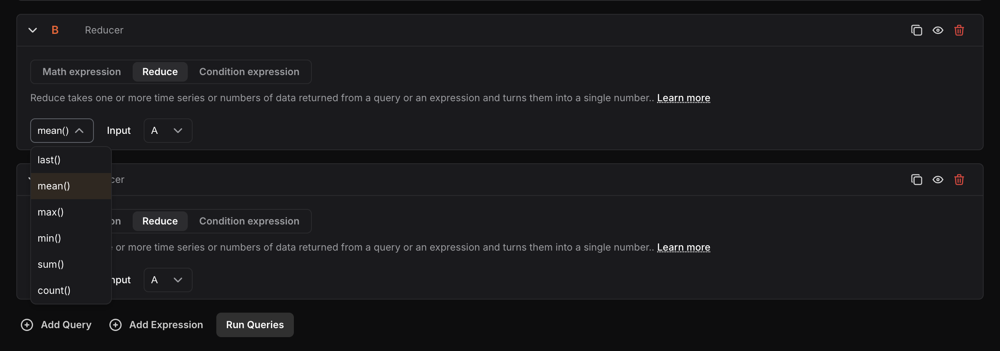

- **Input:** Select the query or expression to reduce using its alphabetical notation.

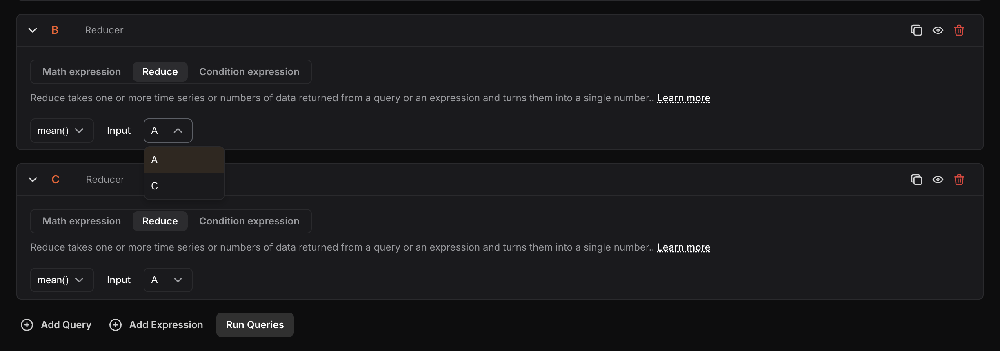

The selected reduction function aggregates the values of the query or expression into a single value.

### Condition Expression

Condition expression takes one or more time series or numbers of data returned from queries or expressions and gives a boolean value as a result — `0` (False) if the condition is not met, or `1` (True) if it is met.

- **WHEN:** Select the reduction function — `last()`, `mean()`, `max()`, `min()`, `sum()`, or `count()`.

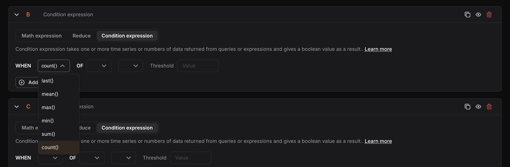

- **OF:** Select the query or expression using its alphabetical notation (e.g., A, C).

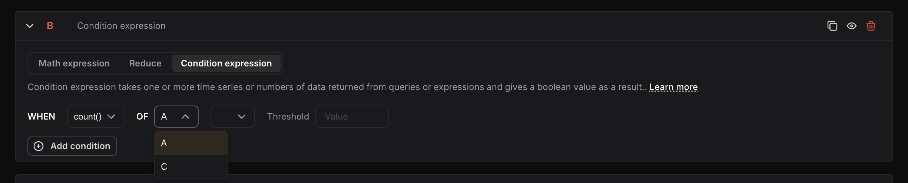

- **Condition string:** Select the comparison condition — `IS ABOVE`, `IS SAME OR ABOVE`, `IS BELOW`, or `IS SAME OR BELOW`.

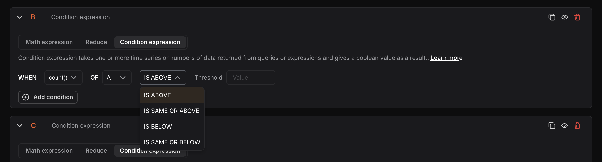

- **Threshold:** Enter the numeric value to evaluate the condition against.

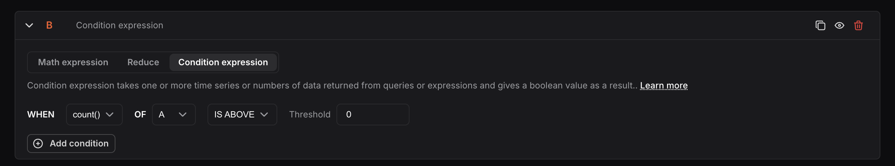

The selected reduction function is applied to the selected query or expression to generate a single value. This value is then compared against the provided threshold according to the selected condition. When the input is a collection of time series or number data, the reduction function is applied to each element individually. Each reduced output is evaluated against the condition individually, and the outputs are then combined using the AND operation.

You can add multiple conditions in a condition expression using the **Add condition** button and choose how they work together using **AND** or **OR** logical operators.

## Nodes

Nodes represent individual queries or expressions used in the creation of alarms and dashboards. Each node is assigned an alphabetical identifier by default (e.g., A, B, C), based on the order in which it was created.

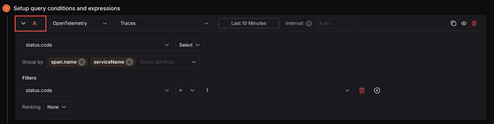

Nodes serve as a reference point, allowing users to easily identify and evaluate specific queries or expressions during data analysis.

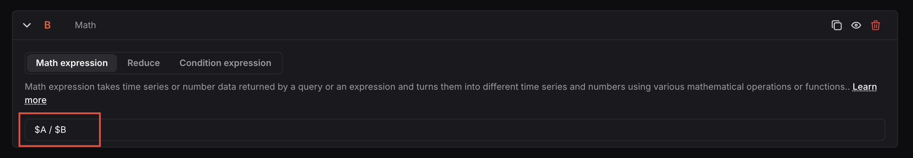

While the default alphabetical naming is applied automatically, users have the flexibility to rename nodes for better clarity and easier identification.

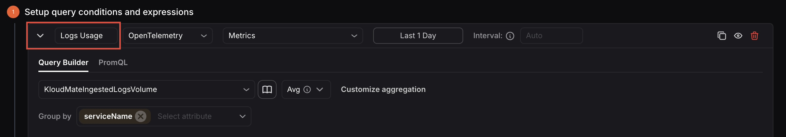

If the custom node name includes spaces, it must be enclosed in **${}**. Example: `${CPU usage}`

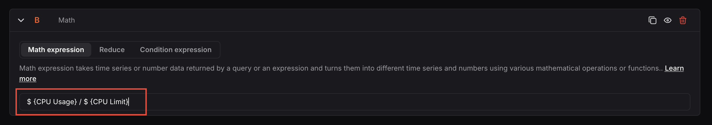
