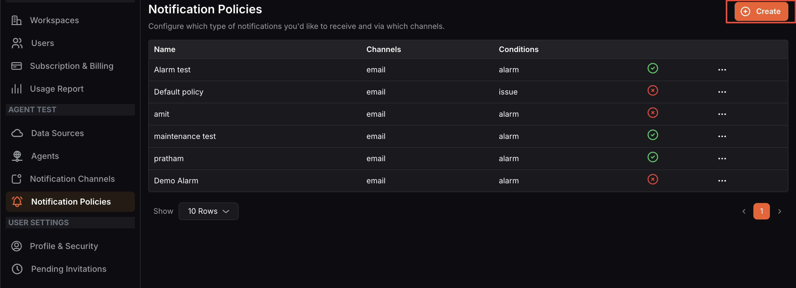
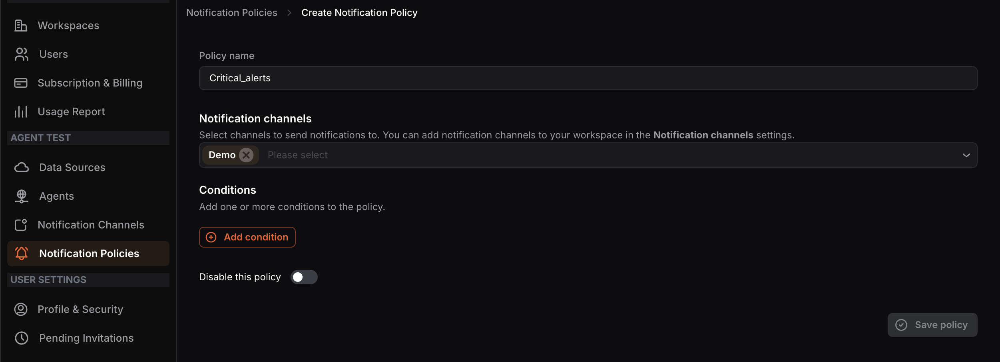
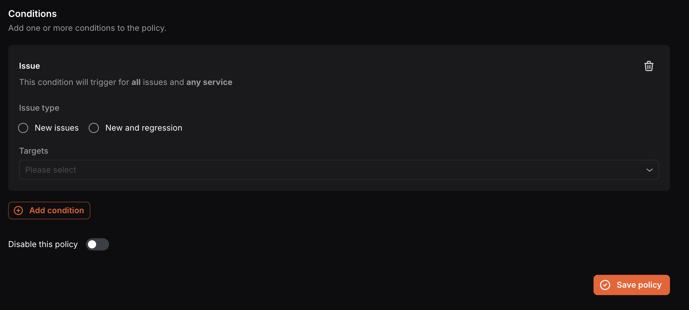

To receive notifications from KloudMate about incidents in your infrastructure, you need to set up notification policies. A notification policy configures how and where you get notified for alarms or issues. 

:::tip
Before creating a policy, ensure you have configured your preferred communication platforms. See [Notification Channels](../../platform/settings/notification-channels/) to learn how to set up Slack, Email, Webhooks, Jira, and more.
:::

:::info
In the case of multiple workspaces and AWS accounts, you must set up notifications for each account in their respective **Settings**.
:::

## How Notifications Work

1. The user creates KloudMate alarms.
2. The user configures their preferred notification channels such as Email, Slack, MS Teams, and more.
3. The user creates a notification policy, adding the alarm and the channel where they want to be notified.
4. When an alarm is triggered, the notification policy determines which notifications are sent via which channels.

## Setting Up Notification Policies

Navigate to **Settings** > **Notification Policies**. The screen displays all existing policies with their name, assigned channels, conditions, and enabled status.

1. Click the **Create** button at the top-right corner.
2. Enter a **Policy name**.
3. Select one or more Notification channels from the dropdown. The dropdown displays channels created for the same workspace you are currently working in.

4. Click **Add condition** to define when this policy should trigger. You can add multiple conditions to a single policy.

**For Alarm conditions:**
- Select the **alarm(s)** from the Select alarms dropdown.
- Optionally **add tags** (Name and Value) to match specific alarm tags. If no tags are specified, the condition will match all alarm tags.

**For Issue conditions:**
- Select the **Issue type** — New issues or New and regression.
- Select the **Target issue(s)** from the dropdown.

5. Use the **Disable this policy** toggle if you want to save the policy without activating it immediately.
6. Click **Save policy**.

:::info
You can add multiple notification channels and multiple conditions in a single notification policy.
:::

