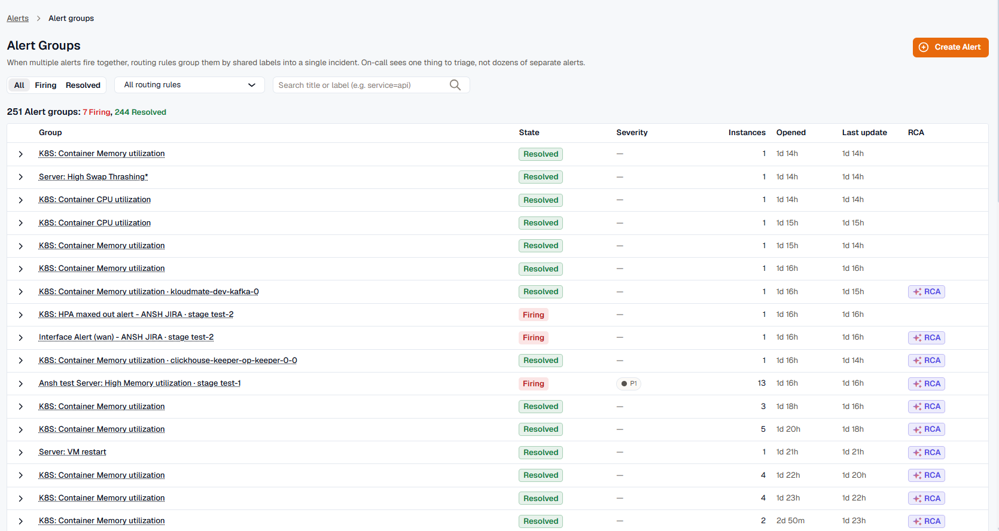
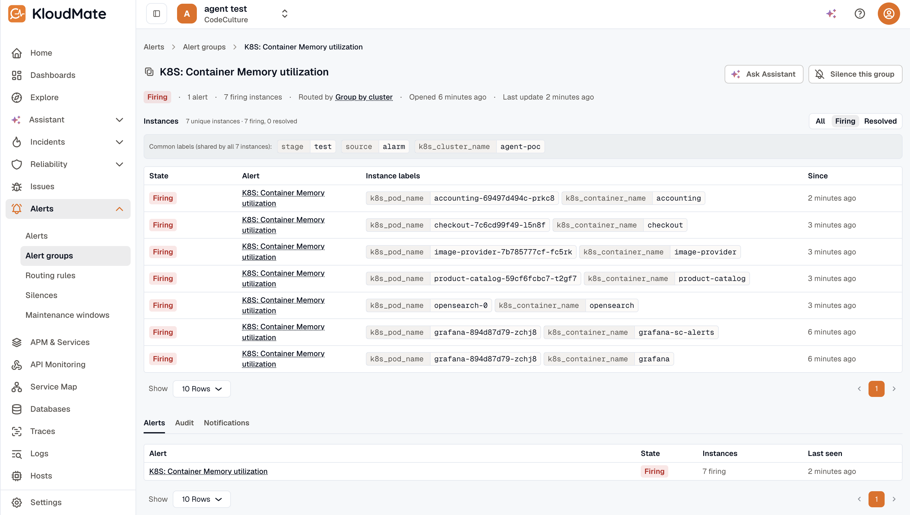

When related alerts fire close together, KloudMate groups them into a single **Alert Group**. Instead of notifying on every individual alert, you get one notification for the group, and new alerts append to it rather than fan out into separate notifications.

A group survives restarts and deduplicates against the same incident over time, so the same recurring issue keeps showing up on the same group rather than spawning a fresh one each time.

## How groups form

An Alert Group can form two ways, and both produce the same kind of group:

- **Static grouping** folds alerts together by the deterministic group-by keys on a routing rule. Alerts that share those label values land in one group.
- **Auto (AI) grouping** hands the decision to the correlation engine, which links related alerts on its own and learns which alerts tend to fire together over time.

You choose the mode per routing rule; see [Routing Rules](../routing-rules/#alert-grouping-static-or-auto-ai). However a group opened, it behaves the same everywhere else on this page. An Auto-correlated group additionally records [why its alerts were grouped](#why-these-were-grouped).

## Where to find groups

Open **Alerts → Alert groups** in the left navigation. This is the workspace-wide view of every group, open or resolved.

{/* TODO: re-capture — Alert Groups list with the Labels and Signals columns gone: Group, State, Instances, Opened, Last update, and the RCA indicator. */}

Columns: **Group** (title), **State** (Open / Resolved), **Instances** (the firing-instance count), **Opened**, **Last update**, and an RCA indicator when an investigation is attached (a manual **Run RCA** or [Auto-RCA](../auto-rca/)).

Expand any row to preview that group's alerts inline: alert name, state, severity, received time, and labels, without leaving the list. The group title links straight to the full detail page.

Filters across the top:

- **State** — All / Open / Resolved toggle. Defaults to **Open**.
- **Routing rule** — dropdown filtered to rules in the workspace.
- **Label matchers** — chip input where you type `key=value`. Press Enter to add a chip.

Severity isn't a filter on the list. It lives on the per-instance alerts inside a group, not on the group itself.

## Anatomy of a group

A group carries:

- **Title** — set by the first alert that opened the group, and **immutable** after that even if a higher-severity alert joins later. A lock icon next to the title marks this; hovering it reads *"Set by first alert — cannot be changed."*
- **State** — `Open` while at least one underlying instance is firing; `Resolved` once everything quiets. A firing group whose firing instances are **all silenced** stays `Open` but carries a **Muted** badge (*"Firing, but all instances are silenced — notifications muted"*). Muting gates notifications; it doesn't resolve the group.
- **Labels** — the labels that define the group, read from the alerts that joined it (the group-by keys, in Static mode).
- **Alerts and instances** — how many distinct alerts and firing instances the group holds so far, shown as *"N alerts · N firing instances"*.
- **Routing rule** — the rule that opened the group.
- **Group ID** — the durable identifier you can share with teammates or paste into the assistant.
- **Correlation reason** — for an Auto-correlated group, why these alerts were grouped. See [Why these were grouped](#why-these-were-grouped).
- **Investigation** — a root-cause investigation, when one is attached. Start it manually with **Run RCA**, or automatically with [Auto-RCA](../auto-rca/); see [Run RCA and View RCA](#run-rca-and-view-rca).

Severity isn't a single group-level field. Each underlying instance carries its own severity, which you read on the **Firing instances** panel and the **Alerts** tab.

## Group detail

Click any row to open the group detail page.

{/* TODO: re-capture — Alert Group detail: header with the Run RCA / View RCA button, the meta strip reading "N alerts · N firing instances" plus a correlation chip, and the bottom "Why these were grouped" and "Was this grouping correct?" sections. */}

### Header

- **Title** with a lock icon (hover: *"Set by first alert — cannot be changed"*).
- **Run RCA / View RCA** — starts or opens a root-cause investigation for the group. See [Run RCA and View RCA](#run-rca-and-view-rca).
- **Ask KloudMate Assistant** — opens the assistant chat panel with the group's labels, state, alert and instance counts, and routing rule pre-loaded into the prompt, so you can jump into investigation without retyping context.
- **Silence this group** — opens the silence creator pre-filled with the group's labels as matchers and bound to the group via `auto_expire_group_id`.

### Meta strip

Below the title: the state chip, the counts (*"N alerts · N firing instances"*), a correlation chip when the group was Auto-correlated (see [Why these were grouped](#why-these-were-grouped)), Opened relative time, Resolved relative time when applicable, and Last update relative time.

### Labels, routing rule, and Group ID

A bordered card directly under the meta strip shows:

- **Labels** — the group's label chips. Internal and per-instance keys are filtered out here, so you see the labels that actually defined the group.
- **Routing rule** — a link to the rule that opened the group.
- **Group ID** — monospace, for sharing or pasting into tooling.

### Firing instances

The **Firing instances** panel is the dominant body section. It's a table of the unique alert instances that joined this group, deduplicated by the per-instance labels the grouping engine uses.

- **Common labels bar** at the top — labels shared by every instance, so the per-row labels column only shows what varies. Internal keys are hidden from this bar and from the per-instance labels.
- **Columns**:
  - **State** — the instance's current state: **Firing**, **No Data**, **Error**, or **Resolved**. Silenced instances are flagged as muted, so you can see at a glance which ones are firing but suppressed.
  - **Alert** — the alert rule name. Links to the rule when the alert is KloudMate-native (carries an `alarm_id` label).
  - **Instance labels** — the labels that distinguish this instance from siblings (common labels are stripped out).
  - **Severity** — the per-instance severity, if the alert carries one.
  - **Since** — how long this instance has been in its current state.
- A summary above the table reports the alert and instance counts with a per-state breakdown, for example *"2 alerts · 7 instances · 4 firing, 3 resolved"*.

Use this panel to see what's firing inside the group at a glance — for example, service A's `prod` and `staging` are firing while `dev` has already recovered.

### Run RCA and View RCA

The group header carries a single root-cause button, and its label reflects whether an investigation is attached yet:

- **Run RCA** — shown when no investigation is attached. It starts a root-cause investigation for the group on demand.
- **View RCA** — shown once an investigation is attached. It opens a side drawer with the root-cause summary and a **View full investigation** link.

This is the manual trigger. To investigate every group a rule opens automatically instead, enable [Auto-RCA](../auto-rca/) on the routing rule; an Auto-RCA result surfaces through the same **View RCA** drawer.

{/* TODO: capture — the View RCA drawer opened from a group header, showing the root-cause summary and the View full investigation link. No existing image. */}

### Tabs

- **Alerts** — every underlying alert as a row. Columns: Alert (linked to the rule when available), State, Severity, Received at, Labels. Use this when you need the raw event-by-event stream rather than the instance-level rollup.
- **Audit** — a vertical timeline of everything that happened to the group: opened, alerts appended, silence applied, notification dispatched, resolved. Auto-correlated groups also log correlation events here — **"Group opened by AI"** and **"Alert correlated into group"**.
- **Notifications** — per-channel dispatch outcomes (ok / failed / suppressed-by-silence), with deep links to where the notification landed: Slack thread URL, Jira ticket, KloudMate Incidents incident, and so on.

### Why these were grouped

When the correlation engine groups more than one alert, it records why. That reasoning surfaces in two places:

- A **correlation chip** in the header meta strip, labeling the strongest reason at a glance.
- A **Why these were grouped** section at the bottom of the detail page, with the reason in plain English, the shared labels, and supporting detail.

The chip label tells you which kind of link the engine found:

| Chip | What it means |
|---|---|
| **Shared attribute** | These alerts share an identifying attribute. |
| **Co-occurring history** | These alerts have fired together before. |
| **Known cascade** | A known cause-and-effect cascade links these resource types. |
| **Topology** | These resources are connected in the dependency graph. |
| **AI** | The correlation engine grouped these alerts by combining several weaker links. |

The chip and section only appear when the engine actually correlated more than one alert. A lone alert the engine evaluated and left on its own shows no chip, which is expected (see [Cold start](#cold-start)).

### Cold start

A brand-new or quiet workspace has little co-occurrence history for the engine to learn from, so it leaves most alerts as separate singletons with no correlation chip. That's expected, not a failure. Correlation strengthens over the following days as the engine sees which alerts tend to fire together.

### Was this grouping correct?

Under the reason, a **Was this grouping correct?** control takes feedback with **Correct** and **Wrong**.

Choosing **Wrong** lets you point at the specific alert that doesn't belong, or mark the whole group as wrong. That feedback trains the correlation engine: a **Wrong** verdict makes it less likely to pair those alerts again, and **Correct** reinforces the grouping. Feedback appears only on Auto-correlated groups, since a Static group has no engine decision to correct.

## When a group resolves

KloudMate marks a group `Resolved` once every underlying instance has resolved and a short flap-grace period has elapsed (a few minutes, long enough to absorb instances that flap rapidly without closing the group prematurely). Resolved groups stay in the list under the **Resolved** filter and remain searchable indefinitely.

## Related

- [Routing Rules](../routing-rules/) — define which alerts a group accepts, and whether it groups by keys (Static) or by the correlation engine (Auto).
- [Silences](../silences/) — suppress notifications for matching labels.
- [Auto-RCA](../auto-rca/) — automatic investigations on group open.
