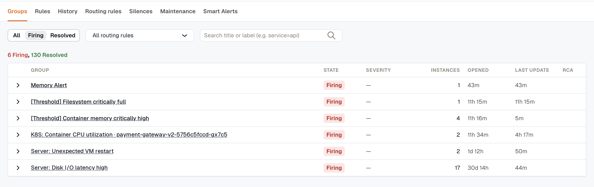
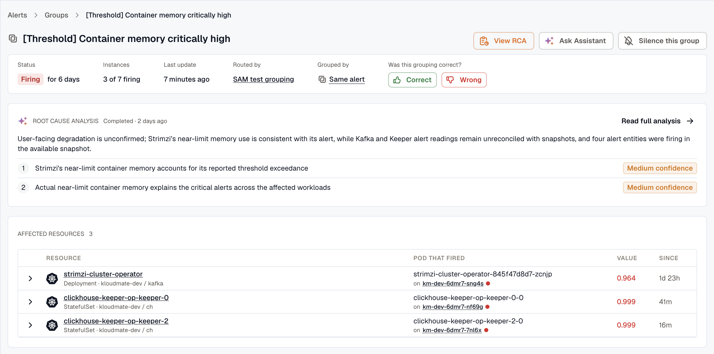
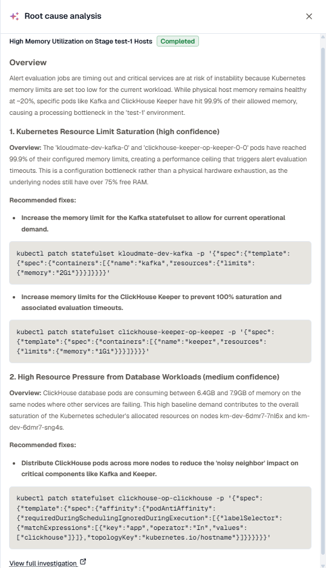
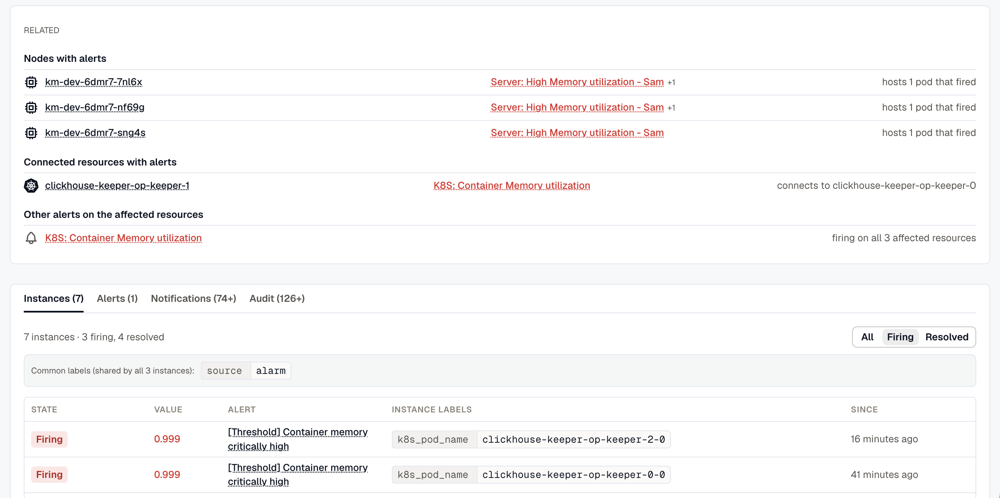
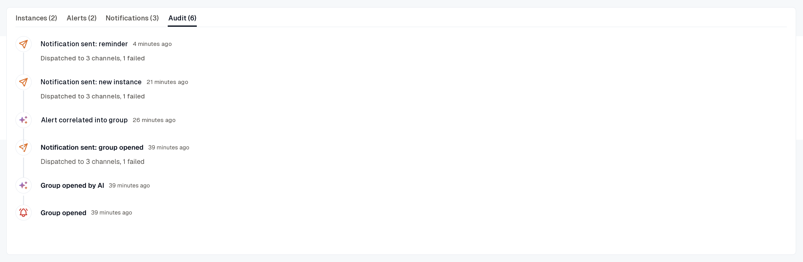

When related alerts fire close together, KloudMate groups them into a single **Alert Group**. Instead of notifying on every individual alert, you get one notification for the group, and new alerts append to it rather than fan out into separate notifications.

## How groups form

An Alert Group forms by static grouping or by the AI correlation engine. Both produce the same kind of group:

- **Static grouping** folds alerts together by the deterministic group-by keys on a routing rule. Alerts that share those label values land in one group.
- **Auto (AI) grouping** hands the decision to the correlation engine, which links related alerts on its own and learns which alerts tend to fire together over time.

You choose the mode per routing rule; see [Routing Rules](../routing-rules/#alert-grouping-static-or-auto-ai). For how membership is decided in each mode, and why a single rule firing on many hosts stays one Auto group, see [How Alert Grouping Works](../how-alert-grouping-works/). However a group forms, it behaves the same everywhere else on this page. An Auto-correlated group also records [why its alerts were grouped](#grouped-by).

## Where to find groups

Open **Alerts**, which starts on the **Groups** tab: the workspace-wide view of every group, firing or resolved.

Above the list, a summary shows how many groups are firing and how many are resolved, such as **6 Firing, 130 Resolved**.

Columns: **Group** (title), **State** (**Firing** or **Resolved**), **Severity**, **Instances** (the number of unique instances in the group), **Opened**, **Last update**, and **RCA** when an investigation is attached (a manual **Run RCA** or [Auto-RCA](../auto-rca/)).

Expand any row to preview that group's alerts inline, with each alert's state, instance counts, and when it was last seen. The group title links straight to the full detail page.

Filter the list by:

- **State:** **All**, **Firing**, or **Resolved**. Defaults to **Firing**.
- **Routing rule:** a single rule, or **All routing rules**.

To find a group by title or by a label such as `service=api`, use the search box. On the **Resolved** and **All** filters, the search matches titles only.

Severity isn't a filter on the list.

## Anatomy of a group

A group carries:

- **Title:** for a **Static** group, the rendered **Title** annotation when every instance that opened the group renders the same text, and otherwise the name of the alert that opened it. An **Auto (AI)** group gets its title from the correlation engine. See [Set a custom notification title](../annotations-and-severity/#set-a-custom-notification-title).
- **Severity:** the most severe **Severity** annotation among the instances that opened the group.
- **State:** **Firing** while at least one underlying instance is firing, and **Resolved** as soon as none is. A firing group whose firing instances are **all silenced** stays **Firing** and is marked **Muted**. Muting gates notifications; it doesn't resolve the group.
- **Labels:** the labels that define the group, read from the alerts that joined it (the group-by keys, in Static mode).
- **Alerts and instances:** how many distinct alerts and firing instances the group holds so far.
- **Routing rule:** the rule that opened the group.
- **Group ID:** the durable identifier you can share with teammates or paste into the assistant.
- **Grouped by:** for an Auto-correlated group, why its alerts were grouped. See [Grouped by](#grouped-by).
- **Investigation:** a root-cause investigation, when one is attached. Start it manually with **Run RCA**, or automatically with [Auto-RCA](../auto-rca/); see [Run RCA and View RCA](#run-rca-and-view-rca).

## Group detail

Click a group's title to open its detail page.

### Header

- **Run RCA / View RCA:** starts or opens a root-cause investigation for the group. See [Run RCA and View RCA](#run-rca-and-view-rca).
- **Ask Assistant:** opens the assistant chat panel with the group's labels, state, alert and instance counts, and routing rule pre-loaded into the prompt, so you can start investigating without retyping context.
- **Silence this group:** opens the silence creator with matchers derived from the group, bound to the group so the silence lifts when the group resolves. The binding sets when the silence ends, not what it mutes: the silence covers any alert in the workspace whose labels match its matchers, group member or not. See [From an Alert Group](../silences/#from-an-alert-group).

### Facts

The row under the title shows the group's **Status** and how long it has been in that state, how many **Instances** are firing, the **Last update**, and the routing rule under **Routed by**. Click the rule to open it.

On an **Auto (AI)** group with more than one instance, the row also shows the **Grouped by** reason and the **Was this grouping correct?** buttons. A **Static** group has neither.

### Grouped by

**Grouped by** shows the strongest reason the correlation engine put these alerts together: **Same alert**, **Shared label**, **Fired together**, **Known cascade**, **Topology**, or **AI**. For what each reason means, see [Why alerts group in Auto mode](../how-alert-grouping-works/#why-alerts-group-in-auto-mode).

Hover over the reason to see the details: a sentence that explains the grouping, the likely root resource when there is one, the labels the alerts share, and any further reasons. For example, a group can show "Fired together 14 times in the last 30 days" or "Alerts on directly connected resources: pods and deployments."

### Cold start

A new workspace has little co-occurrence history for the engine to learn from, so it leaves most alerts as separate groups of one, with no **Grouped by** reason. That's expected. Correlation strengthens over the following days as the engine sees which alerts tend to fire together.

### Rate the grouping

Under **Was this grouping correct?**, click **Correct** or **Wrong**. When you click **Wrong**, pick the alert that doesn't belong, or mark the whole group as wrong.

Your answer trains the correlation engine: a **Wrong** answer makes it less likely to pair those alerts again, and **Correct** reinforces the grouping. The current group doesn't change.

### Run RCA and View RCA

The root-cause button's label depends on whether an investigation is attached:

- **Run RCA:** shown when no investigation is attached. It starts a root-cause investigation for the group on demand.
- **View RCA:** shown once an investigation is attached. It opens the full analysis in a side panel, with a link to the full investigation.

When an investigation is attached, a **Root cause analysis** card appears under the facts row. It gives a short overview and the numbered findings, each with its confidence, such as **Medium confidence**. Click **Read full analysis** to open the side panel.

This is the manual trigger. To investigate every group a rule opens automatically instead, enable [Auto-RCA](../auto-rca/) on the routing rule. The result appears in the same card and under **View RCA**.

### Affected resources

**Affected resources** lists the resources that the group's alerts are about, one row per resource. The resource that started firing first is at the top, because in a cascade the first to fire is usually the closest to the cause.

Each row shows the resource, its type, and where it runs, such as a Kubernetes cluster and namespace. For a Kubernetes workload, **Pod that fired** shows the pod and the node it runs on. A red dot next to the node means the node has alerts of its own. Hover over the dot to see them.

Expand a row to see what the resource connects to, grouped by relation, such as **Runs on** or **Talks with**, with how many of those resources are alerting. A connected resource that belongs to this group is marked **In this group**.

If an alert doesn't match any resource, it's counted under the table. Hover over the count to see why.

### Related alerts and resources

The **Related** card lists clues to the cause from around the affected resources:

- **Nodes with alerts:** nodes that run a pod that fired and have alerts of their own.
- **Connected resources with alerts:** resources that the affected resources connect to and that have alerts of their own. Resources that the affected resources depend on come first, because they're more likely to be the cause.
- **Other alerts on the affected resources:** alerts outside this group that are firing on the same resources.
- **Shared resources with no alerts:** resources that two or more affected resources connect to, such as a database that two workloads both talk to.

When a tooltip on this page lists alert rules, click a rule to open it in a new tab.

### Tabs

Each tab shows how many items it holds, such as **Instances (7)**.

- **Instances:** every unique alert instance in the group. See [Instances](#instances).
- **Alerts:** one row per alert rule in the group, with its state, how many of its instances are firing, and when it was last seen. The alert name links to its rule when the alert is KloudMate-native.
- **Notifications:** every notification sent for the group, reminders included, with each channel's result and a link to where it landed: the Slack thread, the Jira ticket, the KloudMate Incidents incident, and so on.
- **Audit:** a timeline of the group's history, from when it opened to when it resolved. It records each notification and reminder sent, notifications suppressed by a silence or skipped, and investigations. For Auto-correlated groups, it also logs when the engine opened the group and when it correlated each alert.

### Instances

The **Instances** tab lists the unique alert instances in this group. It opens on the **Firing** instances, or on **All** of them when the group is resolved. Filter it by **All**, **Firing**, or **Resolved**.

- **Common labels:** labels shared by every instance, so the per-row labels column only shows what varies.
- **Columns:**
  - **State:** **Firing** or **Resolved**. Instances muted by a silence or maintenance window are also marked **Muted**, so you can see at a glance which ones are firing but suppressed.
  - **Value:** the last evaluated value behind the instance's state.
  - **Alert:** the alert rule name. Links to the rule when the alert is KloudMate-native (carries an `alarm_id` label).
  - **Instance labels:** the labels that distinguish this instance from its siblings (common labels are stripped out).
  - **Since:** how long this instance has been in its current state.

Use this tab to see what's firing inside the group at a glance. Switch to **All** to see, for example, that service A's `prod` and `staging` are firing while `dev` has already recovered.

## When a group resolves

KloudMate marks a group **Resolved** as soon as none of its instances is firing. If a matching alert fires again after that, it opens a new group. Resolved groups stay in the list under the **Resolved** filter.

## Related

- [Routing Rules](../routing-rules/): define which alerts a group accepts, and whether it groups by keys (Static) or by the correlation engine (Auto).
- [Silences](../silences/): suppress notifications for matching labels.
- [Auto-RCA](../auto-rca/): automatic investigations on group open.
