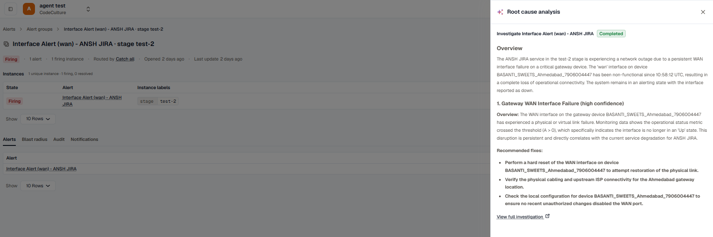

Auto-RCA hands an [Alert Group](../alert-groups/) to KloudMate's AI investigator the moment it opens, so by the time you open the group there's already a root-cause summary waiting. You enable it per [Routing Rule](../routing-rules/); every group the rule produces gets investigated.

Auto-RCA is the automatic trigger: it runs on every group a rule opens, without anyone asking. You can also start an investigation manually on any group with the **Run RCA** button. Once an investigation attaches, the button becomes **View RCA** and opens it in a side drawer. See [Run RCA and View RCA](../alert-groups/#run-rca-and-view-rca).

## How it works

When a routing rule with Auto-RCA enabled opens a group, KloudMate schedules an investigation after the configurable **Auto-RCA delay** (default: 5 minutes). The delay gives related alerts time to fold into the group so the investigation sees the full picture, not only the first alert.

When the investigation completes, its summary attaches to the group:

- On the group detail page, the header's RCA button becomes **View RCA**. Opening it shows the root-cause summary and a **View full investigation** link. See [Run RCA and View RCA](../alert-groups/#run-rca-and-view-rca).
- The notifications dispatched from the group include the investigation summary, where the channel format supports it: a Slack thread reply, a KloudMate Incidents comment, and so on.

:::note[One investigation per group]
Auto-RCA runs only once per alert group, when the group is first opened. Alerts that later join an existing group (for example, a Memory alert folding into a group that a CPU alert already opened) do **not** trigger a new investigation. Those alerts still send the usual group-transition notifications, but Auto-RCA doesn't generate an additional report for them.
:::

## Enable Auto-RCA on a routing rule

1. Open **Alerts → Routing Rules** and edit the rule you want to enrich.
2. Scroll to the **Auto-RCA** section.
3. Toggle **Auto-RCA** on.
4. Set the **Delay** if the default 5 minutes isn't right. A shorter delay surfaces answers faster; a longer one captures more alerts before the investigation runs.
5. Save.

Every group this rule opens from now on triggers an investigation after the configured delay.

## When Auto-RCA is most useful

Auto-RCA works best on rules that group related alerts: a spike after a deploy, cascading errors across services, or downstream impact from an upstream incident. For very narrow per-host or per-instance rules, the investigation has less to work with, and you may prefer to disable it to reduce compute usage.

## Related

- [Routing Rules](../routing-rules/): where the Auto-RCA toggle lives.
- [Alert Groups](../alert-groups/): where the investigation surfaces.
- [KloudMate Assistant](../../kloudmate-assistant/): the broader investigator surface.
