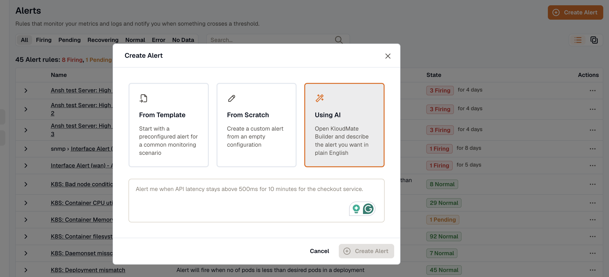
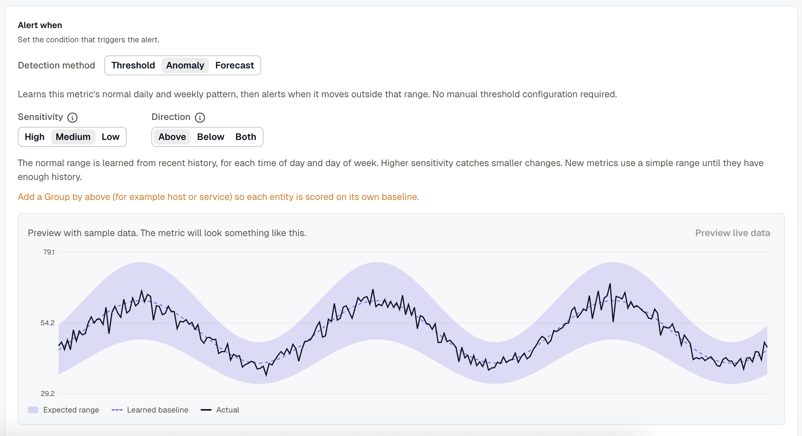
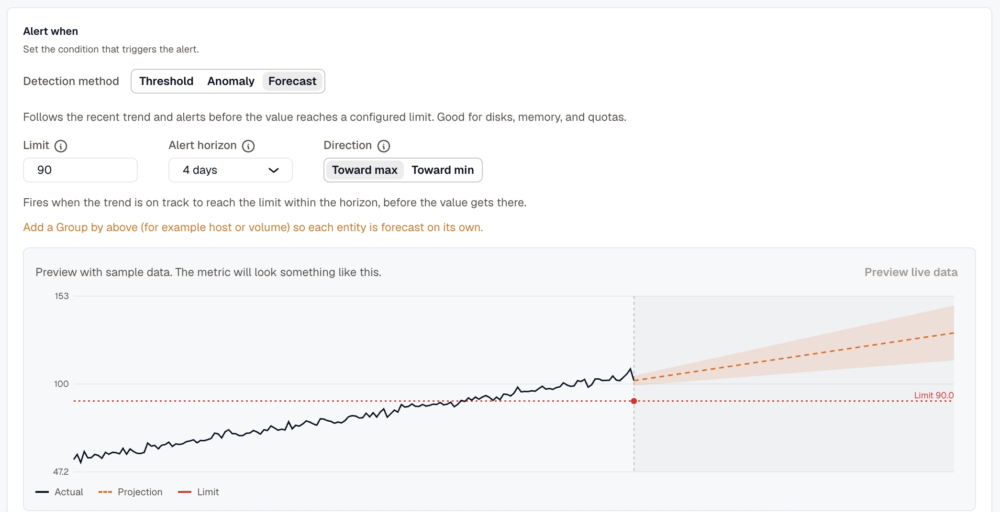

An alert watches a query, evaluates a condition, and when the condition holds long enough, fires into the grouping and routing engine so the right people get notified. This page walks through creating one, step by step.

## Getting started

Open the **Alerts** section from the left navigation.

The **Alerts** screen lists your alert rules with their current state, name, and description. A summary at the top shows how many rules you have, and how many are currently **Firing** or **Pending**. You can group rules into [Folders](../folders/), which appear as collapsible header rows.

From the **more options (⋯)** icon on any rule, you can:

- **Edit** the rule configuration
- **Duplicate** the rule
- **Move to folder** to move the rule into a different [folder](../folders/)
- **View state history** for the rule
- **Pause Evaluation** or **Pause Notifications**
- **Delete** the rule

**Pause Notifications** creates a temporary [silence](../silences/) scoped to this alert: the rule keeps evaluating, but KloudMate suppresses its notifications until the silence expires. While it's paused, the rule shows a **Silenced** badge on the alerts list and its detail page; view or end the pause from **Alerts → Silences**. Add matchers to limit it to specific instances.

For the key concepts, see the [Alerts Overview](../).

## Creating a new alert

Click the **Create Alert** button at the top right of the **Alerts** screen. A dialog appears with three ways to create an alert:

- **From Template:** start with a pre-configured alert for a common monitoring scenario.
- **From Scratch:** create a custom alert from an empty configuration.
- **Using AI:** open **KloudMate Builder** and describe the alert you want in plain English.

### From Template

Instead of building an alert from scratch, start from a pre-configured template that covers a common monitoring scenario.

1. In the **Create Alert** dialog, select **From Template**.
2. Click the **Select a template** dropdown and choose a template that matches your monitoring needs.

3. Click **Create Alert**. The alert appears in the **Alerts** list.
4. To open and configure it, click the menu next to the alert and select **Edit**.
5. The alert opens pre-configured with the query, aggregation, and threshold from the template. Review it and adjust any filters to match your environment.
6. Click **Save** or **Save & Close** when you're done.

### Using AI

The KloudMate assistant generates the queries and thresholds from a plain-English prompt.

1. In the **Create Alert** dialog, select **Using AI**.
2. A text box appears. Describe the alert you want to create.

3. Click **Create Alert**. KloudMate generates the alert configuration from your description.
4. To review or adjust the settings, click the menu next to the alert and select **Edit**.

### From Scratch

To build a fully custom alert, select **From Scratch** in the **Create Alert** dialog and click **Create Alert**.

This opens the alert creation form, where you choose a data source, configure the metric or query to monitor, and define the alert condition on a single page.

Create more queries and expressions with the **Add Query** and **Add Expression** buttons. KloudMate assigns each one a letter, such as **A**, **B**, or **C**, and you can duplicate any block with the copy icon at its top right.

To reach advanced options such as **Math expressions**, **Reduce**, and **Condition expressions**, click **Advanced mode** at the top of the form.

The rule editor walks you through **Setup query conditions and expressions**, **Configure evaluation settings**, **Add alarm details**, and **Notifications**, then a final save.

### 1. Setup query conditions and expressions

#### Setting up query conditions for OpenTelemetry / KloudMate

- **Data Set:** select the dataset you want to retrieve from your data source.
- **Metric to Aggregate:** select the metric you want to monitor from that dataset.
- **Group By:** enter the attributes used to group the data points.
- **Filters:** add filters to narrow the retrieved data points.

OpenTelemetry users can also use **Prometheus query language** to retrieve data and configure alerts.

#### Setting up query conditions for AWS (CloudWatch)

- **Time Range:** set how far back to fetch data with the dropdown, or enter a custom value in seconds.
- **Region:** select the AWS region of the service you want to monitor.
- **Namespace:** select the AWS service namespace you want to alert on.
- **Metric:** select the metric from that namespace.
- **Statistic:** select the statistical function to apply when calculating data points.
- **Dimensions:** optionally scope the alert to grouped resources within the namespace. For EC2, for example, you can filter by autoscaling group name, image ID, instance type, and more.

Click **Run Query** to fetch data.

#### Time range expressions for custom time

Query time ranges support the following:

- **Operators:** `-` for subtracting time
- **Supported values:** the same units and keywords used in dashboards
- **Examples:** `now`, `now-5m`

#### Choose a detection method

In Simple mode, the **Alert when** section sets the firing condition with a **Detection method** toggle:

- **Threshold:** the classic fixed rule. Pick a reduction (such as `mean` or `max`), a comparison, and a value; the alert fires when the reduced value crosses it.
- **Anomaly:** KloudMate learns the metric's normal range for each entity and alerts when a value moves well outside it, with no threshold to set. Choose a **Sensitivity** (High, Medium, or Low) and a **Direction** (Above, Below, or Both).
- **Forecast:** KloudMate follows the recent trend and alerts before the value reaches a **Limit**, within an **Alert horizon** of 1, 4, or 7 days. Set the **Direction** toward the max or the min. Good for disks, memory, and quotas.

Add a **Group by** key (such as host or service) so each entity is scored or forecast on its own baseline. The preview shows the learned range or the projected trend; click **Preview live data** to pull this workspace's own data.

Anomaly and Forecast are the same detection [Smart Alerts](../smart-alerts/) provisions and maintains automatically for common infrastructure. Both need a plan with anomaly detection; Threshold works on any plan.

:::note
The **Detection method** toggle appears only for KloudMate metric queries. Anomaly and Forecast rely on the learned baselines KloudMate builds from your metrics, which aren't available for AWS (CloudWatch) or log and trace queries. Those sources use a **Threshold** condition.
:::

#### Setting up evaluation expressions

Expressions let you apply logic to query results. Reference any query or expression by its letter, such as **A**, **B**, or **C**. An expression can be passed as a parameter only when multiple expressions are configured.

Choose from these expression types:

- **Math Expression:** enter a mathematical expression to apply to a query or expression, such as `$A+1`, `$A<$B`, or `$A && $C`. See [Alert Expressions](../expressions/).
- **Reduce:** aggregate a query or expression into a single number with a function, then pick the target from the **Input** dropdown. Available functions include `mean()`, `max()`, `min()`, `sum()`, `last()`, and `count()`.
- **Condition Expression:** pick a function and a query or expression, then choose a condition and a threshold to evaluate against. You can add multiple conditions and combine them with **AND** or **OR**.

Click **Run Queries** to execute everything you've configured.

:::tip
To avoid the **NoData** issue when a single alert uses multiple queries, use the `ifNull` operator to assign a default value. See [Alert Expressions](../expressions/).
:::

### 2. Configure evaluation settings

This step opens with a **Folder** dropdown. Select an existing folder, or type a new name to create one inline, to organize the rule and inherit shared defaults. The folder's `interval_seconds`, `no_data_state`, and `eval_error_state` flow into the rule as defaults you can override per field. See [Folders](../folders/).

- **Alert condition:** the query or expression that triggers the alert, such as **A**, **B**, or **C**.
- **Evaluate every:** how often the alert condition is evaluated (for example, `60s` or `1m`).
- **Pending duration:** how long the condition must stay true before the alert fires (for example, `5m`). Leave empty to fire immediately.
- **Recovery period:** how long the condition must stay within threshold before the rule resolves (for example, `5m`). This stops a flapping metric from resolving and immediately re-firing. While the rule waits out this window, the instance shows as **Recovering**: still firing, not yet back to Normal. Leave empty to resolve as soon as the condition clears.
- **Alert state if No data:** which state the alert enters when the query returns no data points. Options: **Firing**, **No Data**, **Normal**, or **Error**.
- **Alert state if Error:** which state the alert enters when a query returns an error. Options: **Firing**, **Error**, or **Normal**.
- **Alert when an instance stops reporting:** track each instance the query returns, and alert when one goes silent while the others keep reporting. Turning this on also sets **Alert state if No data** to **Firing**. An **Auto-close after** field appears alongside it, controlling how long a silent instance stays tracked. See [Instance Absence Detection](../instance-absence-detection/).

:::note[How “Firing” interacts with the pending duration]
When **Alert state if No data** or **Alert state if Error** is set to **Firing**, the alert doesn't fire the instant data goes missing or a query errors. It fires only after the condition has held for the **Pending duration** above, so a brief gap or a transient error won't notify anyone, and a series that's already firing rides through the blip without resetting. Set the **Pending duration** to `0` to fire immediately instead.
:::

:::tip
For the full lifecycle, and how **Pending duration**, **Recovery period**, and the **No data** / **Error** states interact across an alert's states, see [Alert Lifecycle & States](../alert-lifecycle/).
:::

Click **Preview alerts** to run the query immediately and check the result.

:::tip
If the rule belongs to a folder with shared defaults, **Evaluate every**, **Alert state if No data**, and **Alert state if Error** show placeholder values inherited from the folder. Leave them blank to keep inheriting, or type a value to override. A small **Reset to folder default** link appears under any field you've overridden.
:::

### 3. Add alarm details

Set the alert's name and description, then fill in the responder context:

- **Alert name:** a name for the alert.
- **Description:** a short description of the alert's purpose.

**Responder context** is a labeled section that holds the annotations responders see when the notification lands. The hint above it reads, for example, *"Help on-call responders understand the alarm and act quickly."*

- **Severity:** free-form severity (for example, `sev1`, `critical`, or `p1`). Supports Liquid templates, so severity can depend on the firing value.
- **Summary:** multiline message included in notifications. Supports templates.
- **Dashboard:** optional dashboard link surfaced with the notification.
- **Panel:** when you pick a dashboard, narrows the link to a specific panel.
- **Playbook URL:** optional runbook URL.

**Custom annotations** is a collapsed accordion at the bottom. Open it to add your own key-value pairs (for example, `service_owner` or `region`). Values support Liquid templates. See [Annotations & Severity](../annotations-and-severity/).

### 4. Notifications

The Notifications step controls how this alert flows into the grouping engine. Routing rules match on **labels**, not free-form tags:

- **Labels:** key/value pairs attached to each alert this rule fires. Add them with **Add label**, or leave the list empty. Routing rules match on these labels, plus the reserved `alarm_id`, `alarm_rule_folder_id`, and per-instance query labels, to decide which channels notify and how alerts group.
- **Routing:** [Routing Rules](../routing-rules/) in **Alerts → Routing rules** match alerts by label and send them to one or more notification channels.
- **Severity:** flows through the reserved `severity` annotation from the previous step; downstream tools use it to prioritize.

If you're migrating a rule that used notification tags, it keeps working; routing now matches on labels instead.

### 5. Save the alert

Click **Save** to save the alert, or **Save & Close** to save and return to the **Alerts** screen. A confirmation appears once the alert is created.

## Viewing an alert

To open an alert, click the menu next to it and select **View**. The detail page has these tabs:

- **Overview:** instance states, breaching instances with their labels, reason, and duration, plus recent state transitions.
- **Instances:** the full list of alert instances and their current states.
- **History:** the state-change history over time.
- **Rule:** the alert configuration and query definition.
