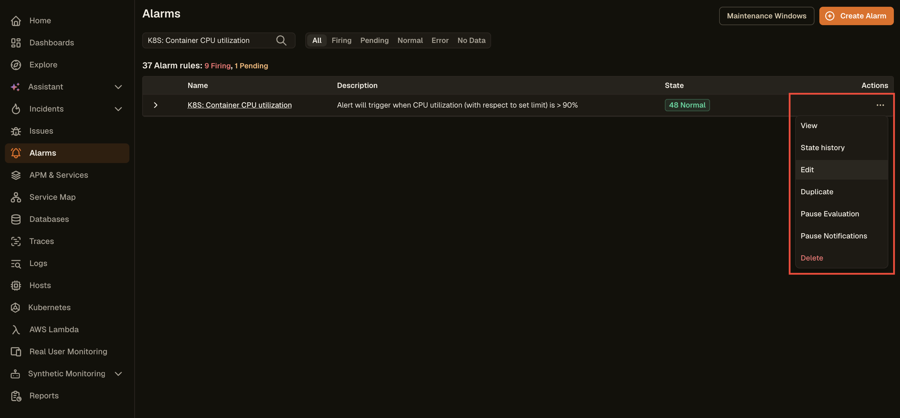
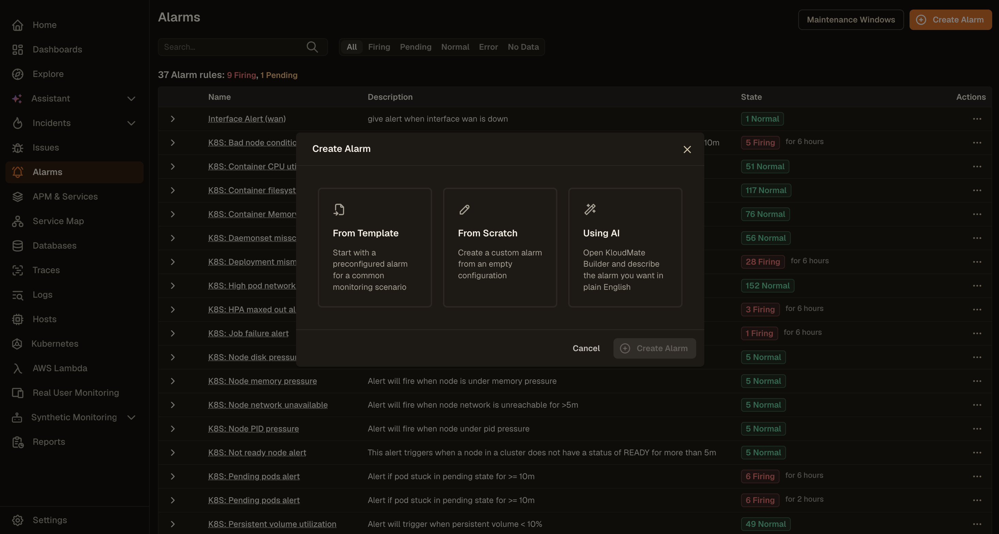
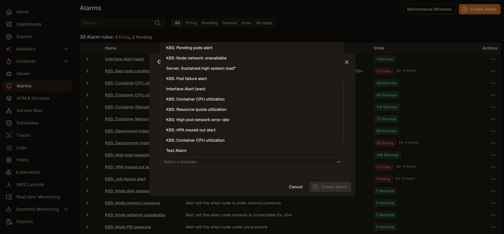
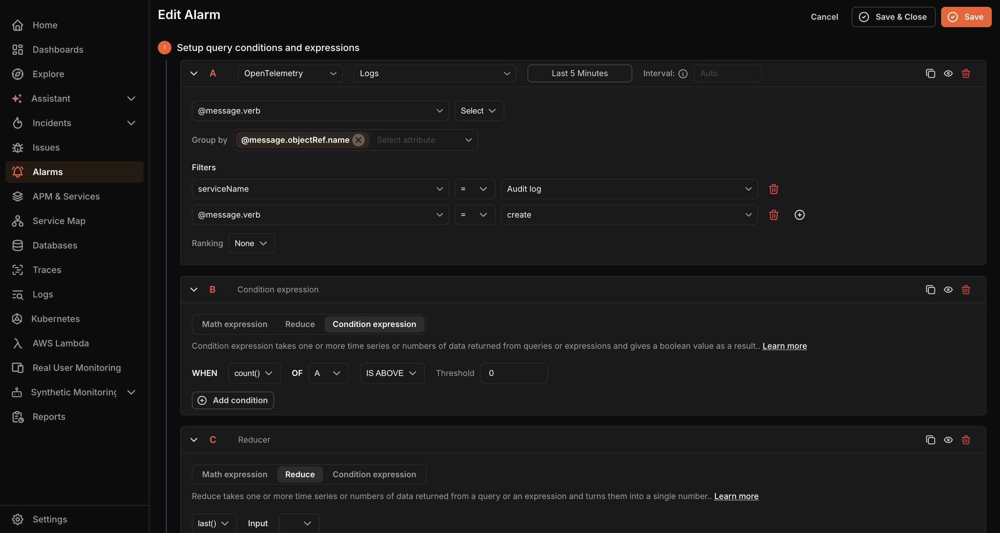
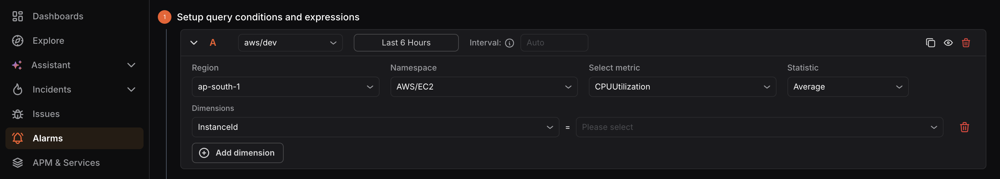
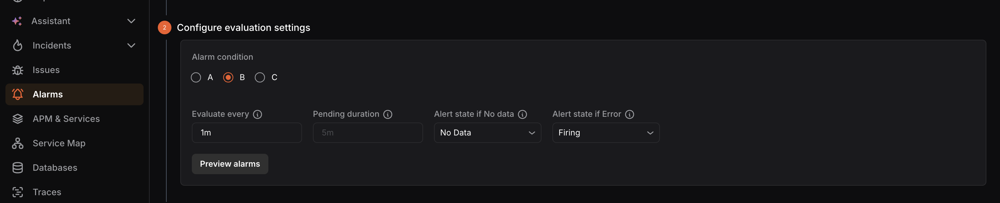
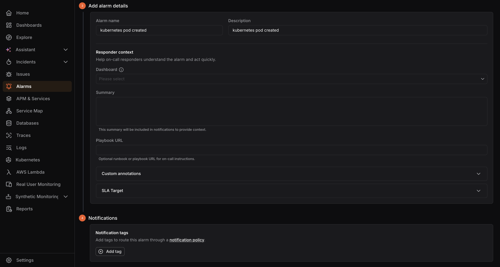
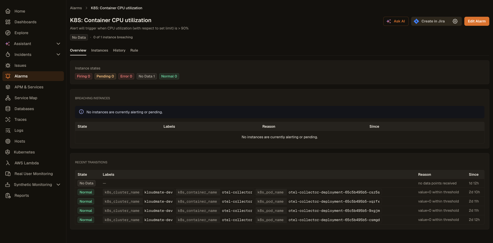

KloudMate lets you create and configure alerts for events that are critical to your application. Each alert watches a query, evaluates a condition, and — when the condition holds long enough — fires into the grouping and routing engine so the right people hear about it.

## Getting started

Navigate to the **Alerts** section from the left navigation menu.

The **Alerts** screen displays a list of all existing alert rules along with their current state, name, and description. The summary at the top shows the total number of rules, including how many are currently **Firing** or **Pending**. Rules can be grouped into [Folders](../folders/), which appear as collapsible header rows.

From the **more options (⋯)** icon on any rule, you can:

- **View** the rule details
- **View State History** for the rule
- **Edit** the rule configuration
- **Duplicate** the rule
- **Pause Evaluation** or **Pause Notifications**
- **Delete** the rule

To learn about the key concepts of KloudMate Alerts, see the [Alerts Overview](../).

## Creating a new alert

Click the **Create Alert** button at the top-right corner of the **Alerts** screen. A dialog appears with three ways to create an alert:

- **From Template** — Start with a pre-configured alert for a common monitoring scenario.
- **From Scratch** — Create a custom alert from an empty configuration.
- **Using AI** — Describe the alert you want in plain English and let KloudMate build it for you.

### From Template

Instead of building an alert from scratch, you can start from a pre-configured template that covers common monitoring scenarios and best practices.

1. In the **Create Alert** dialog, select **From Template**.
2. Click the **Select a template** dropdown and choose a template that matches your monitoring needs.

3. Click **Create Alert**. The alert is created and appears in the **Alerts** list.
4. To open and configure it, click the menu next to the alert and select **Edit**.
5. The alert opens pre-configured with the query, aggregation, and threshold settings from the template. Review and adjust any filters to match your environment.
6. Click **Save** or **Save & Close** when done.

### Using AI

KloudMate's assistant can automatically generate queries and thresholds based on your natural language prompt.

1. In the **Create Alert** dialog, select **Using AI**.
2. A text box appears. Describe the alert you want to create.
3. Click **Create Alert**. KloudMate generates the alert configuration based on your description.
4. To review or adjust the settings, click the menu next to the alert and select **Edit**.

### From Scratch

To build a fully custom alert, select **From Scratch** in the **Create Alert** dialog and click **Create Alert**.

This opens the alert creation form where you can choose a data source, configure the metric or query to monitor, and define the alert condition on a single page.

You can create multiple queries and expressions using the **Add Query** and **Add Expression** buttons. Each query or expression is assigned a unique alphabetical notation such as **A**, **B**, or **C**. You can duplicate any query or expression using the copy icon at the top-right corner of each block.

To access advanced query and expression options such as **Math expressions**, **Reduce**, and **Condition expressions**, click **Advanced mode** at the top of the form.

The rule editor walks you through four steps: **Setup query conditions and expressions**, **Configure evaluation settings**, **Add alarm details**, and **Notifications**.

### 1. Setup query conditions and expressions

#### Setting up query conditions for OpenTelemetry / KloudMate

- **Data Set:** Select the dataset you want to retrieve from your data source.
- **Metric to Aggregate:** Select the metric associated with the selected dataset that you want to monitor.
- **Group By:** Enter the attributes used to group the data points.
- **Filters:** Add filters to narrow down the retrieved data points.

OpenTelemetry users can also use **Prometheus query language** to retrieve data and configure alerts.

#### Setting up query conditions for AWS (CloudWatch)

- **Time Range:** Set the duration for which data should be fetched using the dropdown, or enter a custom value in seconds.
- **Region:** Select the AWS region of the service you want to monitor.
- **Namespace:** Select the AWS service namespace you want to create an alert for.
- **Metric:** Select the metric associated with the selected namespace.
- **Statistic:** Select the statistical function to use when calculating data points.
- **Dimensions:** Optionally configure the alert for grouped resources within the selected namespace. For example, for EC2, you can filter by autoscaling group name, image ID, instance type, and more.

Click **Run Query** to fetch data.

#### Time range expressions for custom time

Query time ranges support the following:

- **Operators:** `-` for subtracting time
- **Supported values:** The same units and keywords used in dashboards
- **Examples:** `now`, `now-5m`

#### Setting up evaluation expressions

Expressions let you apply logic to query results. Reference any configured query or expression using its alphabetical notation, such as **A**, **B**, or **C**. An expression can be passed as a parameter only when multiple expressions are configured.

Choose from the following expression types:

- **Math Expression:** Enter a mathematical expression to apply to the value of a query or expression. Examples: `$A+1`, `$A<$B`, `$A && $C`. For more information, see [Alert Expressions](../expressions/).
- **Reduce:** Select a function to aggregate the values of a query or expression into a single number, then select the target query or expression from the **Input** dropdown. Available functions include `mean()`, `max()`, `min()`, `sum()`, `last()`, and `count()`.
- **Condition Expression:** Select a function and a query or expression, then choose a condition and provide a threshold value to evaluate against. You can add multiple conditions and combine them using **AND** or **OR** logical operators.

Click **Run Queries** to execute all configured queries and expressions.

:::tip
To avoid the **NoData** issue when using multiple queries in a single alert, use the `ifNull` operator to assign a default value. Read more in [Alert Expressions](../expressions/).
:::

### 2. Configure evaluation settings

This section opens with a **Folder** dropdown — pick an existing folder (or type a new name to create one inline) to organize the rule and inherit shared defaults. The folder's `interval_seconds`, `no_data_state`, and `eval_error_state` flow into the rule as inheritable defaults you can override per-field. See [Folders](../folders/).

- **Alert condition** — Select the query or expression that should trigger the alert, such as **A**, **B**, or **C**.
- **Evaluate every** — How frequently the alert condition should be evaluated (e.g. `60s`, `1m`).
- **Pending duration** — How long the condition must remain true before the alert fires (e.g. `5m`). Leave empty to fire immediately.
- **Alert state if No data** — State to enter when the query returns no data.
- **Alert state if Error** — State to enter when the query returns an error.

Click **Preview alarms** to run the query immediately and check the result.

:::tip
If the rule belongs to a folder with shared defaults, **Evaluate every**, **Alert state if No data**, and **Alert state if Error** appear with placeholder values inherited from the folder. Leave them blank to keep inheriting, or type a value to override. A small **Reset to folder default** link appears under any field you've overridden.
:::

### 3. Add alarm details

Two top-level fields and one section:

- **Alert name** — Enter a name for the alert.
- **Description** — Add a description to help identify the alert's purpose.

**Responder context** — a labelled section that holds the five fixed annotations responders see when the notification lands. The hint above the section reads *"Help on-call responders understand the alarm and act quickly."*

- **Severity** — Free-form severity (e.g. `sev1`, `critical`, `p1`). Supports Liquid templates so severity can depend on the firing value.
- **Summary** — Multiline message included in notifications. Supports templates.
- **Dashboard** — Optional dashboard link surfaced with the notification.
- **Panel** — When a dashboard is picked, narrows the link to a specific panel.
- **Playbook URL** — Optional runbook URL.

**Custom annotations** — collapsed accordion at the bottom. Open it to add custom key-value pairs (e.g. `service_owner`, `region`). Values support Liquid templates. See [Annotations & Severity](../annotations-and-severity/).

### 4. Notifications

The Notifications step covers how this alert flows into the grouping engine. KloudMate replaced free-form notification tags with **labels** that routing rules match on:

- **Labels** are auto-derived from query dimensions, the alert rule's folder, and a small set of system keys. You don't enter them by hand.
- **Routing** is decided by [Routing Rules](../routing-rules/) in **Alerts → Routing rules**, which match alerts by label and send them to one or more notification channels.
- **Severity** flows through the reserved `severity` annotation from the previous step — downstream tools use it to prioritize.

If you're migrating an existing rule that used notification tags, the rule keeps working; routing now matches on labels instead.

### 5. Save the alert

Click **Save** to save the alert, or **Save & Close** to save and return to the **Alerts** screen. A confirmation message appears when the alert is created successfully.

## Viewing an alert

To open an alert, click the menu next to it and select **View**. This opens the detail page with four tabs:

- **Overview** — Shows instance states, breaching instances with labels, reason, and duration, along with recent state transitions.
- **Instances** — Shows the full list of alert instances and their current states.
- **History** — Shows the state change history over time.
- **Rule** — Shows the alert configuration and query definition.
