Expressions let you manipulate query results with math and other operations. Alerts can only target numeric data, so if a query returns a time series, you must reduce it with an expression before it can drive an alert.

Each query or expression has a unique letter (A, B, C, and so on). In an expression, reference other queries or expressions by their letter.

## Expression operations

Alert expressions support three operations:

- Math expression
- Reduce
- Condition expression

### Math Expression

A math expression takes the time series or numbers returned by a query or expression and transforms them with mathematical operations or functions.

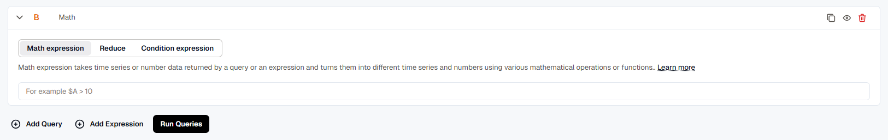

**Input:** any mathematical operation to apply to the data returned from other queries or expressions. Reference queries and expressions by their letter, prefixed with a dollar sign, for example `$A`.

#### Mathematical Operations

**Arithmetic operations:**
- `++` (Increment)
- `--` (Decrement)
- `+` (Addition)
- `-` (Subtraction)
- `*` (Multiplication)
- `/` (Division)
- `%` (Modulo)
- `^` (Exponentiation)

Examples: `++$A`, `$A++`, `$A+1`, `$A-2`, `$A*2`, `$A/6`, `$A%$B`, `$A^2`

**Boolean operations:**
- `==` (Equal to)
- `!=` (Not equal to)
- `<` (Less than)
- `>` (Greater than)
- `<=` (Less than or equal to)
- `>=` (Greater than or equal to)

Examples: `$A==0`, `!$A!=0`, `$A<$B`, `$A>10`, `$A<=$D`, `$A>=$D`

**Logical operations:**
- `&&` (AND)
- `||` (OR)
- `ifNull` (If NoData)

Examples: `$A && $D`, `$A and $D`, `$A or $D`, `$A || $D`, `ifNull($A, 0)`

:::info
For the operations above:
- When both `$A` and `$B` are numbers, the operation runs between the two numbers.
- If one parameter is a number and the other is a time series, the operation runs between the number and each value in the time series individually.
- If both `$A` and `$B` are time series, the operation runs between the values that share the same timestamp.
- Boolean and logical operations return `0` for false and `1` for true.
:::

#### Using Expressions for Multiple Query Conditions

When a single alert uses multiple queries:
- Use the Reduce function on every time series output (for example, mean, max, or last).
- Use `ifNull` on every reduced value, so a query returning NoData doesn't affect the evaluation of the others.

Example: `ifNull($A, 0) > 50 || ifNull($B, 0) > 90`
- `ifNull`: checks for NoData and assigns the given value (0) to that node if true.
- `>`: the arithmetic operation that checks the condition.
- `||`: the logical OR that evaluates both query nodes.

#### Mathematical Functions
- `abs`: returns the absolute value. For example, `abs(-1)` or `abs($A)`.
- `log`: returns the natural logarithm. Returns NaN if the value is less than 0. For example, `log(-1)` or `log($A)`.
- `round`: returns a rounded integer. For example, `round(3.123)` or `round($A)`.
- `ceil`: rounds up to the nearest integer. `ceil(3.123)` returns `4`.
- `floor`: rounds down to the nearest integer. `floor(3.123)` returns `3`.

#### Built-in Time-Range Variables

To get data in a per-time-range format (for example, data per minute), divide the data by the appropriate time-range variable. These built-in variables are available:
- `$range:m`: time range in minutes
- `$range:s`: time range in seconds
- `$range:h`: time range in hours
- `$range:d`: time range in days

### Reduce

Reduce takes the time series or numbers returned by a query or expression and turns them into a single number.

- **Reduction function:** select the function to apply: `mean()`, `max()`, `min()`, `sum()`, `last()`, or `count()`.

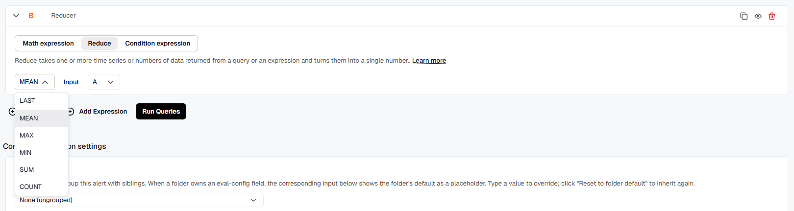

- **Input:** select the query or expression to reduce by its letter.

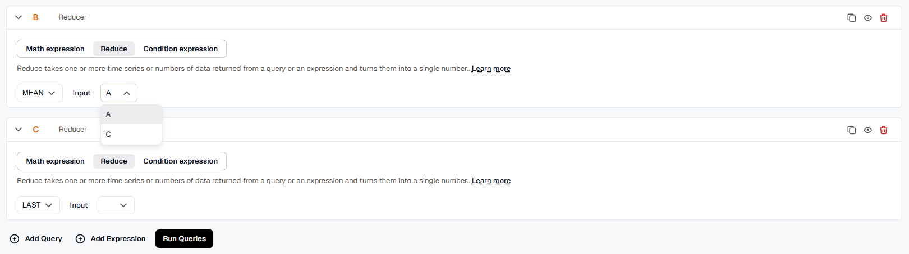

The reduction function aggregates the values of the query or expression into a single value.

### Condition Expression

A condition expression takes the time series or numbers returned by queries or expressions and gives a boolean result: `0` (False) if the condition isn't met, or `1` (True) if it is.

- **WHEN:** select the reduction function: `last()`, `mean()`, `max()`, `min()`, `sum()`, or `count()`.

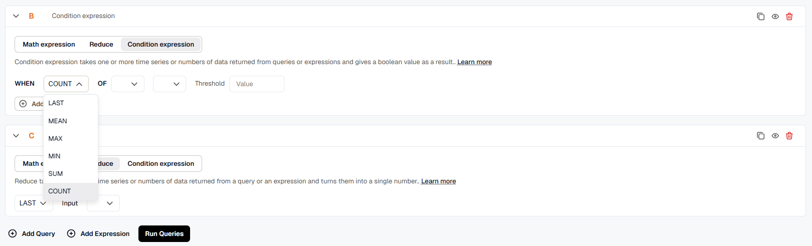

- **OF:** select the query or expression by its letter (for example, A or C).

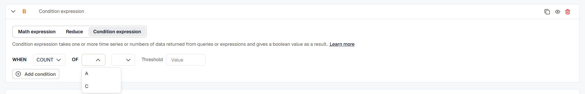

- **Condition string:** select the comparison: `IS ABOVE`, `IS SAME OR ABOVE`, `IS BELOW`, or `IS SAME OR BELOW`.

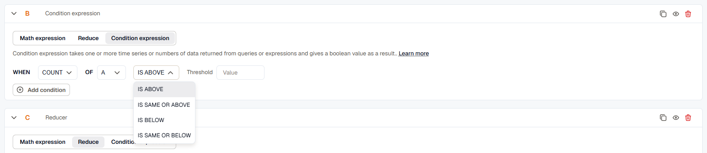

- **Threshold:** enter the numeric value to evaluate the condition against.

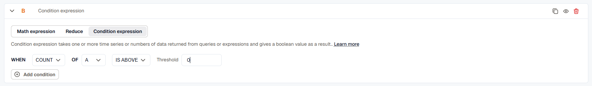

The reduction function is applied to the query or expression to produce a single value, which is then compared against the threshold using the condition you chose. When the input is a collection of time series or numbers, the reduction function is applied to each element individually, each reduced output is evaluated against the condition, and the outputs are combined with AND.

Add more conditions with the **Add condition** button, and choose how they combine with the **AND** or **OR** operators.

## Nodes

Nodes represent the individual queries or expressions used to build alerts and dashboards. KloudMate assigns each node a letter by default (for example, A, B, or C), based on the order it was created.

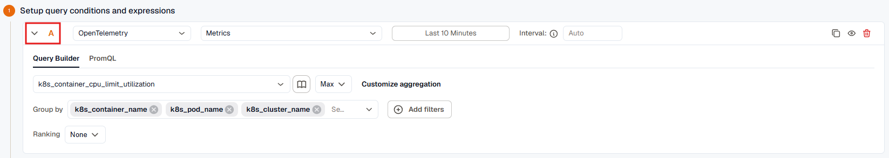

Nodes serve as reference points, so you can identify and evaluate specific queries or expressions during analysis.

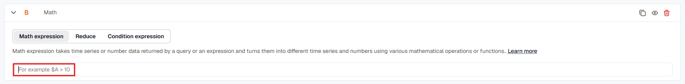

KloudMate names nodes alphabetically by default, but you can rename them for clarity.

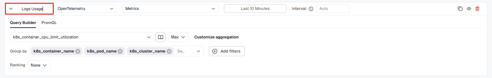

If a custom node name includes spaces, enclose it in **${}**. For example: `${CPU usage}`

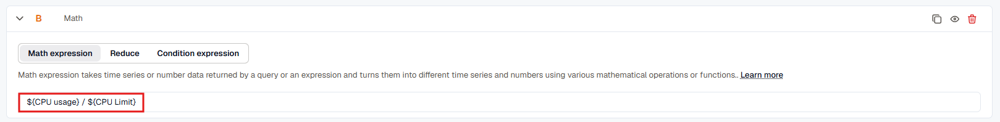
