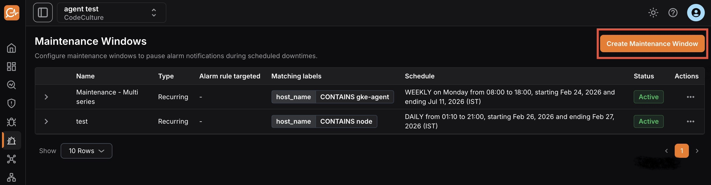

A Maintenance Window is a scheduled period during which matching alerts keep evaluating but their notifications are suppressed. State changes are still recorded in alert history (marked with `silenced_at` / `silenced_by_*` so you can audit what happened), but no notification fires. Like a [Silence](../silences/), a maintenance window is a **notification gate**: it mutes notifications for the matching alerts but never changes their state or resolves them.

Use a maintenance window when you have a calendar-driven quiet period: a planned deployment, a recurring batch job window, or a vendor outage you've been told to expect. For one-off, ad-hoc suppression in the moment, use [Silences](../silences/) instead.

## Purpose

- Suppresses notifications for expected alerts during deployments, patches, upgrades, or infrastructure changes.
- Avoids unnecessary escalations or incident tickets.
- Keeps monitoring reports clean and meaningful.

## Overview page

The overview page lists every maintenance window with these details:

- **Name:** name of the maintenance window.
- **Description:** description of the maintenance window.
- **Alert rule targeted:** the alert rule the maintenance window applies to.
- **Matching label:** labels assigned to the maintenance window.
- **Schedule:** start and end time for the maintenance window.
- **Status:** whether the maintenance window is active or paused.

## Creating a maintenance window

1. Open the **Maintenance Windows** page in the Alerts module.
2. Click **Create Maintenance Window**.

3. Configure these details:

- **Name:** a name for the maintenance window.
- **Description:** a short description of the maintenance window.
- **Timezone:** the timezone for the scheduled window.
- **One time:** schedules the maintenance period once, for a specific date and time.
- **Recurring:** repeats automatically on a regular cycle, so you don't reconfigure it each time.

Additional settings:

- **Start time:** date and time when the maintenance window begins.
- **End time:** date and time when the maintenance window ends.
- **Frequency:** available only for recurring windows; select a daily, weekly, or monthly schedule.
- **Label Matchers:** target the window to specific alerts by their labels (for example, service name, host, or region). Each matcher is a label key, an operator, and a value, combined with AND. The operators are the same four used across the alert module (**Equals**, **Not equals**, **Matches regex**, **Doesn't match regex**), matched against alert rule labels and alert instance labels.

4. Click **Save** to create the new maintenance window.

