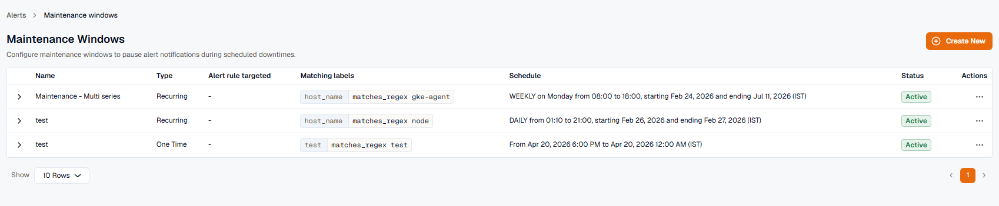
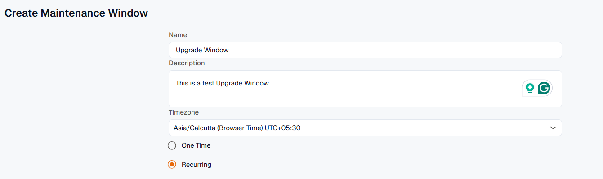
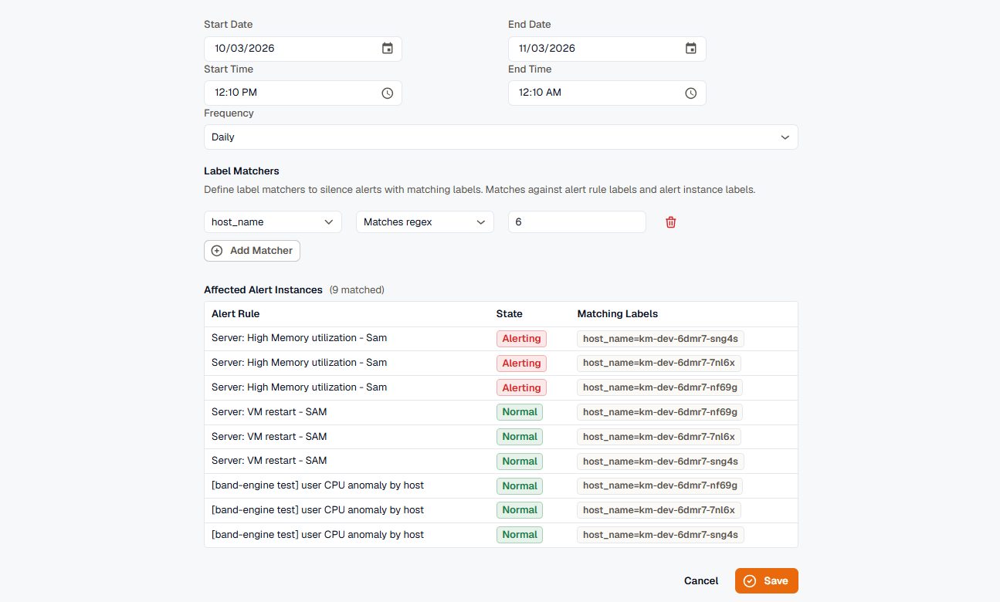

A Maintenance Window is a scheduled period during which matching alerts keep evaluating but their notifications are suppressed. State changes are still recorded in alert history, so you can audit what happened, but no notification fires. Like a [Silence](../silences/), a maintenance window is a **notification gate**: it mutes notifications for the matching alerts but never changes their state or resolves them.

Use a maintenance window when you have a calendar-driven quiet period: a planned deployment, a recurring batch job window, or a vendor outage you've been told to expect. For one-off, ad-hoc suppression in the moment, use [Silences](../silences/) instead.

## Purpose

- Suppresses notifications for expected alerts during deployments, patches, upgrades, or infrastructure changes.
- Avoids unnecessary escalations or incident tickets.
- Keeps monitoring reports clean and meaningful.

## Overview page

Each maintenance window shows:

- **Name:** name of the maintenance window.
- **Type:** whether the window is **One Time** or **Recurring**.
- **Alert rule targeted:** the alert rule the maintenance window applies to.
- **Matching labels:** labels assigned to the maintenance window.
- **Schedule:** start and end time for the maintenance window.
- **Status:** **Active** when the window is enabled, or **Disabled**.

With the **Developer** role, you can **Disable** or **Enable**, **Edit**, or **Delete** a window from its row menu.

## Creating a maintenance window

1. Open **Alerts → Maintenance**.
2. Click **Create window**. You need the **Developer** role to create maintenance windows.
3. Configure these details:

- **Name:** a name for the maintenance window.
- **Description:** a short description of the maintenance window.
- **Timezone:** the timezone for the scheduled window.
- **One Time:** schedules the maintenance period once, for a specific date and time.
- **Recurring:** repeats automatically on a regular cycle, so you don't reconfigure it each time.

Additional settings:

- For a **One Time** window, pick the **From** and **To** date and time, or type a **Duration** such as `2h` and press Enter to start the window now and run it for that long.
- For a **Recurring** window, set a **Start Date**, an optional **End Date**, a **Start Time**, an **End Time**, and a **Frequency** of **Daily**, **Weekly**, or **Monthly**. **Weekly** adds **Days of Week**, and **Monthly** lets you choose by **Day of Month** or **Day of Week**. The **End Time** must be later than the **Start Time**, so a recurring window can't run past midnight.
- **Label Matchers:** target the window to specific alerts by their labels (for example, service name, host, or region). Each matcher is a label key, an operator, and a value, combined with AND. The operators are the same four used across the alert module (**Equals**, **Not equals**, **Matches regex**, **Doesn't match regex**), matched against alert rule labels and alert instance labels. A window needs at least one matcher unless it targets specific alert rules.

As you add matchers, an **Affected Alert Instances** preview lists the alert rules and instances the window currently matches, so you can confirm its scope before saving.

4. Click **Save** to create the new maintenance window.

