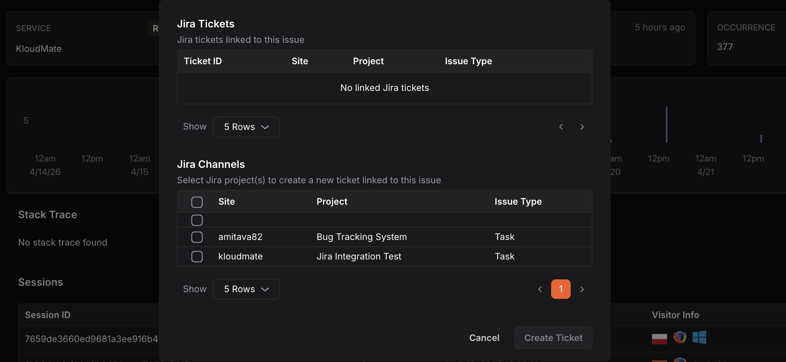

---

title: "Create a manual Jira Ticket"
description: "Documentation for Create a manual Jira Ticket"
sidebar:
  order: 2
---
## Creating a Manual Jira Ticket

You can create a Jira ticket directly from an issue or alarm details page to raise individual tickets that are not assigned to a notification policy.

**Prerequisite:**A Jira notification channel must already be configured.

**Step 1:**  Navigate to the**Issue**or**Alarm** details page.

**Step 2:** Click the**Create in Jira** button. A dialog will open showing all Jira channels integrated with your KloudMate account, along with any previously linked Jira tickets for that issue.

**Step 3:** Under Jira Channels, select the checkbox(es) for the channel(s) you want to raise a ticket in.

**Step 4:**  Click**Create Ticket**.

## Unlinking a Jira Ticket

**Step 1:** On the issue or alarm details page, click the**settings** icon next to the Create in Jira button to open the Jira Tickets panel.

**Step 2:** The panel displays all Jira tickets currently linked to the issue, showing the Ticket ID, Site, Project, and Issue Type.

**Step 3:**  Click the**unlink** icon next to the ticket you want to remove to unlink it from KloudMate.
