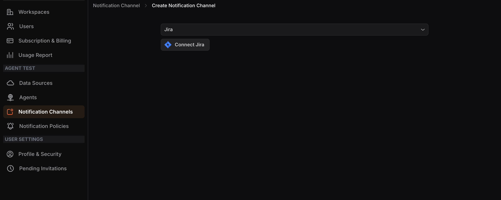
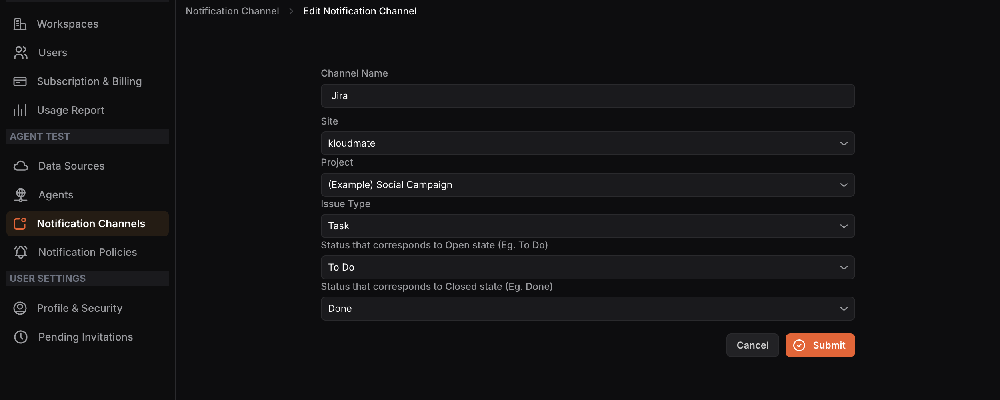

## Configuring the Jira Notification Channel

**Step 1:** Select**Jira**from the dropdown menu and click the**Connect Jira** button.

**Step 2:** You will be redirected to the Jira authorization page. Click**Accept** to authorize the integration between KloudMate and your Atlassian account.

**Step 3:** You will be redirected back to the Jira Notification Channel configuration page in KloudMate. 

Enter a **Channel Name** and select the following:

- **Site**: your Jira site
- **Project**: the Jira project to link
- **Issue Type:**the type of issue to create (e.g., Task)
- **Status for Open state:** the Jira status that corresponds to an open ticket (e.g., To Do, In Progress)
- **Status for Closed state:**the Jira status that corresponds to a closed ticket (e.g., Done)**Step 4:** Click **Submit** to complete the integration.

<hint type="info">
  Jira integration with KloudMate is one-way. Status changes in KloudMate will be reflected in Jira, but status changes made in Jira will not be reflected in KloudMate.
</hint>

## **Alarm details in Jira**|**KloudMate**|**Jira**           |
| ---------------------- | ------------------ |
| Alarm name             | Ticket title       |
| KloudMate account name | Ticket title       |
| Alarm description      | Ticket description |
| Alarm value            | Ticket description |
| Regression alarms      | Ticket comment     |

**Issues details in Jira**
--------------------------

| **KloudMate**|**Jira**           |
| ---------------------- | ------------------ |
| Issue's service name   | Ticket title       |
| KloudMate account name | Ticket title       |
| Regression Issues      | Ticket title       |
| Issue name             | Ticket description |
| Issue comments         | Ticket comments    |

