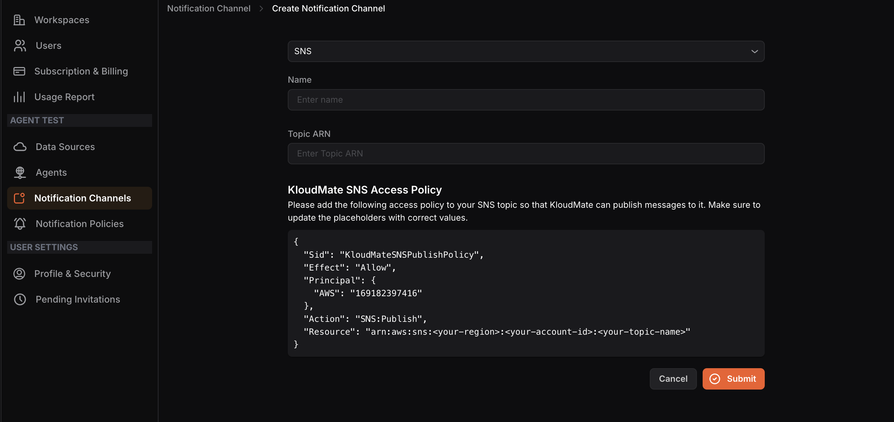

---

title: "SNS"
description: "Documentation for SNS"
sidebar:
  order: 6
---
## Configuring an SNS Notification Channel

**Step 1:** Select**SNS** from the dropdown menu.

**Step 2:** Copy the KloudMate SNS Access Policy displayed on the screen. Navigate to your AWS Console and paste the policy into your SNS topic. Update the placeholders in the policy with the correct values.

**Step 3:**  Return to KloudMate, enter a**Name**and your**Topic ARN**in their respective fields.

**Step 4:**  Click**Submit**.

