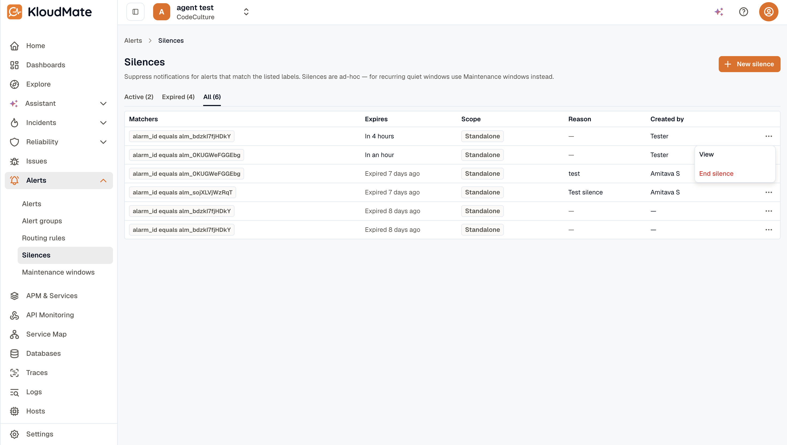

A **Silence** suppresses notifications for alerts whose labels match the silence's matchers, for a bounded time window. Use silences when you know an alert will be noisy and you don't want it notifying anyone: a deployment expected to spike error rates, a known third-party outage, or a maintenance window you can't fully scope.

Silences cap at 30 days. The cap keeps a silence from being forgotten and quietly masking real problems. Re-create one explicitly if you need it longer.

## Where to find silences

Open **Alerts → Silences** in the left navigation. Silences are ad-hoc; for recurring quiet windows, use [Maintenance Windows](../maintenance-windows/) instead.

The list has tabs with live counts: **Active (N)** (default), **Expired (N)**, and **All (N)**. Columns: **Matchers** (chips, with an overflow tooltip), **Expires** (a countdown such as *"In 4h"* or *"Expired 12m ago"*), **Scope** (a `Standalone` or `Group-bound` chip), **Reason**, and **Created by**.

## Anatomy of a silence

| Field | What it does |
|---|---|
| **Matchers** | Label conditions that pick which alerts the silence applies to. Same operator set as [Routing Rules](../routing-rules/#matchers): Equals, Not equals, Matches regex, Doesn't match regex. |
| **Expires at** | Date and time the silence stops. Capped at 30 days from creation. |
| **Reason** | Free-form text; recommended so others know why the silence exists. |
| **Scope** | Either **Group-bound** (auto-expires when a specific [Alert Group](../alert-groups/) resolves) or **Standalone** (lives until its `expires_at`). |

## Create a silence

Create a silence from the Silences page, an alert group, or an alert's Pause Notifications.

### From Alerts → Silences

1. Open **Alerts → Silences** and click **New silence**.
2. Add one or more matcher rows. For each, pick a label key, an operator, and a value.
3. Pick an **Expires at** date and time. The form caps duration at 30 days and disables submit otherwise.
4. Add a **Reason** describing why this silence exists.
5. Click **Save**. The silence appears in the **Active** tab.

### From an Alert Group

On any [Alert Group](../alert-groups/) detail page, click **Silence this group**. The silence creator opens pre-filled with:

- The group's labels populated as matchers.
- A hidden `auto_expire_group_id` set to the current group, so the silence stops automatically when the group resolves.
- A banner above the form that reads something like "This silence will auto-expire when group `<title>` resolves."

Save it from here. The silence shows up as **Group-bound** on the list.

### From an alert's Pause Notifications

On an alert rule's **more options (⋯) → Pause Notifications**, KloudMate creates a silence scoped to that alert (an `alarm_id` matcher) with an expiry: the alert keeps evaluating, and only its notifications are suppressed. While paused, the rule is marked **Silenced** on the alerts list and its detail page, and the silence appears here in the **Active** tab, where you view or end it. Add matchers to narrow the pause to specific instances.

## Silence vs. maintenance window

Both features are a **notification gate, not a state change**: the alert still evaluates on its schedule and its state transitions are still recorded in history; only the notification is withheld. Silencing every firing instance of an alert group keeps the group **Open** (shown as **Muted**); it does **not** resolve the group, and muting never emits a *resolved* notification. The differences between the two are operational, not behavioral:

- **Silences** are ad-hoc, label-matcher driven, capped at 30 days, and can be auto-bound to a specific alert group so they expire when the group resolves.
- **Maintenance Windows** are scheduled: one-time (RFC3339 start/end) or recurring (`DAILY` / `WEEKLY` / `MONTHLY` with a timezone-aware time-of-day).

Both use the same four label-matcher operators (**Equals**, **Not equals**, **Matches regex**, **Doesn't match regex**), matched against alert rule labels and alert instance labels.

Both leave the alert evaluating. Suppressed state transitions are marked with `silenced_at` and `silenced_by_*` columns on the alert state history, so you can always tell after the fact whether a quiet stretch was a real recovery or a suppressed notification.

Pick a silence for a reactive, one-off suppression you'll re-evaluate within 30 days. Pick a [Maintenance Window](../maintenance-windows/) for planned downtime, recurring quiet hours, or anything that needs a calendar schedule.

## Viewing and ending a silence

Each row's kebab menu has **View** and **End silence**. Ending an active silence removes suppression for matching alerts immediately; new firings notify as normal.

## Related

- [Alert Groups](../alert-groups/): the Silence-this-group action.
- [Maintenance Windows](../maintenance-windows/): the scheduled, recurring counterpart to silences.
- [Routing Rules](../routing-rules/): the same matcher model.
