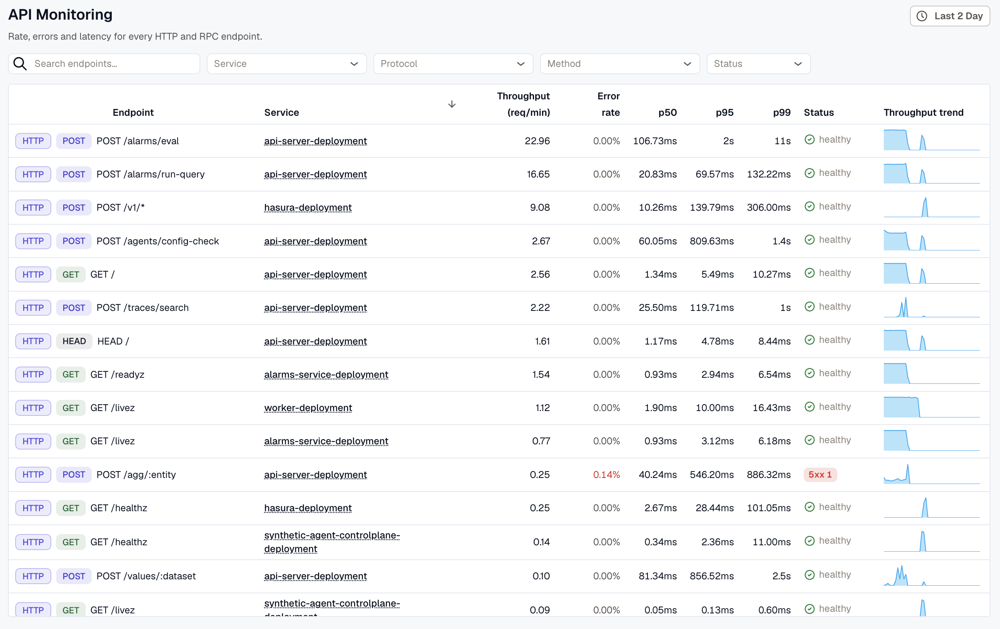
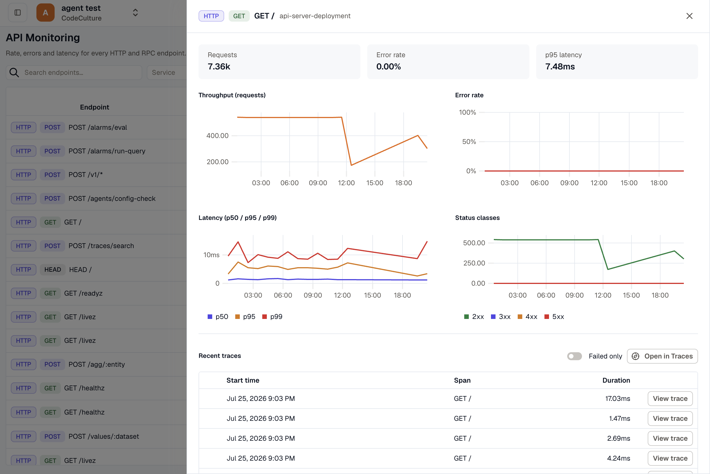

**API Monitoring** shows Rate, Errors, and Duration (RED) metrics for every API endpoint your services handle, across both HTTP and RPC (gRPC and Connect / `connect_rpc`). It is the server-side, per-endpoint view of your traffic.

Where the [Service Map](../service-map/) shows caller-to-callee dependencies and the [Trace Explorer](../../trace-explorer/) helps you find an individual request, API Monitoring sits in between: it answers "which of my endpoints are slow, failing, or busy?" and lets you drill from a single endpoint straight into its traces.

## Overview

In the left navigation, open **APM & Tracing → API Monitoring**.

Use the **time range** picker in the top-right to set the observation window. The view defaults to the last **24 hours** so the per-endpoint trend sparklines have enough history to draw.

Endpoints are derived from your services' server spans. If the table is empty, confirm your services are instrumented and sending traces, or widen the time range — see [Getting Accurate Data](#getting-accurate-data).

## The Endpoints List

Each row is one endpoint, identified by its service, protocol, and (for HTTP) method. The columns are:

- **Endpoint:** a protocol badge (`HTTP`, `GRPC`, or `CONNECT_RPC`), a method chip for HTTP rows (`GET`, `POST`, …), and the endpoint label — a templated route such as `GET /users/{id}` for HTTP, or the full method name such as `pkg.Svc/Method` for RPC.
- **Service:** the service that handles the endpoint. It links to that service's [APM dashboard](../apm-and-services/).
- **Throughput (req/min):** request rate over the selected window.
- **Error rate:** the percentage of requests counted as errors (see [How Errors Are Counted](#how-errors-are-counted)). Shown in red when above zero.
- **p50 / p95 / p99:** latency percentiles, in milliseconds.
- **Status:** an error-focused summary of the HTTP status mix. It reads `healthy` when there are no `4xx` or `5xx` responses, and surfaces `4xx` and `5xx` counts when they occur. Hover it to see the full `2xx` / `3xx` / `4xx` / `5xx` breakdown, plus any uncategorized requests.
- **Throughput trend:** a sparkline of request volume across the window.

### HTTP vs. RPC rows

The protocol badge determines what a row can show:

- **HTTP** rows carry a method chip and a full `2xx`/`3xx`/`4xx`/`5xx` status breakdown.
- **RPC** rows (gRPC, Connect) have no HTTP method or status classes, so the **Status** column shows a dash (`—`). Judge these endpoints by their **error rate**, which is derived from span status and works for every protocol.

:::tip
The trend sparkline rolls up hourly, so it needs at least two hourly buckets to draw a line.
:::

## Filtering and Sorting

Use the filter bar above the table to narrow the list:

- **Search:** match endpoints by name (for example, a path fragment or RPC method).
- **Service:** one or more services.
- **Protocol:** `http`, `grpc`, or `connect_rpc`.
- **Method:** one or more HTTP methods (`GET`, `POST`, `PUT`, `PATCH`, `DELETE`, `HEAD`, `OPTIONS`).
- **Status:** restrict to endpoints that returned a given HTTP status class — `4xx` or `5xx`.

Click the **Throughput**, **Error rate**, or **p95** column header to sort by that metric. Sorting is always highest-first and is applied across all matching endpoints, so the table always shows the true top results rather than re-ordering only the current page.

:::tip
To find failing endpoints quickly, sort by **Error rate**, or set the **Status** filter to `5xx`.
:::

## Endpoint Details

Click any row to open the endpoint drill-down in a slide-over panel. The panel is shareable — its address encodes the selected endpoint, so you can send a teammate a direct link, and closing it returns you to the list with your filters, sort, and time range intact.

At the top, summary tiles show **Requests**, **Error rate**, and **p95 latency** for the endpoint over the selected window. Below them are time-series charts:

- **Throughput (requests)** over time.
- **Error rate** over time.
- **Latency** with `p50`, `p95`, and `p99` overlaid.
- **Status classes** (`2xx` / `3xx` / `4xx` / `5xx`) over time — shown for HTTP endpoints only.

### Recent and Failed Traces

The drill-down ends with a table of the endpoint's traces, so you can move from a metric to the exact requests behind it:

- Each row shows the start time, span, and duration, with a **View trace** action that opens the full trace in [Trace Detail](../../trace-detail/).
- Toggle **Failed only** to keep just the errored requests. This uses the same protocol-neutral error definition as the metrics, so it covers HTTP `5xx` and gRPC/Connect errors alike.
- **Open in Traces** hands the current endpoint and time range to the [Trace Explorer](../../trace-explorer/) for deeper filtering and analysis.

## How Errors Are Counted

An endpoint **error** is any request that either returned an HTTP **`5xx`** status **or** produced a span marked `ERROR` (an exception, or a gRPC/Connect error). This definition is protocol-neutral, which is why RPC endpoints get a meaningful error rate even though they have no HTTP status.

**`4xx` responses are treated as client faults, not endpoint errors.** They appear in the status breakdown but are deliberately excluded from the error rate, so a spike in client mistakes (bad input, unauthorized calls) does not make a healthy endpoint look broken.

:::note
API Monitoring is a **server-side** view: it counts what each endpoint actually returned. A *caller-perceived* failure — for example, a client that times out while calling an otherwise healthy service — does not appear here. Look for those on the corresponding [Service Map](../service-map/) edge, which measures the call from the caller's side.
:::

## Getting Accurate Data

API Monitoring is built entirely from your tracing data. For complete and well-grouped metrics:

- Services must emit OpenTelemetry **server spans** (`span.kind = server`). Each span needs HTTP attributes (method and status code) for HTTP endpoints, or `rpc.system` for gRPC/Connect endpoints.
- For clean grouping, routes should be **templated by the instrumentation** — `GET /users/{id}`, not `GET /users/12345`. Untemplated routes with raw IDs would otherwise create a separate endpoint per value. KloudMate auto-collapses obvious numeric and UUID path segments as a safety net, but SDK route templates give the best result.
- **gRPC and Connect** endpoints are grouped by their full method name and work out of the box — no templating needed.

If you are still setting up instrumentation, see the [Auto Instrumentation](../../auto-instrumentation/) and [Manual Instrumentation](../../manual-instrumentation/) guides.

## Related Paths

- [Service Map](../service-map/) — service-to-service dependencies and the caller's view of failures.
- [Services](../apm-and-services/) — service-level request, latency, and error trends.
- [Trace Explorer](../../trace-explorer/) — search and filter individual traces.
