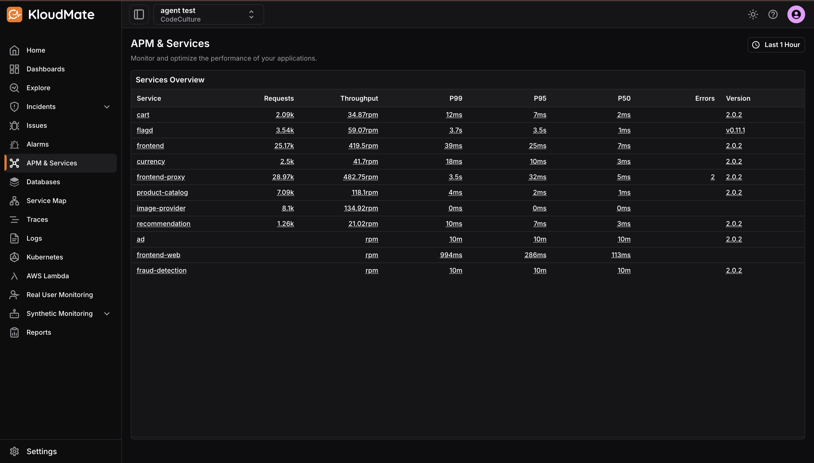
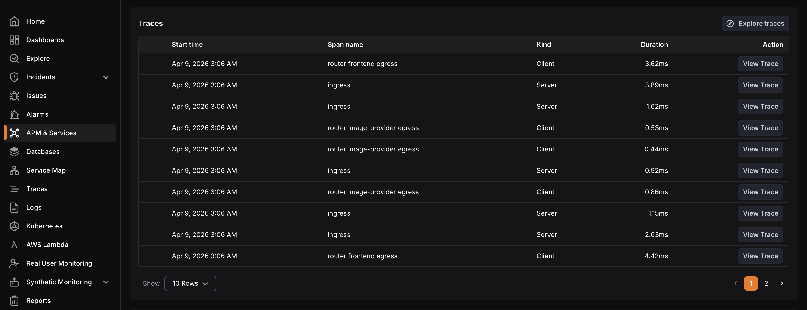

The **Services** view in APM is where you compare application and service performance at a glance.

## Services Overview

The Services Overview page lists all instrumented applications and services in a tabular view, making it easy to compare their health across the selected time range.

Each row represents one service and includes:

- **Service:** the application or service name
- **Requests:** total requests handled during the selected time range
- **Throughput:** request rate, such as requests per minute
- **P99, P95, and P50 latency:** percentile-based latency views for worst-case, upper-percentile, and median performance
- **Error rate:** percentage of failed requests
- **Version:** reported deployment version for release correlation

## Service APM Dashboard

Clicking any service in the Services Overview opens its APM dashboard, which is a preconfigured view focused on that specific service.

The dashboard includes:

- **Requests, errors, and latency over time:** timeline charts that help identify traffic spikes, error bursts, and latency regressions
- **Destinations table:** a breakdown of downstream dependencies, including request rate, error percentage, and dependency latency
- **Related issues, alarms, and dashboards:** links to broader operational context for that service

## Traces and Logs

From the APM dashboard, you can inspect related traces and logs for a selected service.

The **Traces** table shows recent traces with details such as start time, span name, kind, duration, and a link to the full trace for end-to-end request analysis.

The **Logs** table lists recent logs with time, severity, and message, along with actions to explore logs in detail and correlate them with traces and issues for faster root-cause investigation.
