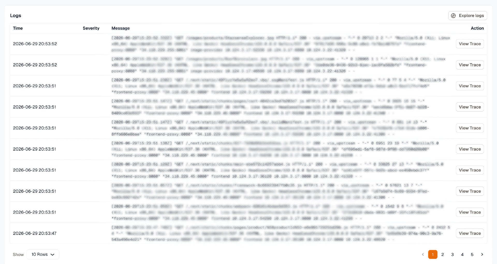

Open **APM & Services** to compare application and service performance at a glance. It opens in the **List** view. Select the **Service map** view to see how your services connect, as described in [Service Map](../service-map/).

## Services Overview

The **List** view shows all instrumented applications and services in a table, so you can compare their health across the selected time range.

Each row represents one service and includes:

- **Service:** the application or service name
- **Requests:** total requests handled during the selected time range
- **Throughput:** request rate, such as requests per minute
- **P99, P95, and P50 latency:** percentile-based latency views for worst-case, upper-percentile, and median performance
- **Error rate:** percentage of failed requests
- **Dep. failures:** outbound calls this service made that failed, with their share of all its outbound calls. These failures don't count toward **Error rate**.

## Service APM Dashboard

Clicking any service in the **List** view opens its APM dashboard, which is a preconfigured view focused on that specific service.

The dashboard includes:

- **Requests, errors, and latency over time:** timeline charts that help identify traffic spikes, error bursts, and latency regressions
- **Service dependencies:** tables of downstream dependencies, outbound calls, and upstream callers, including request rate, error percentage, and latency
- **Related issues, alerts, and dashboards:** links to broader operational context for that service

## Traces and Logs

From the APM dashboard, you can inspect related traces and logs for a selected service.

The **Traces** table shows recent traces with details such as start time, span name, kind, duration, and a link to the full trace for end-to-end request analysis.

The **Logs** table lists recent logs with time, severity, and message, along with actions to explore logs in detail and correlate them with traces and issues for faster root-cause investigation.

