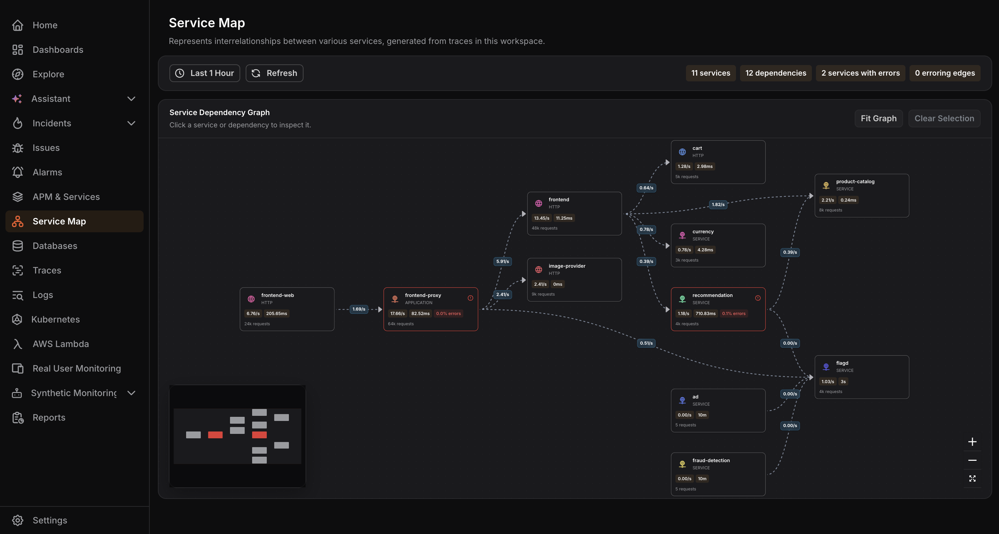
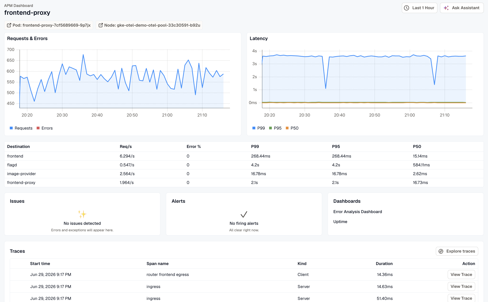
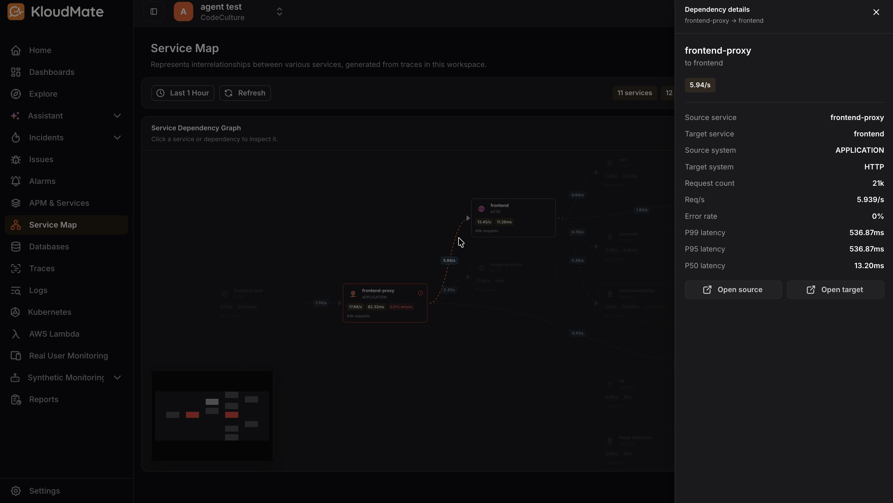

The **Service Map** is a visual representation of the relationships and interdependencies between services in your workspace. It is built from your services' distributed traces and gives you a topology-level view of your architecture.

You can use it to understand service dependencies, traffic flow, and operational health at a glance.

## How the map is built

The map is built from distributed traces, so both sources of tracing feed it:

- **[eBPF monitoring](../../../kloudmate-agent/ebpf-observability/)** captures traces at the kernel level with no code change. A service covered only by eBPF still appears on the map.
- **[Auto-instrumentation](../../../kloudmate-agent/auto-instrumentation/overview/)** and the OpenTelemetry SDK produce traces from inside the application.

Each service becomes a node under its `service.name`, and an edge is drawn wherever one service's trace calls another. A service needs a distinct `service.name` to appear as its own node — the agent gives an eBPF-monitored service the same name it carries once auto-instrumented, so it keeps one identity whether eBPF or the SDK is tracing it.

## Overview

Click **Service Map** in the left navigation to open the map.

At the top of the page, a summary bar shows the total number of services, dependencies, services with errors, and erroring edges in the selected time range.

Use the **time range** selector to adjust the observation window, and click **Refresh** to reload the map with the latest data.

The main area displays the **Service Dependency Graph**. Each service is represented as a node showing its name, protocol, request rate, and average latency. The directed edges between nodes represent the call flow and dependencies between services.

Use the zoom controls on the bottom-right to zoom in and out, or click the expand icon to view the graph in full screen.

## Inspecting a Service

Click any service node on the graph to open the service details panel on the right.

Click **Open service page** at the bottom of the panel to navigate to that service's APM dashboard, where you can inspect request trends, latency percentiles, traces, issues, alerts, and dashboards in more detail.

## Inspecting a Dependency

Click any edge between two service nodes to open the dependency details panel on the right.

Use **Open source** or **Open target** to navigate directly to the APM dashboard of either service involved in the dependency.

## Identifying Issues

Nodes and edges with errors are highlighted in red, making it easy to spot problematic services and dependencies at a glance. Click a highlighted node or edge to review its error rate and latency details.
