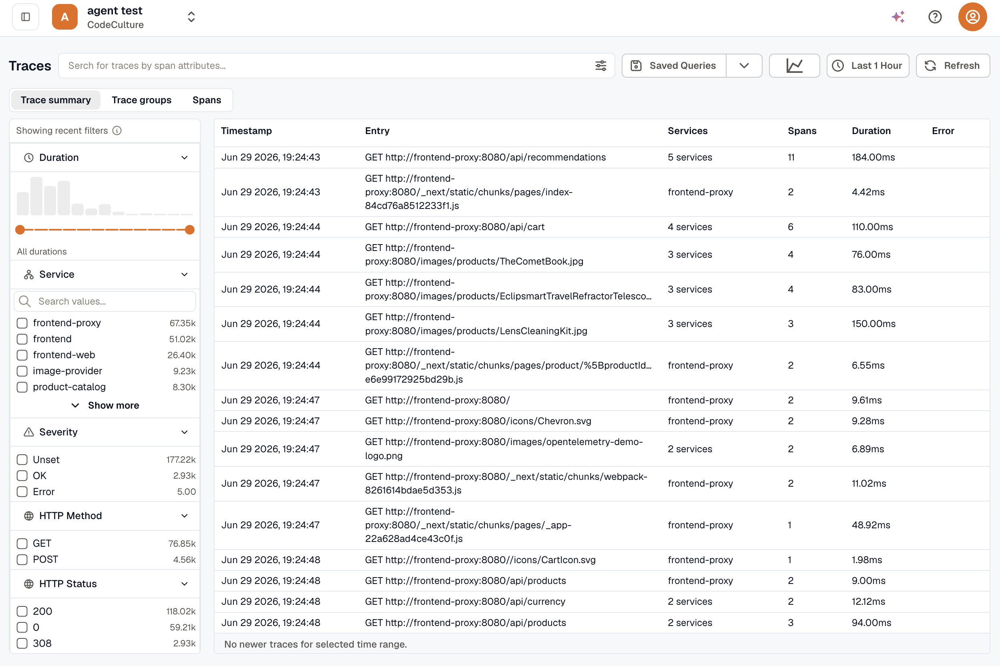

The `APM & Tracing` section in KloudMate gives you end-to-end visibility into how requests travel across your services, along with service-level health and dependency analysis.

## Core Concepts

- **[APM Views](./apm-views/)** is service-centric. Use it to compare latency, throughput, error rate, and dependencies across services.
- **[Trace Explorer](./trace-explorer/)** is request-centric. Use it to debug a specific request, span, or execution path across multiple services.

Start in **APM Views** when you need higher-level service health and dependency analysis. Navigate to **Trace Explorer** when you need to inspect trace-level detail to find the root cause of an issue.

## Instrumentation Paths

KloudMate supports multiple ways to generate APM and tracing data:

- [KloudMate Agent eBPF Observability](../kloudmate-agent/ebpf-observability/) for kernel-level tracing and RED metrics without code changes or restarts
- [Auto Instrumentation](./auto-instrumentation/) for the preferred Kubernetes APM flow through the KloudMate Agent
- [Manual Instrumentation](./manual-instrumentation/) for SDK-based tracing, application metrics, and custom metrics with the most control.

:::note
Because Application Metrics and Custom Metrics are emitted through the exact same OpenTelemetry SDK flow as traces, they are configured together. See [Manual Instrumentation](./manual-instrumentation/) for language-specific guides.
:::

## Related Paths

- [Visualize Data](../visualize-data/)
- [Logs](../logs/)
