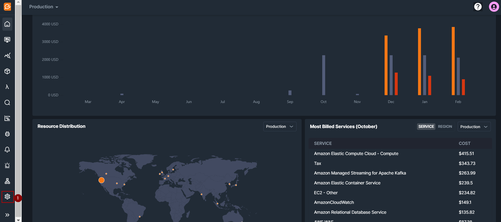
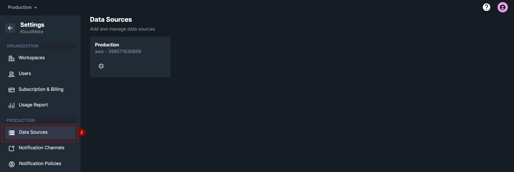
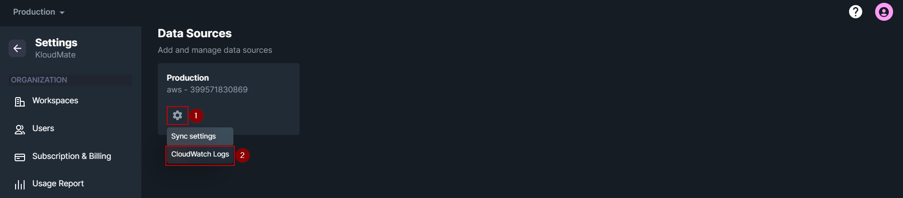
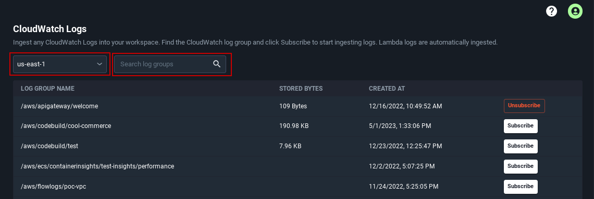
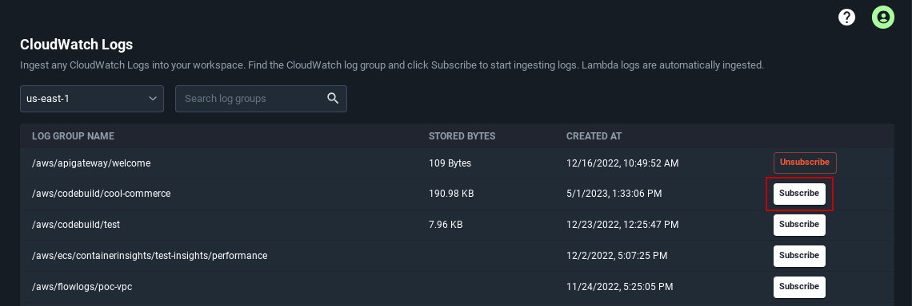

Use this workflow after you have connected your AWS account to KloudMate. You can subscribe CloudWatch log groups by region and make those logs searchable in Log Explorer.

<hint type="info">
  Lambda logs from the connected AWS account are ingested automatically.
</hint>

## Before You Start

- Complete [AWS Account Setup](../account-setup/)
- Confirm that the target log groups exist in CloudWatch

## Subscribe a CloudWatch Log Group

1. From the KloudMate home screen, open **Settings -> Data Sources**.

2. In the list of connected AWS accounts, click the **Settings** icon for the account from which you want to ingest CloudWatch logs.
3. Select **CloudWatch Logs**.

4. Choose the AWS region or use search to find the required log groups.

5. Click **Subscribe** for each log group that you want KloudMate to ingest.

## CloudWatch Subscription Filter Limit

<hint type="info">
  AWS allows only two subscription filters per log group.
</hint>

If a log group already has two active subscription filters, KloudMate cannot add another one until an existing filter is removed.

## Remove an Existing Subscription Filter

To free a subscription slot:

1. Open the AWS console.
2. Go to **CloudWatch -> Log groups**.
3. Select the relevant log group.
4. Open **Actions**.
5. Click **Remove Subscription Filter**.

<hint type="info">
  After subscription is enabled, you can search and analyze the ingested logs in [Log Explorer](../../logs/log-explorer/).
</hint>

## Related Resources

- [Lambda Log Attributes](./cloudwatch-logs-attributes/)
- [AWS Account Setup](../account-setup/)
- [Log Explorer](../../logs/log-explorer/)
