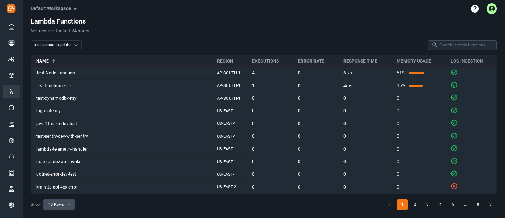
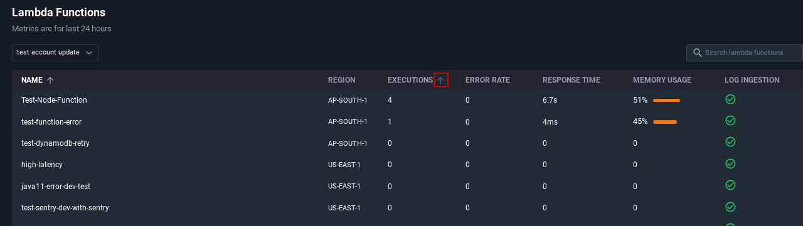
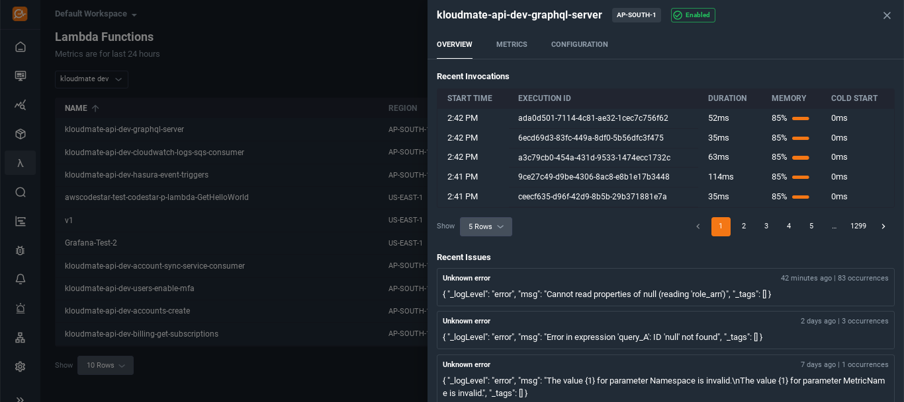
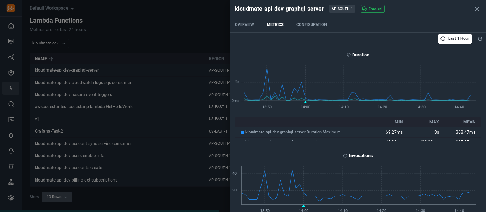

The users can click on the Lambda icon on the left menu bar to navigate to the Lambda console.
 Here users can [deep dive into their Lambda Functions](https://blog.kloudmate.com/debugging-aws-lambda-logs-101-967eed8aad4f). They can observe their Lambdas, view metrics, locate errors and more.
KloudMate pulls and aggregates various Lambda performance and usage metrics such as:

- Invocations
- Errors
- Duration
- Cold Start
- Memory

## Lambda Console Walkthrough

The Lambda console provides a list of all the [Lambda Functions](https://app.kloudmate.com/lambda) in the associated AWS account. You can use the search bar located at the top right corner of the list to find any particular Lambda function. 

Each row in the list represents an individual Lambda function and displays some basic information about it such as Name, Region, Executions, Error rate, Response time, Memory Usage, and Log ingestion.

You can sort the list in ascending or descending order by clicking on the arrow next to all the above-mentioned column headers of the list.

### Invocations and Errors

You can view additional details of any Lambda function by clicking on it in the given list. When you click on a Lambda function, you will see lists of **Recent Invocations**and **Recent Issues**for the selected Lambda function under the **Overview** tab. You can simply click on any recent invocation or recent issue respectively to learn more about it.

### Visualizing Metrics

The Lambda console will provide a **graphical representation**of some default metrics associated with the selected Lambda Function under the **Metrics**tab.

It is also possible to set a custom time duration for which the users want to view the metrics. They can choose from the options given in the time scale menu on the top right corner in the right panel.

