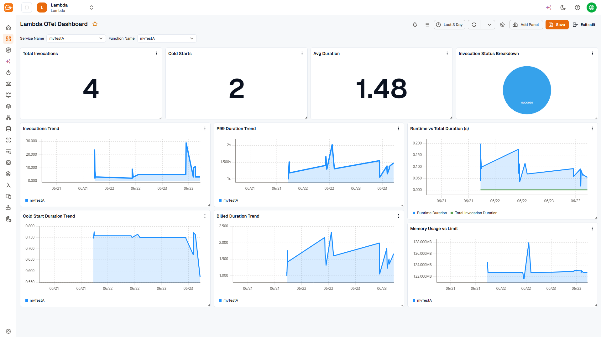
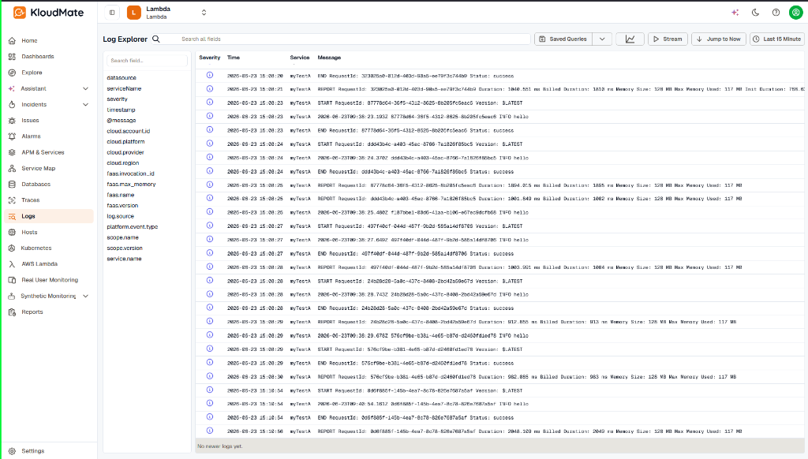
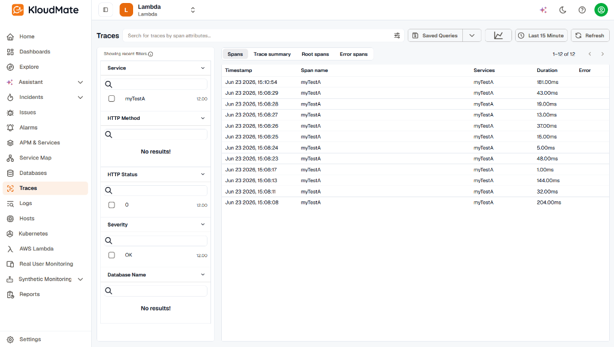
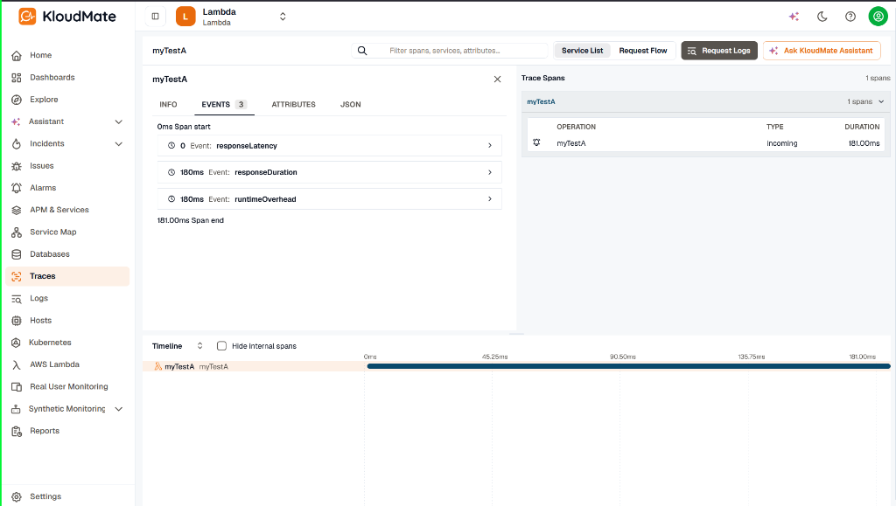

Set these environment variables on the Lambda function, alongside the layer. For the full walkthrough, start with [Setup](../setup/).

## Required

| Variable | Value |
| --- | --- |
| `OTEL_EXPORTER_OTLP_ENDPOINT` | Your KloudMate OTLP endpoint, for example `https://otel.kloudmate.com:4318`. |
| `OTEL_EXPORTER_OTLP_HEADERS` | Your ingest key as an `Authorization` header: `Authorization=YOUR_KLOUDMATE_API_KEY`. Create a key under [API Keys](../../../platform/settings/api-keys/). |

## Optional

| Variable | Value |
| --- | --- |
| `OTEL_SERVICE_NAME` | The name your function appears under in KloudMate. Defaults to the function name. |
| `OTEL_LOGS_EXPORTER` | Set to `none` to stop sending logs — for example, when the [AWS account integration](../../account-setup/) already collects this function's logs from CloudWatch. |
| `OTEL_METRICS_EXPORTER` | Set to `none` to stop sending metrics. |
| `OTEL_TRACES_EXPORTER` | Set to `none` to stop sending traces. |
| `OTEL_LOG_LEVEL` | Set to `debug` to print the extension's own diagnostics to CloudWatch — useful when telemetry isn't showing up. |

## Metrics

The extension reports these for every invocation. Use the names to build dashboards and alerts in KloudMate.

| Metric | Unit | What it measures |
| --- | --- | --- |
| `faas.invoke_duration` | seconds | Total invocation time |
| `faas.init_duration` | seconds | Cold-start time (cold starts only) |
| `faas.mem_usage` | bytes | Peak memory used |
| `aws.lambda.billed_duration` | seconds | AWS billed time |
| `aws.lambda.produced_bytes` | bytes | Response payload size |
| `aws.lambda.runtime_duration` | seconds | Handler time, not counting the extension |
| `aws.lambda.restore_duration` | seconds | SnapStart restore duration |

Each metric is tagged with the request ID, a cold-start flag, and the invocation status, so you can filter and group by any of them.

You can use these metrics to build dashboards that track your function's health and resource consumption over time.

## Logs and traces

Your function's stdout/stderr lines arrive as logs, with the severity read from each line. Without active tracing, you still get logs and metrics.

### Logs in Log Explorer

Every logs or print statement from your function code is forwarded directly to the **Log Explorer**, alongside lifecycle events like `START`, `END`, and `REPORT` requests.

### Trace Correlation

With [X-Ray active tracing](https://docs.aws.amazon.com/lambda/latest/dg/services-xray.html) enabled, each invocation also produces a trace. This connects the logs from that specific execution to a unified trace timeline.

In the **Traces** explorer, you can list and filter invocations by their duration and status:

Selecting an execution trace opens a detailed breakdown of the execution timeline. This breaks down the lifecycle into sub-spans like `responseLatency`, `responseDuration`, and `runtimeOverhead`:

## Related Resources

- [Setup](../setup/)
- [Layer ARNs](../layer-arns/)
- [Overview](../)
