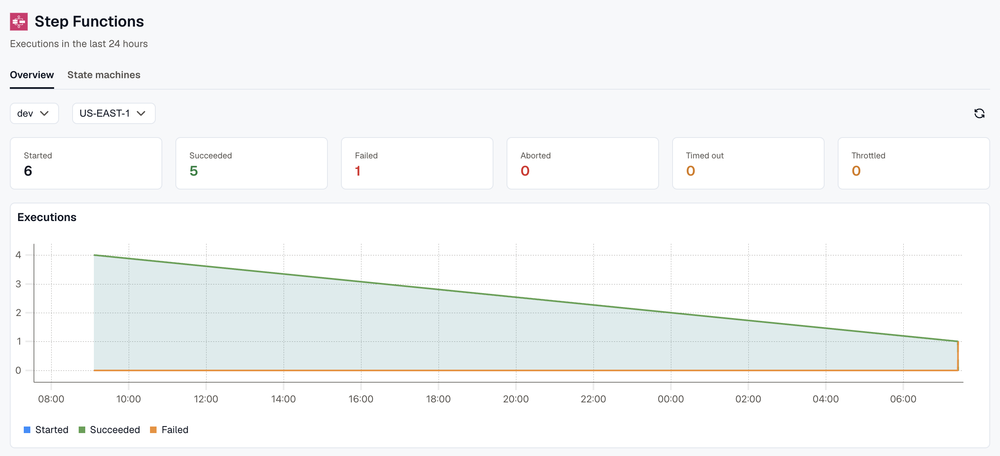
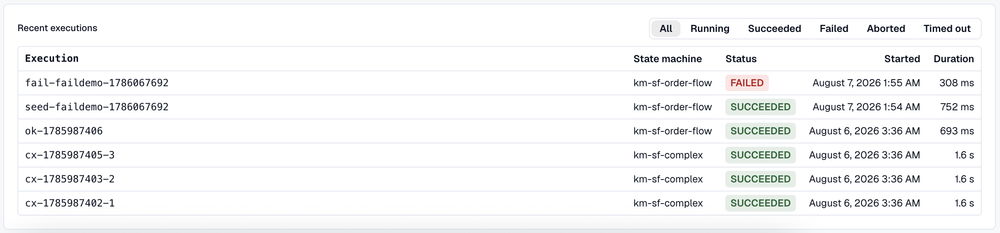
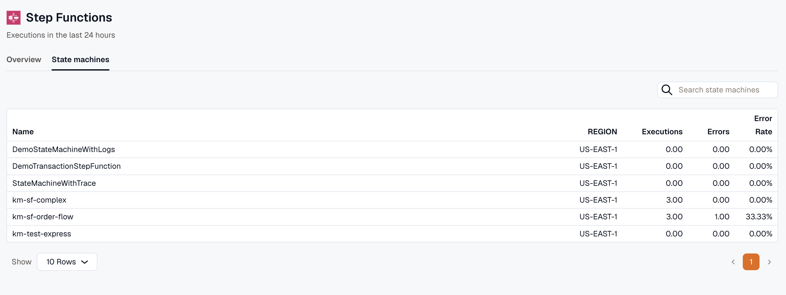
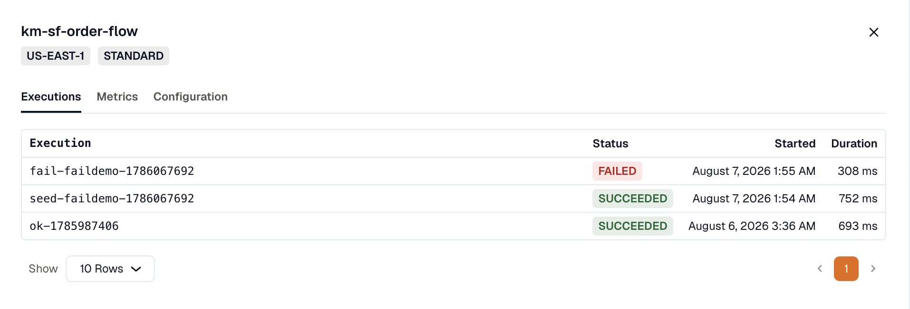
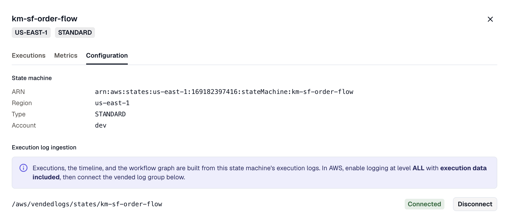
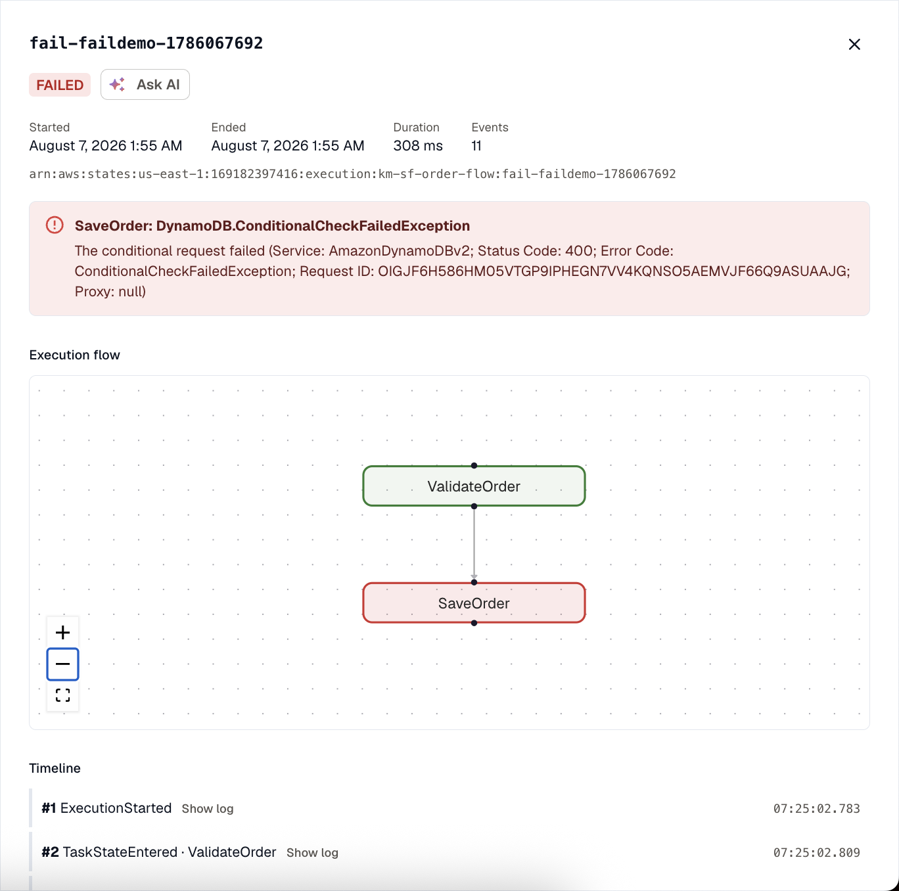
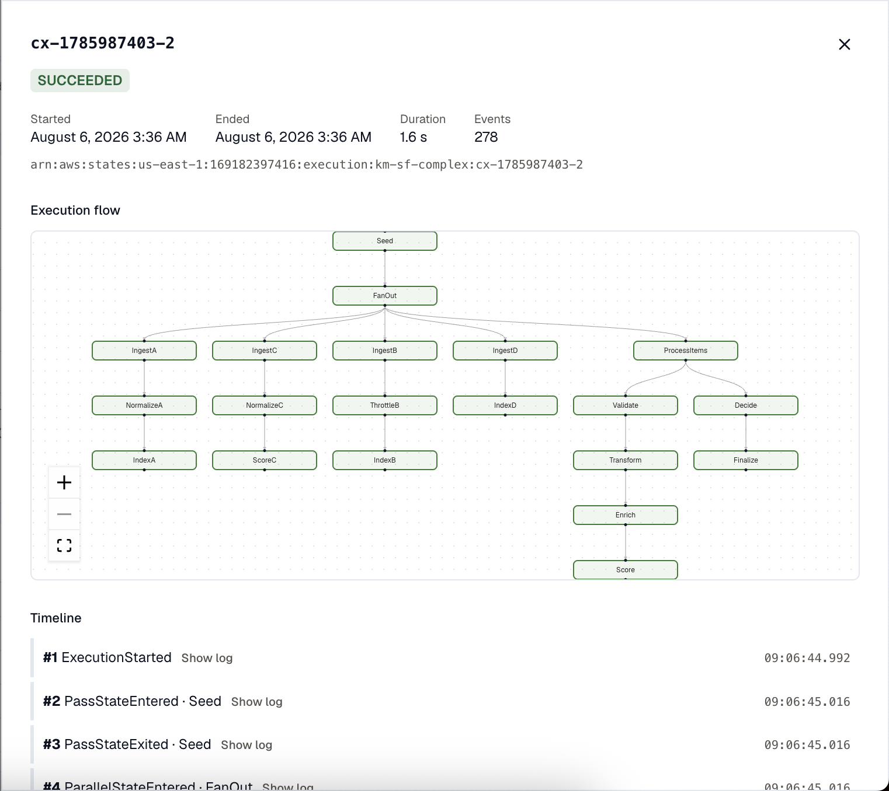
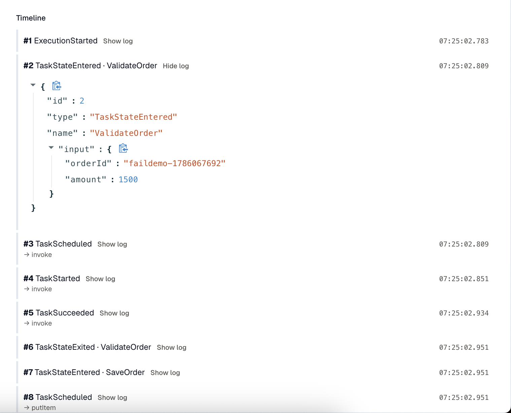

Step Functions monitoring shows your state-machine executions, which ones failed, and where they failed. Open a failed run to read the error and follow the path it took through the workflow.

Open **Step Functions** from the sidebar, under **Serverless**.

Some of this works the moment you connect an AWS account. The rest needs execution logging turned on:

- **Inventory and execution counts work automatically.** KloudMate discovers your state machines and reads their execution counts from CloudWatch. There's nothing to configure.
- **Per-execution timeline and workflow graph need execution logging.** To see the events inside a run and the path it took, turn on Step Functions logging in AWS and connect the log group to KloudMate. See [Turn on execution logging](#turn-on-execution-logging).

## What you can monitor

- **Execution outcomes** for an account: how many runs started, succeeded, failed, aborted, timed out, or were throttled in the last 24 hours.
- **Per-state-machine health**: executions, errors, and error rate for every machine KloudMate discovers.
- **A single execution end to end**: its status, duration, the states it ran, and the input and output of each one.
- **Failure details**: the failing state, its error code, and its cause, marked on the workflow graph.

## Before you start

- A connected AWS account. If you don't have one yet, see [AWS Account Setup](../account-setup/). Inventory and the execution counts start working on their own once an account is connected.
- For the execution timeline and workflow graph: Step Functions **execution logging** at level **ALL** with execution data included, connected in KloudMate. This works the same for Standard and Express workflows. See [Turn on execution logging](#turn-on-execution-logging).

## The Overview dashboard

Start on the **Overview** tab to see whether your executions are healthy. It summarizes the last 24 hours across the workspace.

A workspace can span several AWS accounts, so set the scope with the **Account** and **Region** menus at the top left. KloudMate reads CloudWatch for that account and region, and the page remembers your choice next time. Use **Refresh** to update the numbers.

The tab shows:

- **Outcome tiles**: **Started**, **Succeeded**, **Failed**, **Aborted**, **Timed out**, and **Throttled** counts for the selected scope.
- **Executions chart**: Started, Succeeded, and Failed plotted across the day.
- **Recent executions**: the latest 10 runs, filtered by **All**, **Running**, **Succeeded**, **Failed**, **Aborted**, or **Timed out**. Click a row to open the execution.

## The State machines table

Use the **State machines** tab to find a specific machine or spot the ones that are failing. It lists every state machine KloudMate has discovered in the workspace. Search by name from the box at the top right.

Each row shows the machine's **Name** and **Region**, with its **Executions**, **Errors**, and **Error Rate** over the last 24 hours. Sort by **Error Rate** to bring the machines with the most errors to the top, then open one to see which runs failed.

## Inside a state machine

Opening a state machine shows its type and region at the top, with tabs for Executions, Metrics, and Configuration.

### Executions

The **Executions** tab lists that machine's recent runs, each with its status, start time, and duration. Click a run to open its [detail view](#inside-an-execution).

### Metrics

The **Metrics** tab charts the machine's health from CloudWatch: executions by outcome, throttles, and execution time (average, p90, and p99). Adjust the time range from the picker at the top right.

Express workflows report different metrics. Instead of the outcome and duration charts, they show **Billed duration** and **Billed memory**. See [Standard and Express workflows](#standard-and-express-workflows).

### Configuration

The **Configuration** tab shows the machine's ARN, region, type, and account. It's also where you connect its execution logs to KloudMate.

Under **Execution log ingestion**, KloudMate looks for the machine's vended log group (`/aws/vendedlogs/states/<name>`) and shows whether it's connected. Click **Connect** to start reading its logs, or **Disconnect** to stop. The timeline and workflow graph are built from these logs. If no vended log group appears, logging isn't on yet in AWS; see [Turn on execution logging](#turn-on-execution-logging).

## Inside an execution

Open an execution to see what happened in a single run: the path it took, every event, and, when it failed, why. Each execution has its own URL, so you can share a link to a specific run.

The header shows the status, start and end times, duration, event count, and the execution ARN. When a run fails, a banner names the failing state, its error code, and the cause.

### Execution flow

The **Execution flow** graph shows the path the run took, built from its logs. A failing state is outlined in red. Click any state to see its input and output. Parallel branches and Map iterations show as separate paths.

### Timeline

The **Timeline** lists every execution event in order. Each row has a **Show log** toggle that reveals the raw event log, with the input, output, error, and cause where present.

### Ask AI

On a failed execution, **Ask AI** opens the [KloudMate Assistant](/kloudmate-assistant/) with the failing state, error, and cause already filled in, so you can start debugging without retyping the context.

## Turn on execution logging

Outcome counts and metrics come from CloudWatch and need no per-machine setup. The execution **timeline** and **workflow graph** come from the state machine's execution logs, so they need logging turned on in AWS and the log group connected in KloudMate.

### 1. Enable logging in AWS

In the AWS Step Functions console, open the state machine and edit its logging settings:

1. Set the **Log level** to **ALL**. Lower levels don't record the per-state events the timeline and graph need.
2. Turn on **Include execution data** so the logs carry each state's input and output.
3. Save.

AWS writes these logs to a vended log group named `/aws/vendedlogs/states/<state-machine-name>`, creating it on the first logged run.

:::note
This works for both Standard and Express workflows. Express keeps its execution history only in these logs, so Express runs don't show up until you turn logging on.
:::

### 2. Connect the log group in KloudMate

Open the state machine in KloudMate, go to the **Configuration** tab, and under **Execution log ingestion** click **Connect**. KloudMate detects the `/aws/vendedlogs/states/<name>` group for you. The next run shows up with its timeline and workflow graph.

## Standard and Express workflows

KloudMate supports both Standard and Express workflows. The type shows next to the machine's name, and it changes what the **Metrics** tab plots:

- **Standard** workflows report execution outcomes (started, succeeded, failed, aborted, timed out), throttles, and execution time (average, p90, and p99).
- **Express** workflows don't report per-outcome execution metrics to CloudWatch. Their **Metrics** tab shows **Billed duration** and **Billed memory** instead, and their execution counts come from the logs. Turn on execution logging to see Express runs at all.

## Troubleshooting

### I see metrics but no executions

The outcome tiles and charts are filled in, but the **Recent executions** list or a machine's **Executions** tab is empty.

The counts come from CloudWatch, which needs no logging. Individual executions come from the logs, so they appear only after you turn on execution logging and connect it in KloudMate. See [Turn on execution logging](#turn-on-execution-logging).

### The graph or timeline is empty

An execution opens, but its **Execution flow** graph or **Timeline** has nothing in it.

This usually means the logs aren't detailed enough, or aren't reaching KloudMate. Check both of these:

- **Log level is ALL, with execution data included.** At lower levels, or with execution data turned off, the logs don't carry the per-state events the graph and timeline need.
- **The log group is connected.** In the machine's **Configuration** tab, confirm **Execution log ingestion** shows **Connected**. A message about no `/aws/vendedlogs/states/` log group means logging hasn't started in AWS yet.

## Related

- [AWS Account Setup](../account-setup/): connect an AWS account so KloudMate can discover your state machines.
- [AWS Lambda Monitoring](../lambda-monitoring/): monitor your Lambda functions the same way.
- [KloudMate Assistant](/kloudmate-assistant/): the assistant that Ask AI opens with the failure details.
