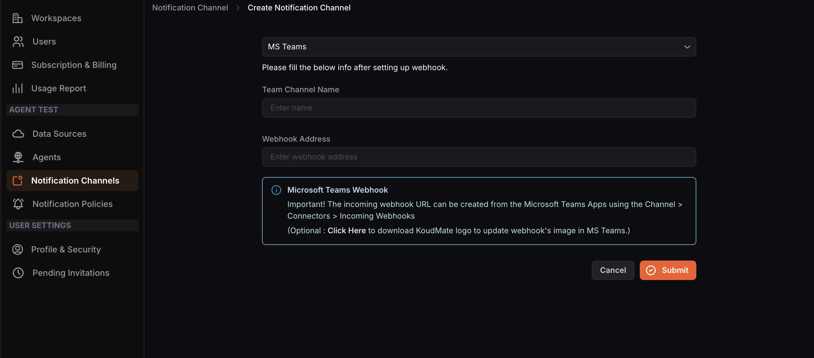

## Configuring an MS Teams Notification Channel

**Step 1:** Select **MS Teams** from the dropdown menu.

**Step 2:** Create an incoming webhook URL from Microsoft Teams by going to **Channel** > **Connectors** > **Incoming Webhooks** in the Microsoft Teams Apps.

**Step 3: **Enter the **Team Channel Name** and the **Webhook Address** in their respective fields.

**Step 4: **Click **Submit**.

<hint type="info">
  Optionally, you can download the KloudMate logo from the link provided on the screen to update the webhook’s image in MS Teams.
</hint>

