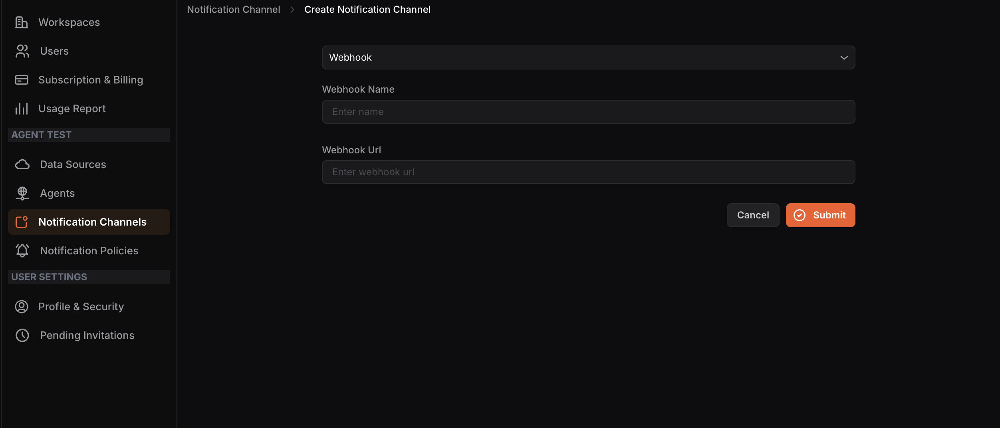

## Configuring a Webhook Notification Channel

**Step 1:** Select **Webhook** from the dropdown menu.

**Step 2: **Enter a **Webhook Name** and the **Webhook URL** in their respective fields.

**Step 3:** Click **Submit**.
