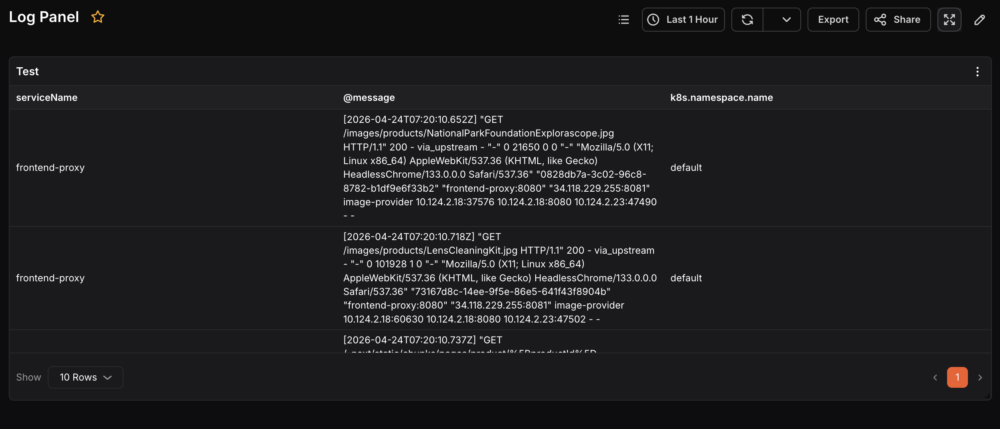
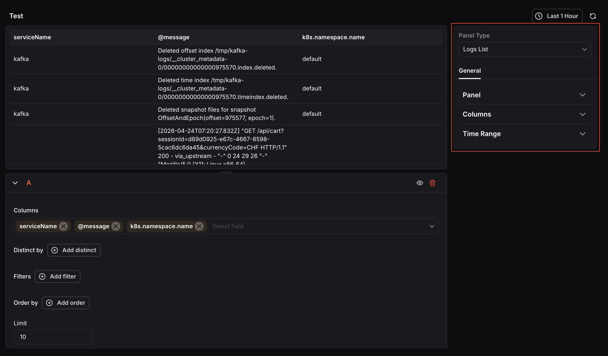
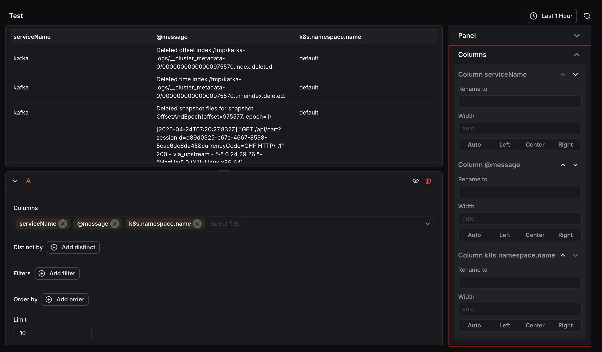

The Logs List Panel displays a list of logs generated for the selected time range. The list can be filtered based on available attributes, and you can choose which columns to display from your log data.

When the panel type is set to Logs List, the following settings are available under the **General** tab:

### Panel
- **Name: **Enter a name for your panel. This appears as the panel title on the dashboard.
- **Description: **Enter a description to provide additional context about what the panel displays.

### Columns
Configure the appearance and formatting of each column in the log table individually. Each column detected from your query result appears here and can be expanded to access its settings.

- **Rename to: **Enter a custom display name for the column heading.
- **Width:** Set a fixed width for the column or leave it as Auto to size automatically.

Columns correspond to the fields selected in the query.

### Time Range
Configure time range behavior for this panel independently from the dashboard.

- **Override Dashboard Time Range:** Individual panels can use their own time range configuration. Enable this to override the time range set at the dashboard level.
- **Time Shift:** Shift the panel’s start and end time by a specified time shift expression. Use the minus (`-`) operator to subtract time, with the same units supported by the dashboard time range expressions. 

Refer to [Time Range Expressions and Settings](<./Time Range Expressions and Settings.mdx>) for supported units and syntax.

<hint type="info">
  At the query level, you can select which Columns to display, filter results using Filters, remove duplicate entries using Distinct by, sort using Order by, and control how many rows appear using the Limit field.
</hint>

 

