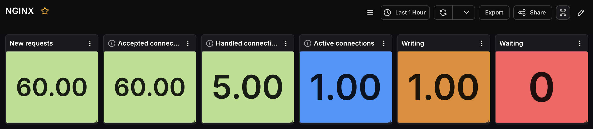
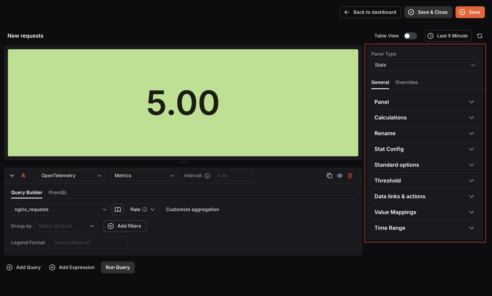
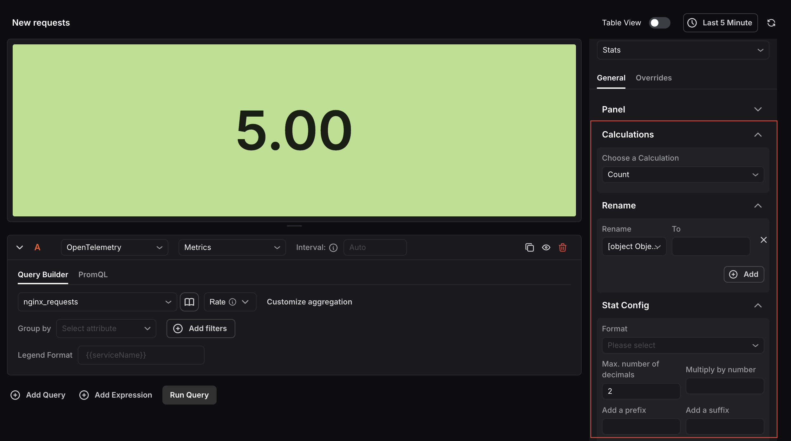
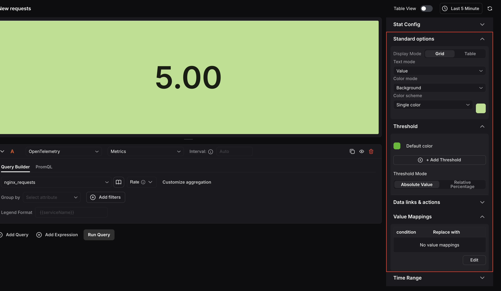

The Stats Panel displays your data as a single prominent value. It includes a query box to define the data and a set of settings to control how that value is calculated and visually presented.

When the panel type is set to Stats, the following settings are available under the **General tab**:

### Panel
- **Name:** Enter a name for your panel. This appears as the panel title on the dashboard.
- **Description:** Enter a description to provide additional context about what the panel displays.

### Calculations
Select the aggregate calculation you want the panel to display. Available options include Count, Mean, Max, Min, Total, and others. This determines the single value shown prominently in the panel.

### Rename: 
Rename the label displayed alongside the stat value in the panel. This is useful when the default query label is too technical or not meaningful to the viewer.

### Stat Config
Control the formatting of the value displayed in the panel.

- Use the Format dropdown to choose how the value is presented, such as Number, Percentage, or Duration.
- Set the maximum number of decimal places to control precision.
- Optionally multiply the value by a number, or add a prefix and suffix to the displayed value.

### Standard options
Configure the visual presentation of the stat panel.

- **Display Mode:** Choose between Grid view, which presents multiple values in a grid layout, or Table view, which displays values in a sortable table format.
- **Text mode:** Choose what information appears in the panel: the label only, the value only, or both together.
- **Color mode:** Choose whether the color is applied to the value text only, or to the entire panel background.
- **Color scheme:** Select a single color to apply uniformly to all values, or use threshold-based coloring so the color automatically changes when a value crosses a defined threshold.

### Threshold: 
Define threshold values to visually indicate when a stat crosses an important boundary.

- A default color is shown for values that do not cross any threshold.
- Click **Add Threshold** to define additional threshold values, each with its own color.
- **Threshold Mode: **Choose between Absolute Value (based on the actual data value) or Relative Percentage (based on a percentage of the range).
- When the stat value crosses a threshold, the panel color updates to the corresponding threshold color.

### Data links & actions: 
Add URL links that users can access from within the panel.

### Value Mappings: 
Map specific data values to custom display text and colors based on defined conditions. When a value meets a condition, it is replaced with the mapped text and displayed in the mapped color. Click Edit to add or modify mappings.

### Time Range: 
Configure time range behavior for this panel independently from the dashboard.

- **Override Dashboard Time Range:** Enable this to allow the panel to use its own time range instead of the one selected at the dashboard level.
- **Time Shift:** Shift the panel’s start and end time by a specified expression. Use the minus (`-`) operator to subtract time, with the same units supported by the dashboard time range expressions.

Refer to [Time Range Expressions and Settings](<./Time Range Expressions and Settings.mdx>) for supported units and syntax.

