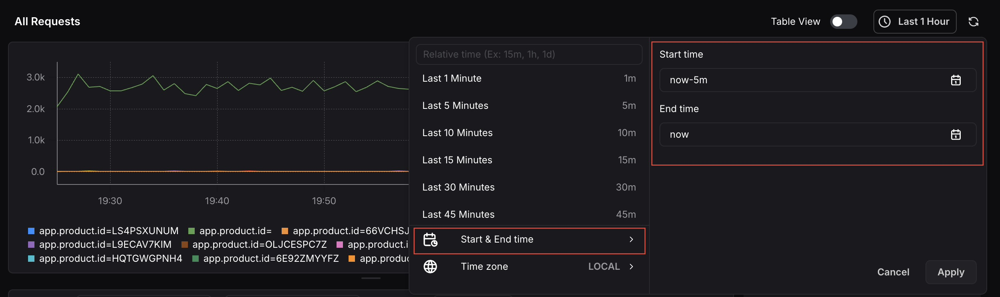
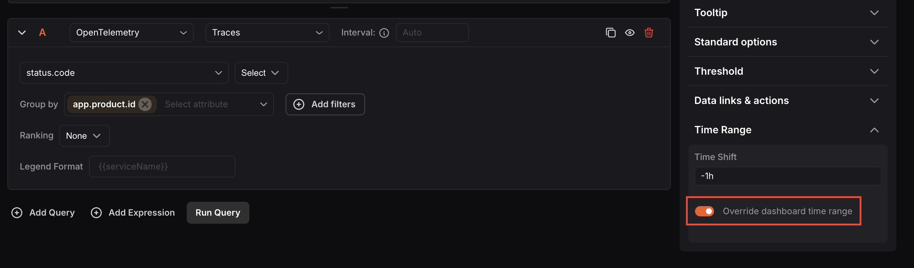
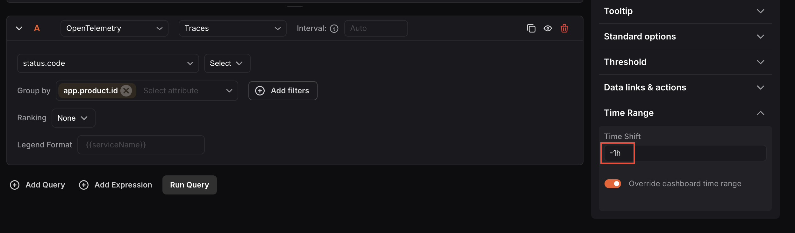

---

title: "Time Range Expressions and Settings"
description: "Documentation for Time Range Expressions and Settings"
sidebar:
  order: 99
---
## Time Range Expressions

Time range expressions let you manually configure the time range of dashboards and panels using a simple syntax instead of selecting fixed dates. This is useful when you want dynamic time windows that always stay relative to the current time.

- **Supported Units**
  - `s`: Seconds
  - `m`: Minutes
  - `h`: Hour
  - `d`: Days
  - `w`: Weeks
  - `M`: Months
- **Supported Operators**
  - `/`: Start of (day, month, week, etc.)
  - `\`: End of (day, month, week, etc.)
  - `-`: Subtract time
  - `+`: Add time
- **Keywords**- `now`: Current time**Examples:**|**Expression**|**From**|**To**   |
| -------------- | -------- | -------- |
| Last 5 minutes | now-5m   | now      |
| Yesterday      | now-1d/d | now-1d\d |
| The day so far | now/d    | now      |
| This week      | now/w    | now\w    |

<hint type="info">
  You can enter the **From**and**To**expressions in the time picker’s**Start & End time**fields. Click**Apply** to apply the custom range to the panel or dashboard.
</hint>

## Time Range Settings

Access panel-level time range settings by going to **Panel Settings**>**Time Range** in the right-side panel editor. These settings let you configure the time range independently for individual panels.

### 1. Override Dashboard Time Range

By default, all panels follow the dashboard’s global time range. Enabling **Override dashboard time**range lets an individual panel use its own time range, independent of the rest of the dashboard.

This is useful when you want to visualize and compare data across different time periods on the same dashboard, for example, comparing last month’s data alongside this month’s in separate panels.

### 2. Time shift

Time Shift moves a panel’s start and end time forward or backward by a specified amount. This lets you view historical data offset from the current time range without changing the dashboard’s global range.

- **Supported operators:** `-` (subtract time required)
- **Supported units:**Same as Dashboard time range expressions**Examples:**|**From**|**To**|**Time Shift**|**Applied From**|**Applied To** |
| -------- | -------- | -------------- | ---------------- | -------------- |
| now-1d   | now      | **-5h**        | now-1d-5h        | now-5h         |
| now-1d/d | now-1d\d | **-1d**        | now-1d/d-1d      | now-1d\d-1d    |

