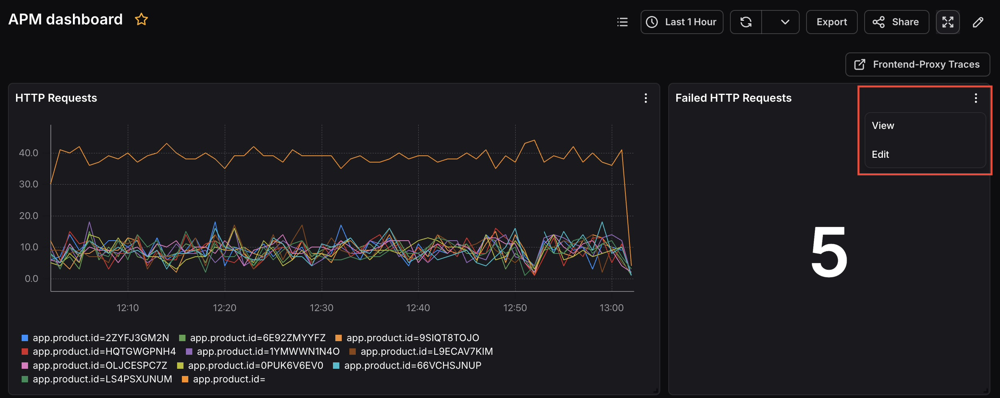
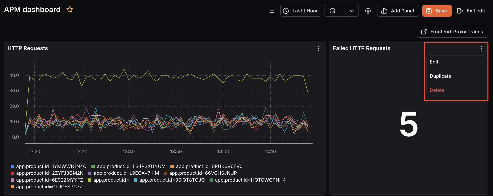
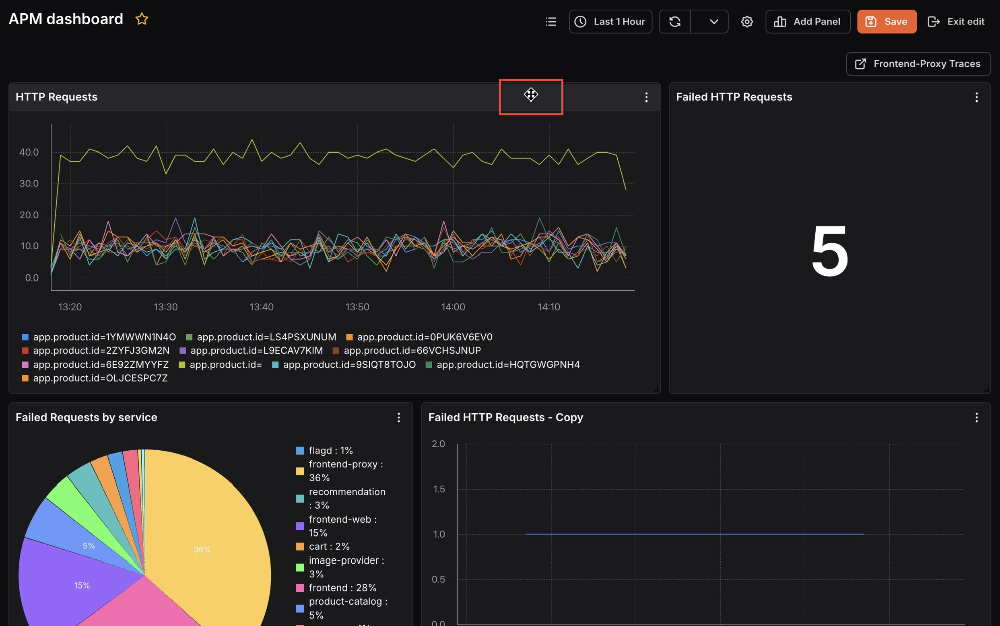

---

title: "Managing Panels"
description: "Documentation for Managing Panels"
sidebar:
  order: 5
---
Panel management actions are available in two modes, view mode and edit mode. Some actions are only available once you enter edit mode by clicking the **Edit** icon in the dashboard toolbar.

### View Mode 

In view mode, click the more options (⋯) icon on any panel to access:

- **View:** Opens the panel in a focused full view for a closer look at the data.
- **Edit:** Opens the panel editor to modify the query, visualization, or settings.

### Edit Mode 

In edit mode, click the more options (⋯) icon on any panel to access:

- **Edit:** Opens the panel editor to modify the query, visualization, or settings.
- **Duplicate:** Creates a copy of the panel on the same dashboard. Useful when you need a similar panel with minor query differences.
- **Delete:** Removes the panel from the dashboard.

### Reposition a Panel

In edit mode, a drag handle (move icon) appears at the top-center of each panel. Click and drag it to move the panel to a different position on the dashboard. This helps you arrange panels in a layout that makes the most sense for your workflow.

### Resize a Panel

In edit mode, a resize handle appears at the bottom-right corner of each panel. Click and drag it to make the panel larger or smaller. Resizing lets you give more space to the metrics you care about most.
