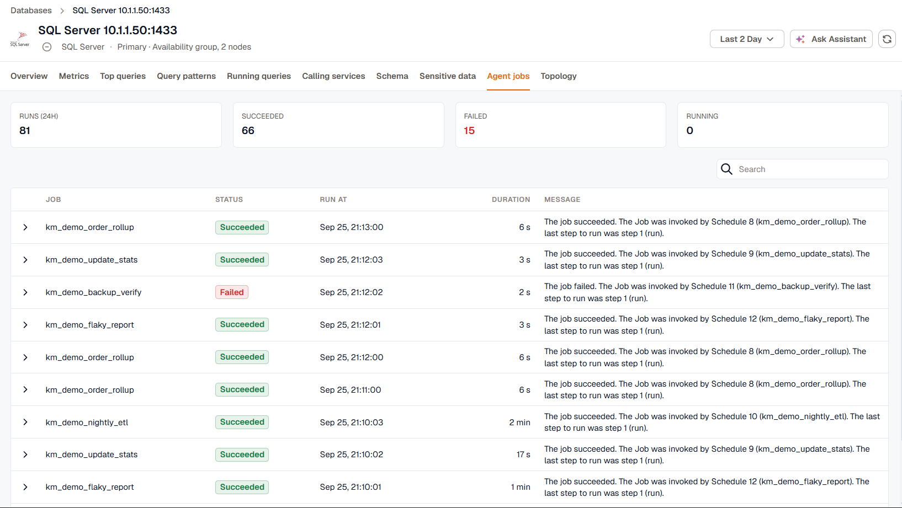

SQL Server and Oracle instances each have one extra tab: **Agent jobs** for SQL Server and **AWR** for Oracle.

## SQL Server Agent jobs

The **Agent jobs** tab lists the SQL Server Agent job runs in the time range, so you can catch a failed backup or maintenance job without logging in to the server. The tiles at the top count the runs, and how many succeeded, failed, and are still running.



Each run shows the job name, its status, when it ran, how long it took, and the message it logged. Expand a run to read the full message.

To collect job runs, turn on the **Agent jobs** coverage for the instance in the agent's database monitoring settings. The monitoring login needs the `SQLAgentReaderRole` role in the `msdb` database:

```sql
USE msdb;
CREATE USER [kloudmate] FOR LOGIN [kloudmate];
ALTER ROLE SQLAgentReaderRole ADD MEMBER [kloudmate];
```

Replace `kloudmate` with your monitoring login. Skip the `CREATE USER` line if the login already has a user in `msdb`.

:::note
Older agents send run times without a time zone. For those, times are shown in the instance's own time zone, and runs can reach back up to 48 hours.
:::

## Oracle AWR

The **AWR** tab shows the sections of Oracle's Automatic Workload Repository report as panels:

- **Report Summary**, with the load profile and instance efficiency percentages
- **Time Model and Wait Class Statistics**
- **Foreground Wait Events, Enqueues, and Services**
- **Load Profile Trends**
- **SQL Statistics**, such as SQL ordered by elapsed time
- **I/O Stats and Segment Statistics**
- **Active Session History**

:::caution
AWR is part of the Oracle Diagnostics Pack, a separately licensed Enterprise Edition option. Only turn on the AWR coverages if your Oracle license includes it.
:::

Each row needs its AWR coverage turned on for the instance in the agent's database monitoring settings. The values change once per AWR snapshot, which Oracle takes every hour by default.
