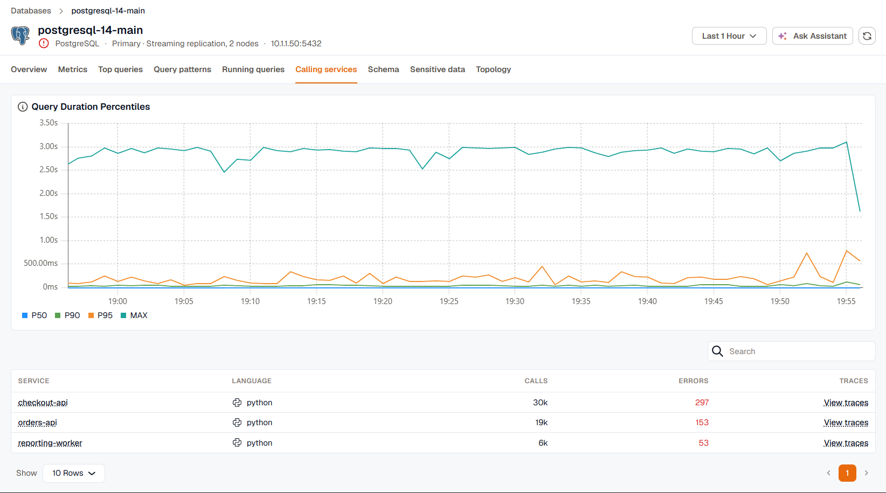

The **Calling services** tab lists the services that called the database in the selected time range, with their call and error counts. Use it to find which application is behind a load spike, then open that service in APM or its traces.

## How services are matched

Calling services are found from traces, not from the database. A service appears when its database calls are recorded as client spans with the database's address and port, either by [eBPF monitoring](../../kloudmate-agent/ebpf-observability/) or by OpenTelemetry instrumentation in the service. See [APM and tracing](../../apm-and-tracing/) to instrument your services.

If the instance has no endpoint recorded, there's nothing to match spans against, and the tab has no data.

## Read the tab

**Query Duration Percentiles** charts the P50, P90, P95, and maximum duration of the database calls over the time range.

The table lists each calling service with its language, the number of calls, and the number of calls that ended in an error. Click a service to open it in APM, or **View traces** to open the Traces explorer filtered to that service's calls to this database.

## Match a query to its traces

The **Calling services** tab in a query's [details](../query-performance/#query-details) narrows the list to the services that ran that one query. Queries are matched to spans in one of two ways, and the tab shows which one it used:

- **Exact match** uses a query ID that the query and its spans both carry.
- **Approximate match** uses a distinctive part of the query text when spans carry no query ID. It can miss some traces, or include a different query with the same text.

Most instrumentation doesn't record a query ID, so the match is usually approximate. On MySQL, which stores queries in a rewritten form, the match uses a run of words from the query rather than an exact fragment.

If the traces in your workspace carry neither a query ID nor query text, queries can't be matched to traces.
