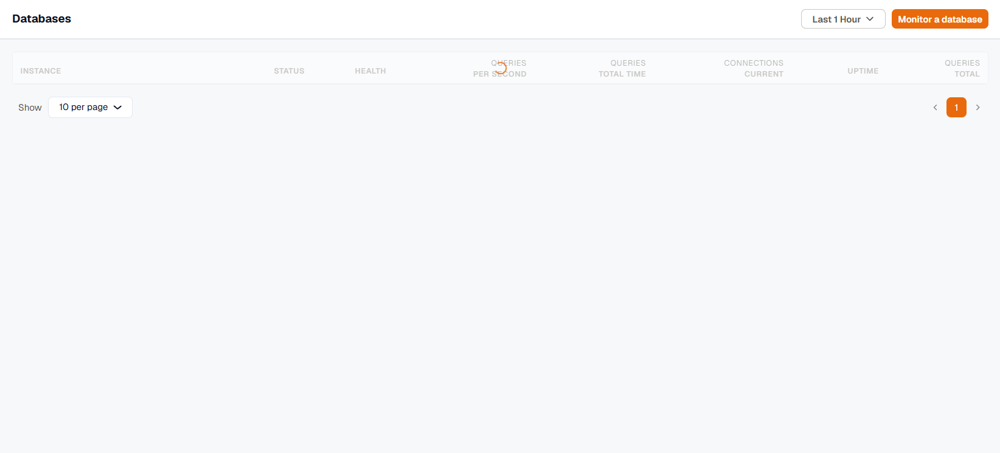

The **Databases** page lists every monitored database instance with its status, health, query load, and connections. Use it to spot the instances that have stopped reporting or are running hot, then click an instance to open its [details](../instance-overview/).

## Status and health

**Status** tells you whether the instance is reporting. An instance is **Available** while the agent keeps sending its heartbeat, and **Not reporting** when no heartbeat has arrived in the last five minutes. On wide time ranges the window stretches to three data points.

**Health** summarizes how the instance is doing, as the worst level across these categories:

| Category | Measures | Warning | Critical |
|---|---|---|---|
| CPU | Host CPU utilization | 80% | 90% |
| Memory | Host memory utilization | 85% | 95% |
| Disk | Host filesystem utilization | 80% | 90% |
| Connections | Current connections as a share of the connection limit | 80% | 90% |
| Cache hit | MySQL and MariaDB buffer pool hit ratio | 90% or lower | 80% or lower |
| Replication lag | Seconds behind the primary, on MySQL and MariaDB replicas | 30 s | 120 s |

Hover the health icon to see the level of each category. A few rules affect how you read it:

- **CPU**, **Memory**, and **Disk** only count when the database runs on the same host as the agent. For a managed database, such as Amazon RDS, the agent's host tells you nothing about the database, so these categories are left out.
- A category with no data doesn't count as healthy. If no category has data, the icon shows that there's no health data yet.
- An instance that isn't reporting shows **Not reporting** for health too.

Health comes from thresholds on the collected metrics. It isn't tied to your alert rules. When an alert rule is firing for an instance, the instance's header shows it, as described in [Instance details and Overview](../instance-overview/#the-instance-header).

## Filter and search

Use the filters above the table to show one status or one engine at a time. Selecting a filter replaces the previous one, and clicking the active filter again clears it. **All** clears every filter.

The search box matches an instance's name, endpoint, host, and engine.

## Replicas and clusters

When two or more members of the same cluster are monitored, they're grouped under the primary, with the cluster type and each member's role in the **Cluster** column. Collapse a group to hide its replicas. Paging counts a group as one row, so a group never splits across pages.

## Read the columns

- **Queries per second** and **Queries total** come from the instance's query rate. **Queries total** is that rate over the selected time range.
- **Queries total time** is the time the database spent running queries in the range.
- A dash in a query column means the instance hasn't reported query metrics yet.
- **Connections current** shows the latest connection count next to its trend over the range.

You can sort by instance name, the query columns, connections, and uptime. Instances with no value for the sorted column always sort last.

## Add a database

1. Click **Monitor a database**.
2. Choose the agent that will monitor the database. The agent must be able to reach the database: install it on the database's own host for a self-hosted database, or on a host with network access to a managed one. Agents in manual configuration mode can't be used here; switch the agent to managed in **Settings** first.
3. Choose the engine. The list shows the engines that agent supports.
4. Configure the database in the agent's database monitoring settings, which open with the agent and engine already selected. See [Database monitoring overview](../../kloudmate-agent/database-monitoring/overview/) for the coverages and credentials.

Data starts arriving within a minute of saving.
