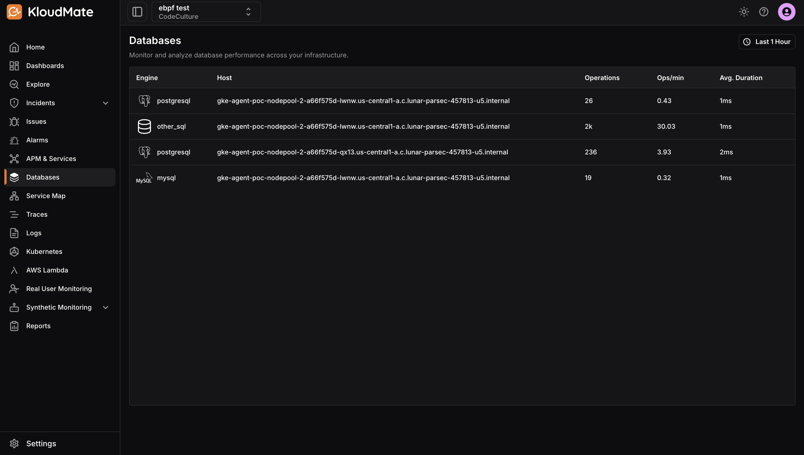
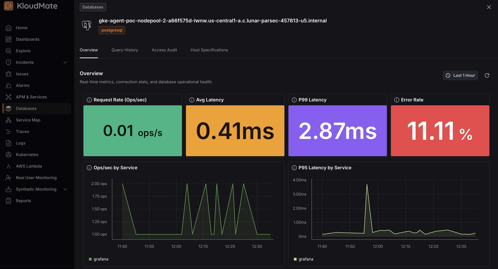
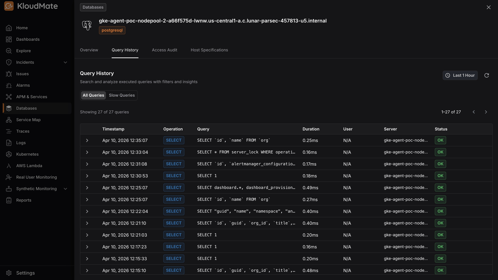
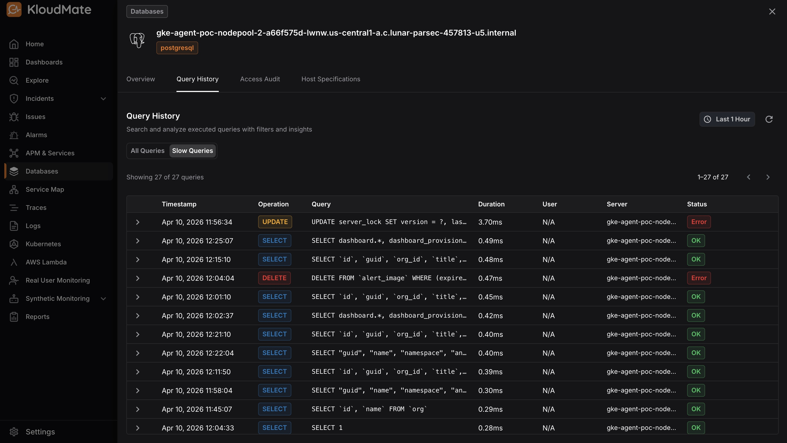
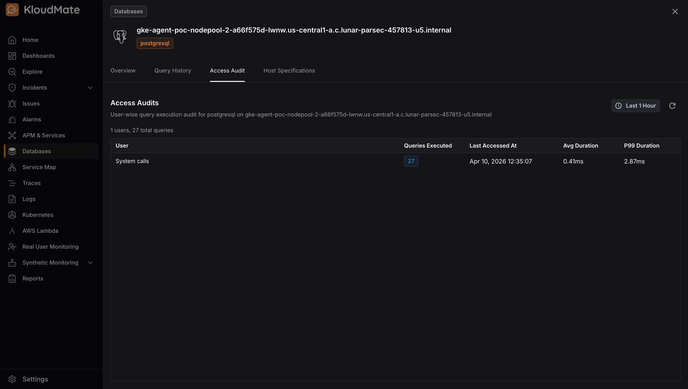
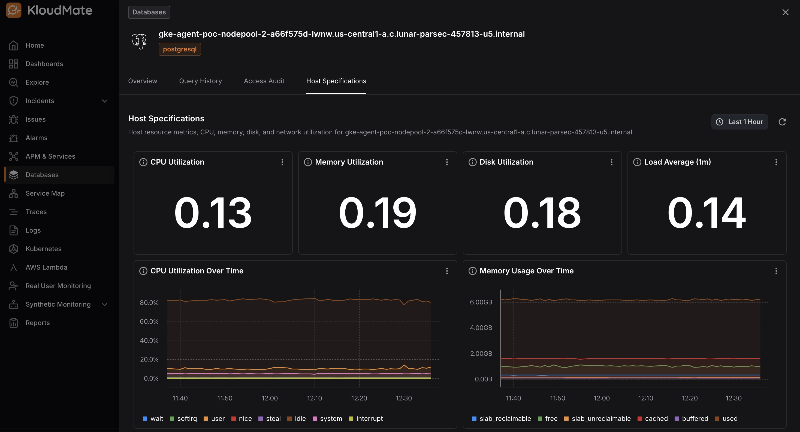

Click **Databases** in the left navigation to see a list of all monitored database instances across your workspace. Each entry shows the database engine, host, total operations, operations per minute, and average query duration, giving you an at-a-glance health check across all your databases.

## Database Detail View

Clicking on any database instance opens a dedicated detail view for that host. The detail view is organized into four tabs: **Overview**, **Query History**, **Access Audit**, and **Host Specifications**, each focused on a different aspect of database health and activity.

### Overview

The Overview tab gives you a real-time picture of the database’s operational health. At the top, key performance indicators — **request rate**, **average latency**, **P99 latency**, and **error rate**, let you immediately assess whether the database is performing within expected bounds.

Below the summary metrics, time-series charts break down operations and latency by the services querying the database. This makes it easy to identify which services are driving the most load or contributing to latency spikes, rather than looking at the database in isolation.

### Query History

The **Query History** tab lets you search and analyze all queries executed against the database.

- **All Queries** shows the complete query log, with each entry displaying the operation type, query text, duration, user, server, and status. Queries that resulted in errors are clearly flagged for quick identification.

- **Slow Queries** sorts all queries by duration from slowest to fastest, making it easy to immediately identify the most time-consuming operations.

### Access Audit

The **Access Audit** tab gives you a user-wise view of all query activity on the database. It shows who is accessing the database, how many queries they’ve executed, when they last accessed it, and how their queries are performing in terms of average and P99 duration. 

This is useful for understanding usage patterns and identifying users or processes that may be contributing to performance issues.

### Host Specifications

The **Host Specifications** tab shows the resource health of the host machine running the database. Current utilization values for CPU, memory, disk, and load average give you an immediate sense of the host’s condition.

The detailed charts below provide a granular breakdown of how these resources are being consumed over time, helping you correlate database performance issues with underlying infrastructure constraints.

