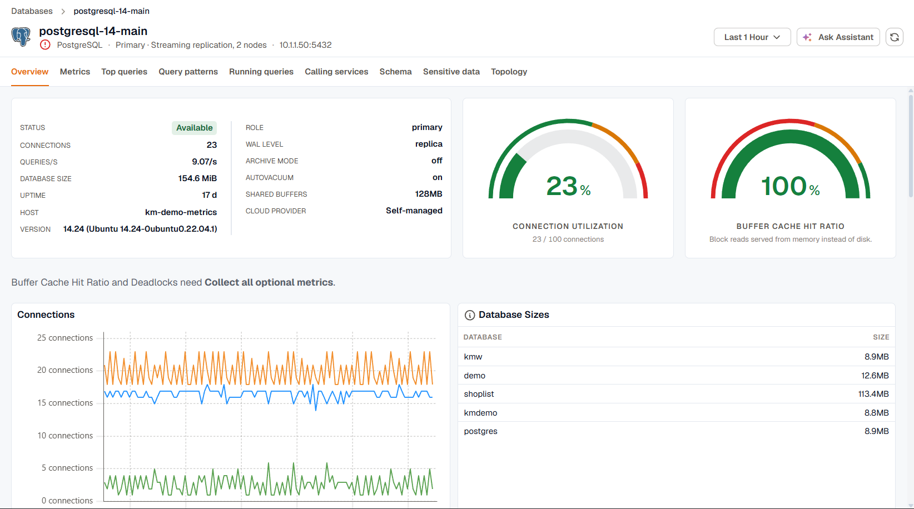

Open an instance from the [Databases list](../databases-list/) to see everything KloudMate collects for it. The page opens on the tab you viewed last, and every tab uses the time range in the top-right corner.

## The instance header

The header shows the engine, the instance's role, and its cluster, for example **Primary · Streaming replication, 2 nodes**. Hover the cluster to see the other members. An instance that belongs to more than one hierarchy, such as an Oracle database that's both in a container and in Data Guard, shows each one. Oracle instances also show whether they're a container database (CDB) or a pluggable database (PDB).

When alert rules are firing for the instance, the header shows the number of active alerts. Open the list to go to an alert. Alerts match the agent's host name when the database runs on that host, and the instance itself otherwise.

The health icon is the same one shown on the [Databases list](../databases-list/#status-and-health). When the worst category is **CPU**, **Memory**, or **Connections**, click the icon to open the Overview tab with a triage banner for that category. See [Triage from the health icon](#triage-from-the-health-icon).

## Tabs and page controls

The tabs available depend on the engine. See [Supported engines](../#supported-engines) for the full list.

- **Database** narrows the query, session, schema, and sensitive data tabs to one database on the instance. It appears for PostgreSQL, where databases are discovered from their size metric, and for Oracle container databases, where you pick a container. An Oracle CDB has no **All databases** option; its own container is selected by default.
- **Ask Assistant** opens the KloudMate Assistant with a prompt that already includes the instance's status, health, connections, and query rate.
- **Refresh** reloads the current tab.

## The Overview tab

The Overview tab brings together the numbers you usually check first.

### Instance info and gauges

The info card shows the instance's status, connections, query rate, database size, uptime, and host. When the database doesn't run on the agent's host, the host row is labelled **Monitored from** and shows the agent's host. The card also lists engine settings when the engine reports them:

| Engine | Settings |
|---|---|
| PostgreSQL | Version, role, WAL level, archive mode, autovacuum, shared buffers |
| MySQL, MariaDB | Version, flavor, read-only state, binary log, buffer pool, time zone |
| SQL Server | Version, edition, product level, Always On, CPUs, max server memory |
| Oracle | Version, open mode, Data Guard role, log mode, archiver, SGA target |

Cloud details such as provider, account, region, and availability zone appear when the agent reports them. When it doesn't report a cloud provider, KloudMate infers one from the endpoint, for example Amazon RDS or Azure SQL Database, and marks it as inferred.

Next to the card, gauges show the ratios that matter most for the engine:

| Engine | Gauges |
|---|---|
| PostgreSQL | Connection utilization, buffer cache hit ratio |
| MySQL, MariaDB | Buffer pool utilization, buffer pool hit ratio |
| SQL Server | Oldest backup age, memory usage |
| Oracle | Session utilization, database CPU utilization, oldest backup age |
| MongoDB | Connection utilization, cache hit ratio |
| Redis | Memory utilization, network input, network output |

A gauge only appears when it has data. Cache hit ratio gauges turn red below 60% and amber below 85%. A Redis instance without a `maxmemory` limit has no memory utilization, because there's no ceiling to measure against.

ClickHouse, Elasticsearch, SAP HANA, MongoDB Atlas, and Snowflake show status, connections, query rate, and database size as separate tiles instead of the card and gauges.

### Trend charts

Below the card, charts show how the instance changed over the time range. Every engine gets a **Connections** chart. The rest depend on the engine, for example **Database Sizes** on PostgreSQL, **Keyspace Hit Ratio** on Redis, **Backup Status** on SQL Server and Oracle, and the query rate, failed queries, and parts charts on ClickHouse.

When query statistics are collected, the tab also shows **Query Volume**, **Total Duration by Query**, and **Average Query Duration** for the busiest queries, with a link to [Query patterns](../query-performance/#query-patterns).

A note above the charts names any chart that needs **Collect all optional metrics**.

### Load by calling service

The **Load by calling service** chart shows how the database's call time splits across the services that call it, for the six busiest services plus the rest. Hover a segment to see that service's share. It's built from traces, so it only has data when your services' database calls are traced. See [Calling services](../calling-services/). It isn't shown for Oracle.

## Triage from the health icon

Clicking the health icon opens the Overview tab with a banner that names the category and its current level. For **Connections**, the banner links to [Running queries](../running-queries/) so you can see what's holding connections. On PostgreSQL it also offers to create an SLO on connection utilization, so you're alerted before the limit is reached next time.
