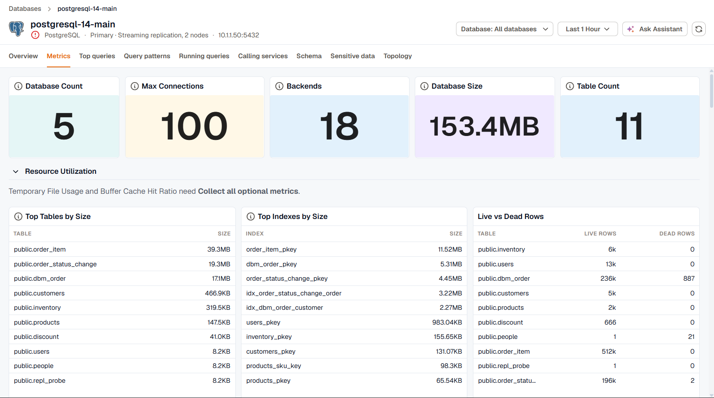

The **Metrics** tab is a prebuilt dashboard for the instance's engine. Stat tiles across the top show the headline numbers, and the panels below are grouped into collapsible rows such as **Throughput**, **Locks**, and **Replication**.

Collapse the rows you don't need. A collapsed row doesn't load its panels, and it stays collapsed the next time you open an instance of the same engine.

## Panels that need more collection

Some panels only have data after you turn on more collection for the instance in the agent's database monitoring settings. The row says so above its panels:

- **Collect all optional metrics** adds the engine's optional metrics. On PostgreSQL, for example, it fills in **Temporary File Usage** and **Buffer Cache Hit Ratio**.
- A named coverage adds a specific data set. For example, **Blocked Sessions** on PostgreSQL needs the **Locks & blocking** coverage, and the **TempDB** row on SQL Server needs **TempDB usage**.

See [Engines and coverages](../../kloudmate-agent/database-monitoring/engines-and-coverages/) for what each coverage collects.

## What each engine's dashboard covers

| Engine | Stat tiles | Rows |
|---|---|---|
| PostgreSQL | Backends, max connections, database count, database size, table count | Resource utilization, throughput, locks, replication, checkpoints |
| MySQL, MariaDB | Connected threads, running threads, uptime, replication lag | Throughput, buffer pool and table locks, handlers and InnoDB, connections and errors, queries and network, table cache, tables and indexes |
| SQL Server | User connections, batch requests, buffer cache hit ratio, page life expectancy | Compilations and locks, transactions, pages and checkpoints, waits and file I/O, sessions, index health, Agent jobs, memory, schedulers, TempDB, plan cache |
| Oracle | Active sessions, active processes, active transactions, PGA allocation rate | Locks, throughput, I/O and CPU, capacity, time model, memory and cursors, workload detail, efficiency |
| MongoDB | Current connections, active sessions, database count, open cursors | Operations, cache and memory, network and cursors, storage, collections and indexes, server health, latency and replication, locks |
| MongoDB Atlas | Connections, open cursors, page faults, restarts | CPU and memory, operations, storage and disk, network, locks and replication, tickets and cache |
| Redis | Connected clients, blocked clients, connected replicas, uptime | Memory, throughput, connections and keys, replication, persistence and CPU |
| ClickHouse | Running queries, rows inserted, rows read, average query duration, merges running, max parts per partition | Queries, inserts, reads, merges and parts, caches, resources, background pools and compression, replication and distributed |
| Elasticsearch | Cluster status, cluster nodes, pending tasks, in-flight fetches | Shards and documents, JVM, disk and OS, caches, circuit breakers and thread pools |
| SAP HANA | Uptime, connections, blocked transactions, active alerts | Memory, CPU and transactions, replication, disk, volumes, and services |
| Snowflake | Warehouse credits used, credits used by warehouse | Storage |

The ClickHouse dashboard also has cards for server version and inventory, CPU, memory, and disk utilization, the query mix by kind, and data parts by state, with the busiest partition marked against the limits where inserts are delayed (1,000 parts) and rejected (3,000 parts).

## Engines without a dashboard

An instance of an engine KloudMate doesn't have a dashboard for gets a dashboard built from traces instead. It shows operations per second, average and P99 latency, and error rate, broken down by service and operation, for the database calls your traced services make.
