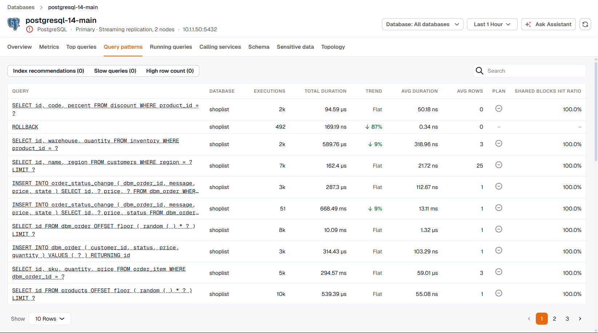
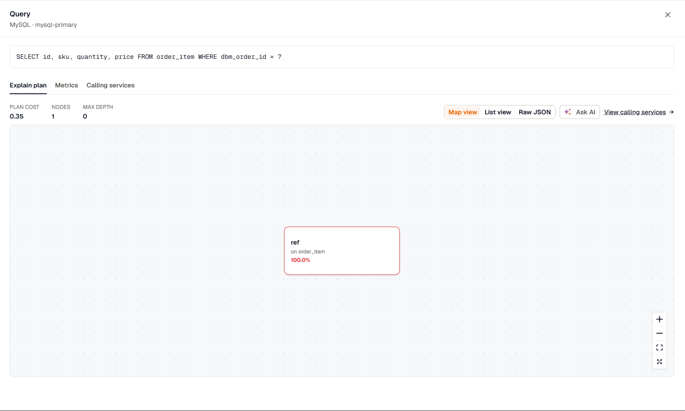

The **Top queries** and **Query patterns** tabs rank the statements your database runs by the time they cost. The queries at the top of the list are usually the ones worth tuning first. Open a query from **Query patterns** to read its execution plan and per-query metrics.

These tabs are available for PostgreSQL, MySQL, MariaDB, SQL Server, Oracle, and MongoDB. They need the **Query performance (samples + top queries)** coverage turned on for the instance in the agent's database monitoring settings. See [Engines and coverages](../../kloudmate-agent/database-monitoring/engines-and-coverages/).

:::note
MongoDB query statistics need a KloudMate agent built on OpenTelemetry Collector 0.155.0 or later.
:::

Queries are grouped by their normalized form, with literal values replaced, so every execution of `SELECT * FROM orders WHERE id = ?` counts as one query no matter which ID it used.

## Top queries

**Top queries** lists the queries that ran in the selected time range, sorted by total duration. Expand a row to read the full query text.

The columns depend on what the engine reports:

- **Database** shows the database the query ran in. MySQL doesn't report it.
- **Avg rows** shows the rows returned or affected per execution, on PostgreSQL, SQL Server, and Oracle.
- **Shared blocks hit ratio** shows how many of the blocks a query read came from shared memory, on PostgreSQL.

## Query patterns

**Query patterns** adds a trend and a plan status to each query, and lets you filter for the queries that most likely need attention.

The **Trend** column compares the query's total duration with the previous period of the same length. A change under 5% shows as **Flat**. An increase is marked in red and a decrease in green. Queries that didn't run in the previous period have no trend.

The **Plan** column shows whether an execution plan was captured for the query in the time range. Plans are only kept when **Collect execution plans** is on for the instance, and they're only checked for the 20 queries that took the most time.

Use the filters above the table to narrow the list:

- **Index recommendations** shows queries whose plan has a sequential scan over an estimated 10,000 rows or more, a common sign of a missing index. Only the plans of the 20 most time-consuming queries are checked.
- **Slow queries** shows queries that averaged one second or more per execution.
- **High row count** shows queries that returned or affected 10,000 rows or more per execution.

Below the table, **Query Volume** and **Total Duration by Query** chart the ten busiest queries over the range, and **Load by calling service** shows which services generated the load.

## Query details

Click a query in **Query patterns** to open its details in a side panel over the list. The panel shows the full query text and tabs for **Explain plan**, **Metrics**, and **Calling services**. To share a query with a teammate, copy the page URL while the panel is open.

### Explain plan

Execution plans are available for PostgreSQL, MySQL, MariaDB, SQL Server, and Oracle, when **Collect execution plans** is on for the instance. A new query can take a few collection intervals to get its first plan.

The tab shows the plan's total cost, number of nodes, and depth, with three views of the plan:

- **Map view** draws the plan as a tree of operations. Click a node to see its costs, rows, row width, relation, filter, and join details.
- **List view** lists each operation with its share of the total cost.
- **Raw JSON** shows the plan exactly as the database returned it.

When the plan has a sequential scan over an estimated 10,000 rows or more, a warning suggests indexing the filtered or joined column.

If the query ran under more than one plan in the time range, **Plan history** lists each plan with the time it was first seen and how often it was captured. Select an older plan to compare it with the current one. A plan that changed is a common cause of a query that suddenly got slower.

Click **Ask AI** to ask the KloudMate Assistant about the plan.

### Metrics

The **Metrics** tab charts the query on its own: executions, average and total duration, and rows per execution, plus the engine-specific panels the database reports. For example:

- PostgreSQL shows blocks accessed, buffer cache hit ratio, planning time, and temporary blocks written per execution.
- SQL Server shows logical reads, CPU versus wait time, and memory grants per execution.
- Oracle shows logical reads, CPU versus wait time, and wait time by class.
- MongoDB shows documents examined versus returned.

When session samples are collected, the tab also shows **Active Sessions by Client** and **Sessions by Wait Type** for sessions running the query.

### Calling services

The **Calling services** tab lists the services that ran this query, from your traces. See [Match a query to its traces](../calling-services/#match-a-query-to-its-traces).
