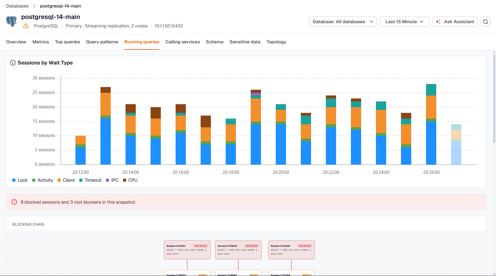
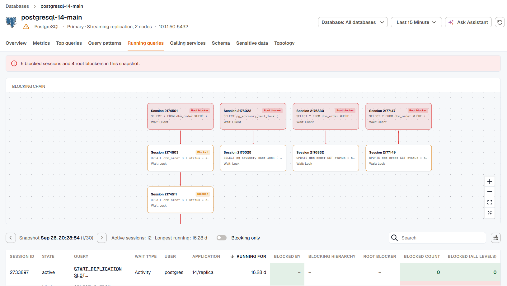
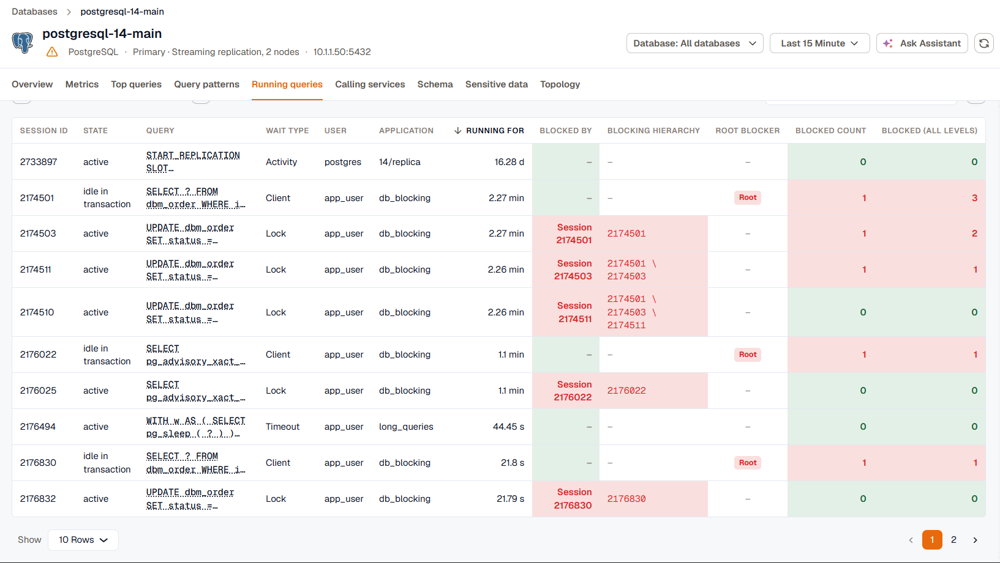

The **Running queries** tab shows the sessions that were active on the database, captured as snapshots over the time range. Use it when connections pile up or queries stall, to find what the sessions were waiting on and which session was holding the others up.

The tab is available for PostgreSQL, MySQL, MariaDB, SQL Server, Oracle, and MongoDB. Session snapshots need the **Query performance (samples + top queries)** coverage turned on for the instance. See [Engines and coverages](../../kloudmate-agent/database-monitoring/engines-and-coverages/).

## What sessions were waiting on

**Sessions by Wait Type** counts the active sessions in each snapshot by what they were waiting on, such as a lock, I/O, or the client. Sessions that weren't waiting on anything are counted as **CPU**. A band that grows over time, for example **Lock** during a batch job, points you at the kind of contention to look for.

## Step through snapshots

The table shows one snapshot at a time, starting with the newest. Use the arrows next to the snapshot time to move to older and newer snapshots. The toolbar also shows how many sessions were active and how long the longest one had been running.

Each row shows the session, its state, the query it was running, its wait type, the database user, the client application, and how long it had been running. Click a query to read its full text.

The tab loads the newest 500 session rows in the time range. If a busy database produces more than that, older snapshots are left out, and narrowing the time range brings them back.

## Find the session that's blocking others

When a snapshot contains blocked sessions, a banner counts the blocked sessions and the root blockers, and the **Blocking chain** graph draws who's waiting on whom:

- A **root blocker** is holding a lock and isn't waiting on anyone else. It's usually the session to investigate first. Root blockers are often sessions that are idle in a transaction: they still hold the locks they took, but aren't running anything, so their wait shows as **Client**.
- Each blocking session shows how many sessions it blocks, what it's waiting on, and the relation it's waiting for.
- A blocker that wasn't captured in the snapshot is drawn with a dashed outline.

Click a session in the graph to read its full query text.

On SQL Server, some blockers aren't user sessions. These are shown by name, such as an orphaned distributed transaction or a deferred recovery transaction.

Turn on **Blocking only** to hide the sessions that aren't part of a blocking chain.

## Add blocking columns to the table

Use the **Columns** button to add the blocking columns to the session table. They're hidden by default, and your choice is saved in your browser.

| Column | Shows |
|---|---|
| **Blocked by** | The session directly blocking this one. |
| **Blocking hierarchy** | The whole chain of sessions above this one, starting from the root blocker. |
| **Root blocker** | Marks the sessions at the top of a chain. |
| **Blocked count** | How many sessions this one blocks directly. |
| **Blocked (all levels)** | How many sessions this one blocks directly or through other sessions. |
