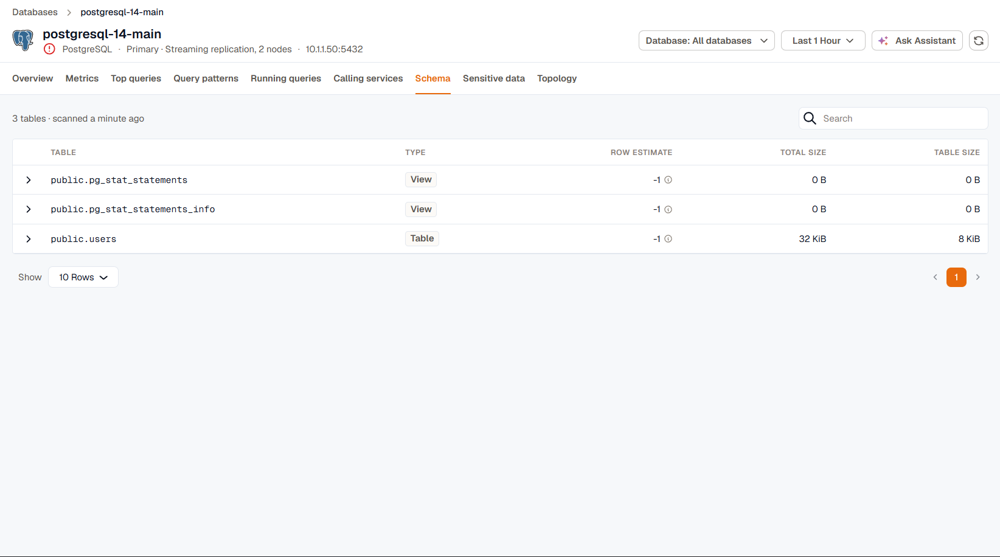

The **Schema** tab lists the tables in the database with their size and structure. Check a table's indexes and constraints here while you investigate a slow query. On MongoDB, the same tab is called **Collections**.

## Tables

The **Schema** tab is available for PostgreSQL, MySQL, MariaDB, SQL Server, and Oracle. It shows the newest schema scan from the last 24 hours, and needs the **Schema catalog** coverage turned on for the instance in the agent's database monitoring settings.

Each table shows its type, an estimated row count, its total size including indexes, and its table size. The row estimate comes from the database's optimizer statistics, so it can lag behind the real count until the statistics are refreshed.

Expand a table to see its columns, indexes, and constraints, including primary keys, foreign keys, unique, and check constraints. A scan lists up to 5,000 tables.

On an Oracle container database, tables live in the pluggable databases. Select a PDB in the **Database** menu to see its tables.

## MongoDB collections

MongoDB has no fixed schema, so the **Collections** tab lists collections instead of tables, with the number of index accesses for each. A collection appears once a query uses one of its indexes. It doesn't need a separate coverage.

## Missing index suggestions

On SQL Server, the **Missing index suggestions** card below the tables lists the indexes SQL Server's own optimizer recommends, with the estimated improvement and how often the index would have been used for seeks and scans. The card only appears when there are suggestions.

For other engines, use the **Index recommendations** filter in [Query patterns](../query-performance/#query-patterns) to find queries that scan large tables without an index.
