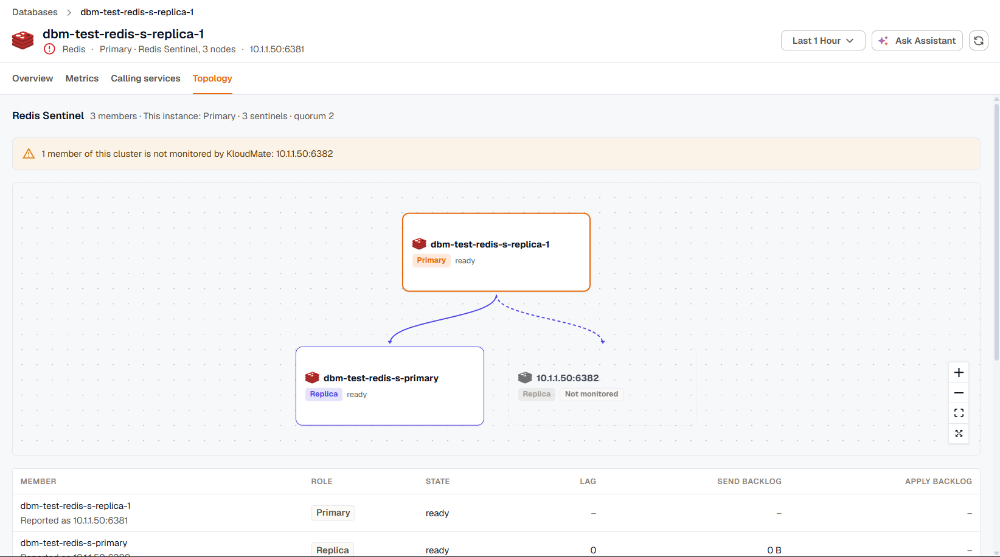

The **Topology** tab shows the replication setup or cluster the instance belongs to: its primary, its replicas, the role and state of each member, and how far each replica lags behind. Use it to confirm which node is the primary after a failover, or to find the replica that's falling behind.

The tab is available for PostgreSQL, MySQL, MariaDB, SQL Server, Oracle, Redis, and ClickHouse. It needs a topology coverage turned on for the instance in the agent's database monitoring settings:

| Engine | Coverage |
|---|---|
| PostgreSQL, MySQL, MariaDB, SQL Server, Redis, ClickHouse | **Replication topology & lag** |
| Oracle | **Container topology (CDB / PDB)**, **RAC topology**, or **Data Guard topology & lag** |

## Read the tree

The tree starts at the primary and branches to its members. The instance you opened has a thicker border. Each member shows its role, such as primary, replica, or standby, and its current state.

A member that reports into the cluster but isn't monitored by KloudMate is drawn in grey and marked **Not monitored**, and a banner above the tree lists its address. Set up monitoring for it to see its own metrics. See [Database monitoring overview](../../kloudmate-agent/database-monitoring/overview/).

The heading counts the members and names this instance's role. When an instance belongs to more than one hierarchy, each gets its own section. For example, an Oracle database can show its container, its RAC cluster, and its Data Guard configuration separately.

## Check replication lag

The table lists every member with its role and state. When the members report them, it adds:

- **Lag**, how far the member is behind the primary.
- **Send backlog** and **Apply backlog**, how much data is waiting to be sent to the member and waiting to be applied on it.

Not every engine reports every column. For example, MySQL reports lag but no backlog.

Hover a member's name to see how KloudMate matched it to a monitored instance: by an exact match on its identity, by address, or by host name. When a member could match more than one instance, it's marked as ambiguous.

For clusters that replicate, **Replication Lag vs Primary Write Rate** charts each replica's lag against how fast the primary is writing, so you can tell whether a replica fell behind because of a write burst or on its own.

## Redis Sentinel and Redis Cluster

For a Redis group managed by Sentinel, the heading also shows how many Sentinels watch the group and the quorum they need to agree on a failover. While a failover is in progress, a banner says so, and roles and lag can change until the Sentinels finish promoting the new primary. After the failover, the tree shows the new primary at the root.

For Redis Cluster, each primary is shown with its replicas beneath it, and every node shows the range of hash slots it serves.

## If the tab is empty

An instance that reports itself as standalone isn't part of a cluster, so there's no tree to draw. If the instance reported no cluster membership at all in the time range, check that the topology coverage is turned on for it.
