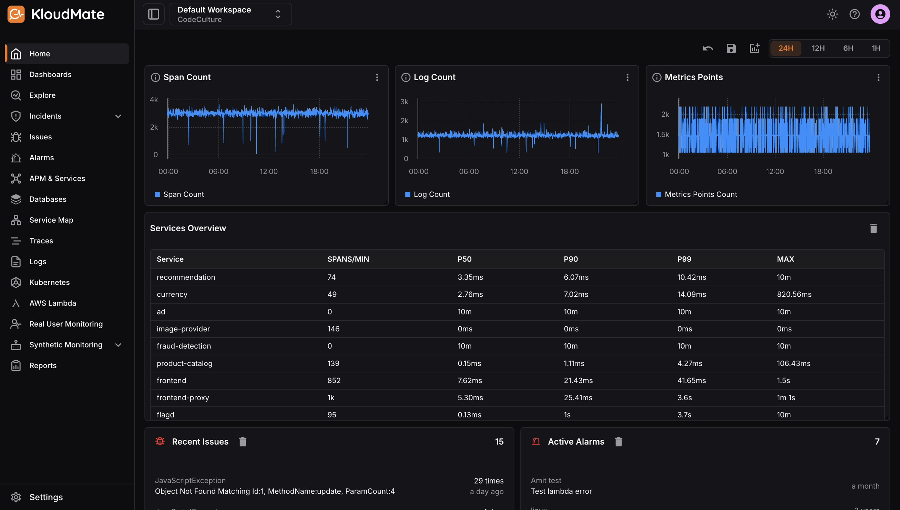
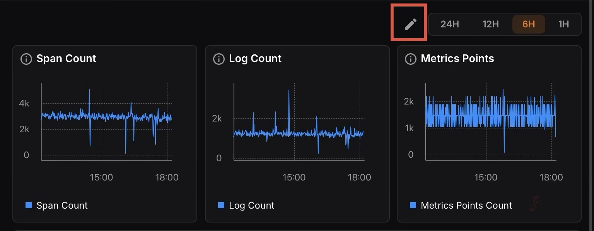
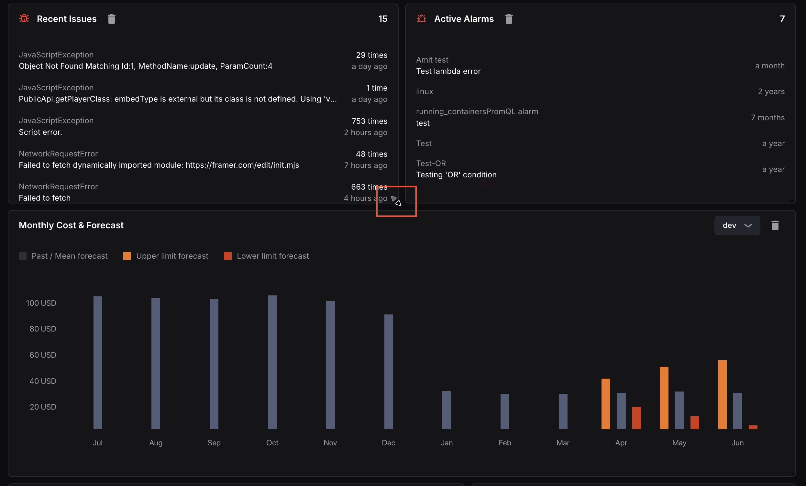
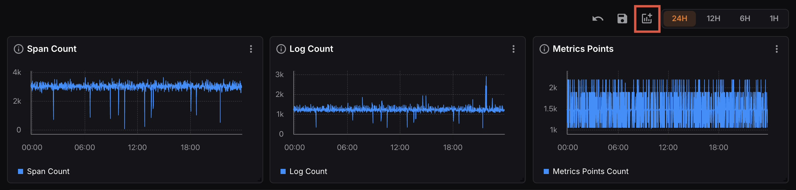
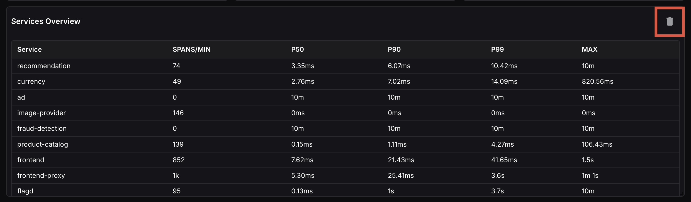
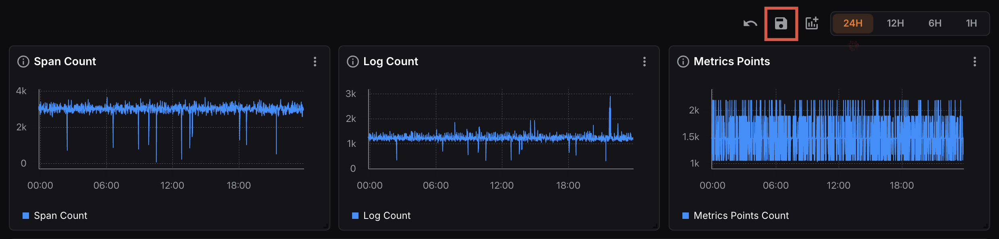
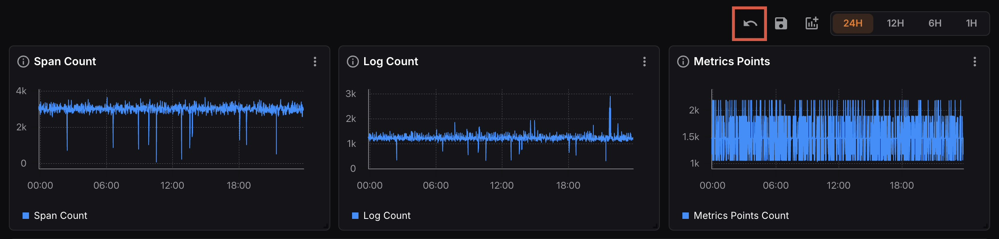
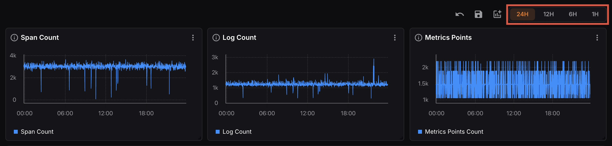

The [Homepage](https://app.kloudmate.com/) is the first page you land on when you log into KloudMate. It provides an at-a-glance view of your system’s health and activity, combining observability signals, service performance, recent issues, active alarms, and cost insights in one place.

The homepage can be fully customized based on the metrics and signals that matter most to you. Customizing it according to the relevance of your role and responsibilities enhances your personalized experience within KloudMate.

## Customizing the Homepage

### Entering Edit Mode

Click the **Edit** icon at the top right corner of the homepage to enter edit mode. The Undo, Save, and Add Widget icons appear at the top right, allowing you to make changes to your homepage layout.​​​​​​​​​​​​​​​​

### Resizing and Repositioning Panels

In edit mode, you can drag and drop panels to reposition them anywhere on the homepage. You can also resize any panel by dragging its edges to adjust it to your preferred size and layout.

### Adding a Widget

In edit mode, click the **Add Widget** icon at the top right corner.

A panel will appear listing all available pre-defined widgets you can add to your homepage.

Click on any widget from the list to add it to your homepage. Click **Close** to dismiss the panel without making changes.

### Removing a Widget

Each widget on the homepage has a Delete icon at its top right corner. Click it to remove that widget from your homepage view.

### Saving Changes

Once you have finished customizing, click the **Save** icon at the top right corner to save your updated homepage layout.

### Undoing Changes

To discard recent changes and revert to the previous homepage layout, click the **Undo** icon at the top right corner.

### Time Range

Use the time range selector at the top right of the homepage to adjust the time window across all panels simultaneously.

***

## **Related Resources**

- [Creating a dashboard](https://docs.kloudmate.com/creating-a-dashboard)
- [Setting up KloudMate alarms](https://docs.kloudmate.com/setting-up-kloudmate-alarms)

