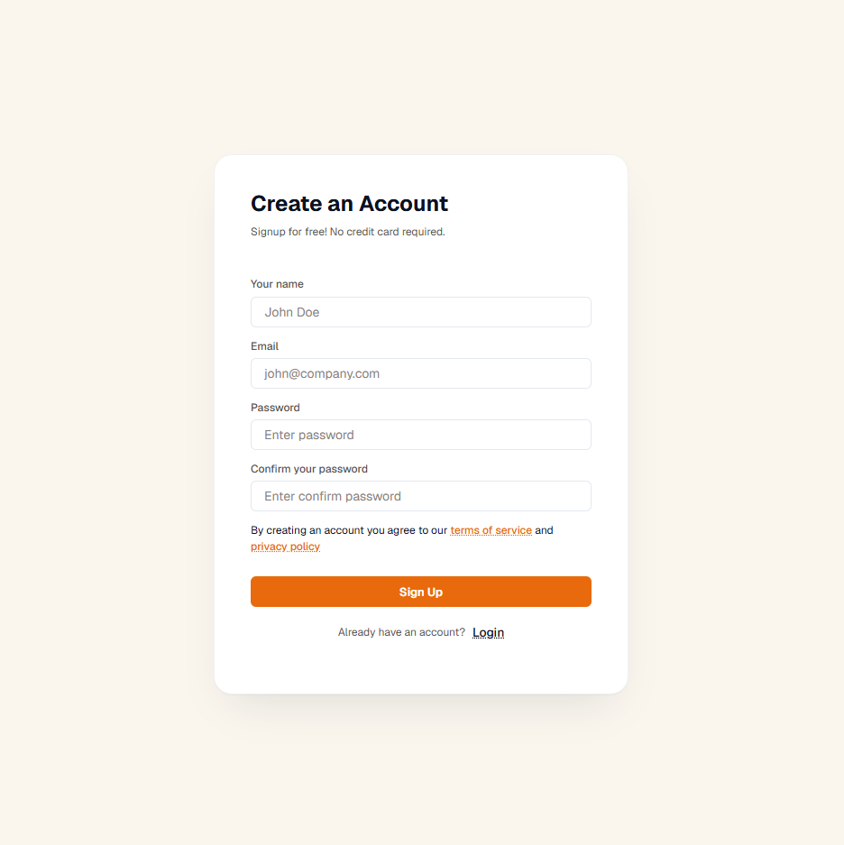
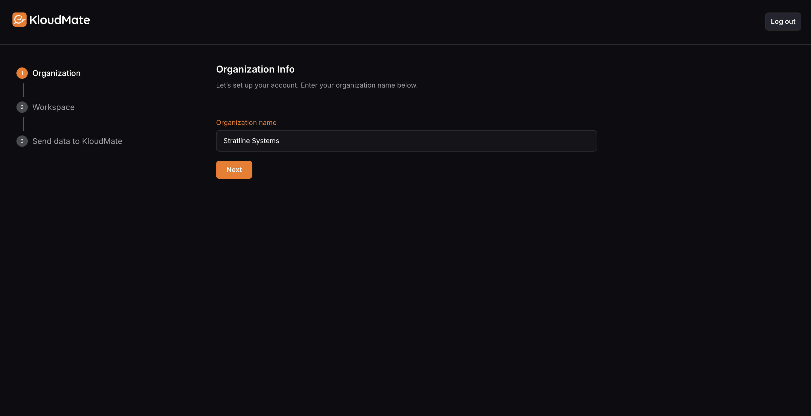

import { LinkCard, CardGrid, Steps } from '@astrojs/starlight/components';

This page is your starting point. You'll sign up, run through onboarding, send your first telemetry event, and determine what to set up next — based on what you want to monitor: infrastructure, applications, databases, cloud services, or something else.

Already have an account and just want to send data? Jump to [Sending Data to KloudMate](../sending-data-to-kloudmate/).

## 1. Sign up

<Steps>
1. Open the [KloudMate signup page](https://app.kloudmate.com/signup).
2. Fill in the form with a work email address.

   

3. Check your inbox for a verification code from `noreply@kloudmate.com`. Check your spam folder if it doesn't arrive.
4. Enter the code on the next screen and click **Next**.

   
</Steps>

## 2. Walk through the onboarding wizard

Onboarding is a five-step wizard. Most steps take seconds; the only one with real work is the data-source step.

### Step 1 — Create your organization

Pick a name for your organization. Your browser timezone is captured as the org-wide default for alert schedules and report cadences — change it later under **Settings → Organization**.

### Step 2 — Tell us about your stack

Three quick picks that tailor the next step to your setup:

- **Your role** — Developer, SRE, Platform, or Eng. Manager.
- **Primary language** — Node, Python, Java, Go, .NET, Ruby, PHP, or Other.
- **Where you run your services** — Kubernetes, VMs, Serverless (AWS), or Mixed.

These drive the install-method recommendation in Step 4 and pre-tune the snippets you'll see. Change any of them later under **Settings**.

### Step 3 — Name your workspace

Workspaces separate environments, teams, or products inside one organization — for example, `prod`, `staging`, and `dev` as three workspaces sharing the same org. Pick a name; add more workspaces later under **Settings → Workspaces**.

### Step 4 — Send your first event

Two options appear, with one marked **Recommended for your stack** based on the deployment you picked in Step 2:

| If you picked… | Recommended path |
|---|---|
| **Kubernetes**, **VMs**, or **Mixed** | **OpenTelemetry** — install the KloudMate agent (Helm chart for K8s, Linux/Windows binary for VMs). Auto-instruments Node, Python, Java, .NET, and Go pods on K8s with no code changes. |
| **Serverless (AWS)** | **AWS Integration** — connect your AWS account; Lambda, EC2, RDS metrics and CloudWatch logs flow in without an agent install. |

Select the recommended option unless your setup requires otherwise. The other option is still available — connect AWS even from a Kubernetes deployment if you want both. The next section covers less common cases.

The OpenTelemetry path opens install instructions in a new tab and advances the wizard to Step 5. The AWS path runs the AWS onboarding flow inline.

### Step 5 — Verify ingestion

The verify step waits for any signal — trace, log, metric, RUM event — to land in the workspace. As soon as the first one arrives, the step ticks complete and the wizard finishes. To continue later, click **Skip for now** — the home-page checklist picks up where you left off.

## 3. Pick the right ingestion path for your goal

The Step 4 recommendation is a good default, but the right path depends on what you're actually monitoring. Use this table to match your goal to the page that has the install instructions.

| What you want to monitor | Best path | Notes |
|---|---|---|
| **Hosts, VMs, or Kubernetes infra** (CPU, memory, disk, network, pod health) | [KloudMate Agent](../../kloudmate-agent/) | One agent install. eBPF-powered, low overhead, zero code changes. |
| **Application traces and latency** (APM) | [OpenTelemetry SDK](../../opentelemetry/) — or the KloudMate Agent on K8s for auto-instrumentation | On Kubernetes the agent auto-instruments Node, Python, Java, .NET, and Go pods. Outside K8s, install the OTel SDK directly in your app. |
| **Application logs** | [KloudMate Agent](../../kloudmate-agent/) — or push directly via [OpenTelemetry](../../opentelemetry/) | The agent tails common log paths automatically. The OTel logs SDK gives you finer control over structured logging. |
| **Databases** (Postgres, MySQL, Mongo, Redis, etc.) | [Database Monitoring](../../database-monitoring/) | Connect the database; query stats, slow logs, and connection health stream in. |
| **AWS services** (Lambda, EC2, RDS, ECS, DynamoDB, …) | [AWS Integration](../../aws-integration/) | Agentless cloud-platform pull via the AWS API. |
| **Azure services** | [Azure Integration](../../azure-integration/) | Azure Monitor + Event Hub. |
| **Existing Prometheus metrics** | [Prometheus Integration](../../infrastructure/integrations/prometheus-integration/) | Forward your Prometheus metrics via the OTel-based remote-write path. |
| **Existing OpenTelemetry pipelines** | [OpenTelemetry Collector](../../opentelemetry/) | Add an OTLP exporter — no changes to your collector-first architecture. |
| **Synthetic monitoring** (uptime, browser checks) | [Synthetics](../../synthetic/) | Set up checks from the UI; no agent or SDK required. |
| **Real-User Monitoring (RUM)** | [RUM](../../rum/) | Drop the browser SDK into your frontend to capture session, performance, and error data. |

For a side-by-side decision walkthrough and a phased rollout pattern, see [Sending Data to KloudMate](../sending-data-to-kloudmate/).

## 4. What to do next

When the wizard finishes, you land on the home page with a **Setup checklist** drawer open. It lists the next steps worth completing — instrument an application, build a dashboard, create an alert, wire a notification channel, invite a teammate. Each row jumps you straight to the right page, with the option to ask the assistant if you'd rather be walked through.

Re-open it any time from the **Setup** pill in the header.

## Where to go from here

<CardGrid>
  <LinkCard title="Sending Data to KloudMate" description="Detailed comparison of every ingestion path and a phased rollout pattern." href="../sending-data-to-kloudmate/" />
  <LinkCard title="KloudMate Agent" description="Install the agent for infrastructure, logs, and zero-code APM via eBPF." href="../../kloudmate-agent/" />
  <LinkCard title="OpenTelemetry guide" description="Use the OTel SDK or Collector to ship application telemetry." href="../../opentelemetry/" />
  <LinkCard title="AWS Integration" description="Connect an AWS account for Lambda, EC2, RDS, and more." href="../../aws-integration/" />
  <LinkCard title="Create your first alert" description="Watch a metric, define a threshold, route notifications." href="../../alerts/create-alerts/" />
  <LinkCard title="Reliability & SLOs" description="Set service-level objectives and get paged on burn-rate spikes." href="../../reliability/" />
</CardGrid>

## Related resources

- [What is KloudMate?](../what-is-kloudmate/) — concepts and platform overview.
- [Core concepts](../core-concepts/) — signals, OpenTelemetry, eBPF, SLOs.
- [Get help](../get-help/) — support and community.
