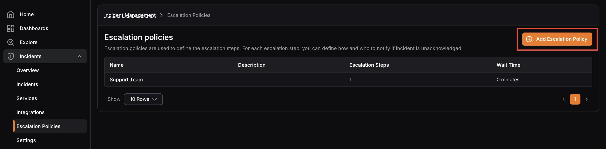
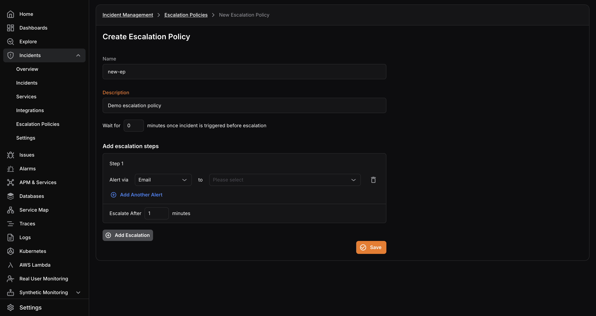
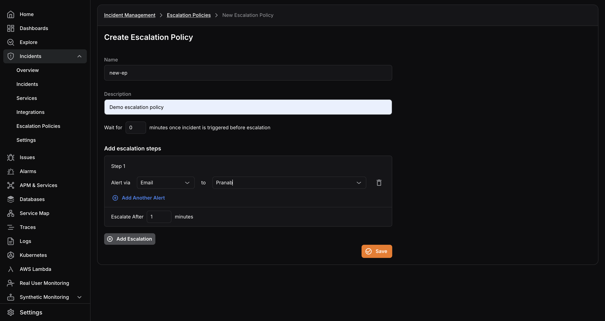
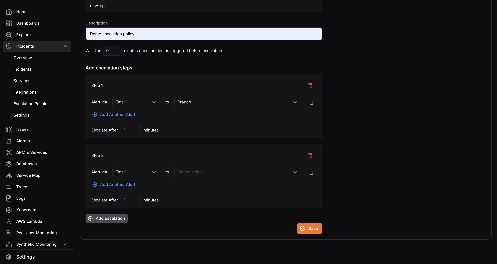
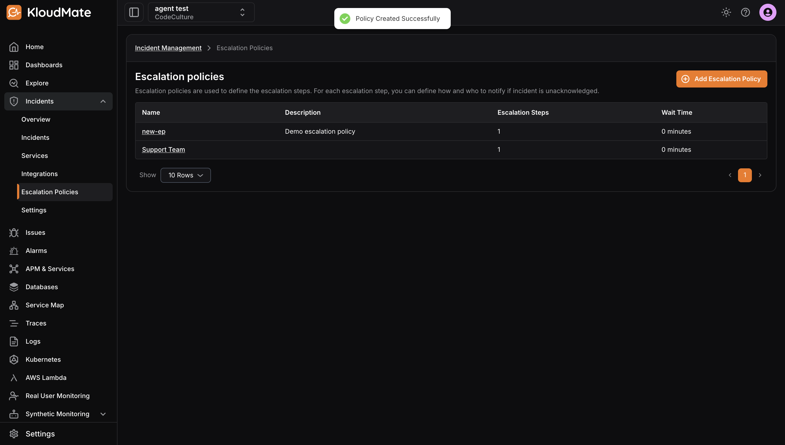

import { Aside } from '@astrojs/starlight/components';

Use the steps below to create a new escalation policy.

1. Click **Add Escalation Policy** from the escalation policies page.

2. Enter a **Name ** and ** Description**.
3. Set the initial **Wait Time** in minutes.

4. Under **Add Escalation Steps**, configure the notification targets for the first step:
   - Select the notification channel
   - Select the assignee
   - Use **Add Another Alert** to add multiple channels in the same step

<Aside type="note">
  If you plan to notify Slack, first complete [Slack Integration](../../slack-integration/).
</Aside>

5. Set the **Escalate After** timeout in minutes for that step.

6. Click **Add Escalation** to create additional steps as needed.

7. Click **Save** when the policy is complete.

